# Orchestrator

> **A IA é substituível. O projeto é permanente.**

Orchestrator é uma plataforma desktop/local de desenvolvimento assistido e
autônomo por múltiplas IAs. O usuário conecta **quantas APIs de IA quiser**
(OpenAI e compatíveis, Anthropic, Gemini ou qualquer API HTTP), usa as
**assinaturas** que já tem (Claude Pro/Max, ChatGPT, conta Google) pelas
CLIs oficiais, ou baixa **modelos locais** que rodam no próprio
computador, com um motor que o Orchestrator instala e gerencia. Os agentes trabalham sobre o **mesmo projeto**, compartilham memória,
assumem tarefas uns dos outros e operam sobre um ambiente real de
desenvolvimento — sempre através do runtime do Orchestrator.

- O projeto, o código e o Git pertencem ao usuário.
- A memória e o histórico pertencem ao projeto.
- Agentes são descartáveis; providers são intercambiáveis.
- O workspace local é a fonte primária; o GitHub é remoto.
- O Orchestrator controla a execução; o usuário decide o nível de autonomia.

A arquitetura completa está em [`ARCHITECTURE.md`](./ARCHITECTURE.md). As
decisões arquiteturais estão em [`docs/adr/`](./docs/adr) e o relatório de
cada fase em [`docs/phases/`](./docs/phases).

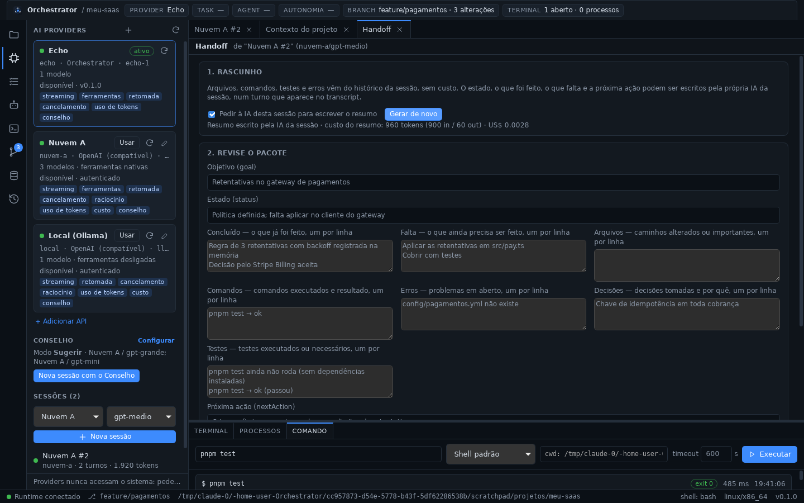

## Estado atual

| Fase | Escopo | Estado |
| ---- | ------ | ------ |
| 0 | README, ARCHITECTURE, estrutura do monorepo | ✅ concluída |
| 1 | Tauri + React + TypeScript + Rust; filesystem, shell, terminal, process manager | ✅ concluída |
| 2 | Project Discovery, Project Profile, Git | ✅ concluída |
| 3 | AIProvider, Provider Registry, Provider Sessions | ✅ concluída |
| 4 | Providers por API com cadastro livre (OpenAI e compatíveis, Anthropic, Gemini, qualquer API por perfil) | ✅ concluída |
| 5 | Roteador de modelos e Conselho de IAs (modos Sugerir e Full) | ✅ concluída |
| 6 | SQLite, memória L1/L2/L3, histórico e decisões | ✅ concluída |
| 7 | Context Builder e Handoff entre IAs | ✅ concluída |
| 8a | Task Manager e painel TASKS | ✅ concluída |
| 8b | Agentes, subagentes e File Locks | ✅ concluída |
| 9 | Autonomia: Assistido, Autônomo, Acesso Irrestrito e Pause | ✅ concluída |
| 10 | GitHub, pull requests e operações remotas | ✅ concluída |
| 11 | Otimização de tokens, cache, compactação, agent scheduling | ✅ concluída |
| 12 | Instaladores, release e atualização automática (escolhida depois do plano do documento mestre) | ✅ concluída |
| — | Acesso total da IA: internet, APIs e segredos ([ADR-0020](./docs/adr/0020-acesso-total-da-ia.md)) | ✅ concluída |
| — | Configurações, regras e skills, servidores MCP, assinaturas por CLI e modelos offline ([ADR-0021](./docs/adr/0021-configuracoes-assinaturas-offline-e-mcp.md), [docs/settings.md](./docs/settings.md)) | ✅ concluída |
| — | Dados preservados nas atualizações: backups automáticos, restauração e gravação segura ([ADR-0022](./docs/adr/0022-dados-preservados-nas-atualizacoes.md)) | ✅ concluída |
| — | Vários projetos abertos na barra lateral e projetos relacionados, cujas IAs se consultam ([ADR-0023](./docs/adr/0023-varios-projetos-e-projetos-relacionados.md)) | ✅ concluída |

A ordem das Fases 4–5 foi redefinida na
[ADR-0010](./docs/adr/0010-providers-por-api-com-cadastro-livre.md):
providers só por API, e não por CLIs.

## Estrutura do repositório

```text
orchestrator/
├── apps/
│   └── desktop/            # Tauri 2 + React + TypeScript (UI) e src-tauri (ponte IPC)
├── packages/
│   ├── core/               # [Rust] contratos: ToolCall, ToolResult, eventos, ProjectProfile,
│   │                       #        sessões de provider
│   ├── runtime/            # [Rust] Tool Runtime: filesystem, shell, terminal, processos,
│   │                       #        projeto, git, package managers, runtimes
│   ├── orchestrator/       # [Rust] Orchestrator Engine: Context Builder, Handoff,
│   │                       #        ferramentas de memória das IAs, Task Manager
│   ├── agents/             # [Rust] Agent Manager, subagentes, File Lock Manager
│   ├── memory/             # [Rust] banco local (SQLite): histórico, projetos, sessões,
│   │                       #        memória L1/L2/L3, decisões, deliberações
│   ├── git/                # [Rust] Git local via `git` do sistema e GitHub pela API REST
│   ├── providers/          # [Rust] AIProvider, Provider Registry, Provider Sessions
│   │   ├── api/            # [Rust] conexões de API: OpenAI e compatíveis, Anthropic,
│   │   │                   #        Gemini e perfil genérico
│   │   └── cli/            # [Rust] assinaturas pelas CLIs: Claude Code, Codex, Gemini CLI
│   ├── local/              # [Rust] modelos locais: motor llama.cpp, modelos GGUF, servidor
│   ├── mcp/                # [Rust] servidores MCP como ferramentas e o endpoint MCP local
│   └── router/             # [Rust] roteador de modelos e Conselho de IAs
├── docs/                   # ADRs, relatórios de fase, referência de IPC e ferramentas
├── ARCHITECTURE.md
├── Cargo.toml              # workspace Cargo (crates Rust)
├── package.json            # workspace pnpm (apps TypeScript)
└── pnpm-workspace.yaml
```

## Pré-requisitos

| Ferramenta | Versão mínima | Observação |
| ---------- | ------------- | ---------- |
| Node.js | 20 | testado com 22 |
| pnpm | 9 | testado com 10 |
| Rust (rustup) | 1.90 | exigido pelo Tauri 2.12 |
| Git | 2.30 | |
| Tauri CLI | 2.x | instalado como dependência do projeto (`@tauri-apps/cli`) |

Dependências de sistema do Tauri por SO:

- **Windows 10/11**: Microsoft C++ Build Tools (workload “Desktop development
  with C++”) e WebView2 (já presente no Windows 11).
- **macOS**: Xcode Command Line Tools (`xcode-select --install`).
- **Linux (Debian/Ubuntu)**:
  ```bash
  sudo apt install libwebkit2gtk-4.1-dev build-essential curl wget file \
    libxdo-dev libssl-dev libayatana-appindicator3-dev librsvg2-dev
  ```

Referência: <https://v2.tauri.app/start/prerequisites/>.

## Instalar

Os instaladores para Windows (`.exe`/`.msi`), macOS (`.dmg`, universal) e
Linux (`.deb`, `.rpm`, AppImage) ficam na página de Releases do GitHub. O
app avisa quando há versão nova e a instala quando você pede. Detalhes,
assinatura de código e como publicar um release:
[`docs/release.md`](./docs/release.md).

## Como executar

```bash
pnpm install          # dependências do frontend e do Tauri CLI
pnpm dev              # abre o app desktop em modo desenvolvimento
pnpm build            # gera o executável/instalador de produção
```

## Como testar

```bash
pnpm test             # testes Rust (core, git, runtime, providers, router, memory, engine, agents, desktop) e do frontend
pnpm test:rust        # somente cargo test --workspace
pnpm test:web         # somente vitest
pnpm typecheck        # checagem de tipos TypeScript
pnpm check            # typecheck + cargo fmt --check + cargo clippy -D warnings
```

## O que já funciona

### Acesso total da IA — internet, APIs e segredos (ADR-0020)

- **Internet:** as IAs leem páginas (`web.fetch`, HTML vira texto) e chamam
  qualquer API HTTP (`http.request`).
- **Segredos:** chaves de API e tokens guardados no cofre do sistema (aba
  Autonomia → "Segredos") e usados pelas IAs **pelo nome**,
  `{{secret:NOME}}`, numa URL, cabeçalho, corpo ou variável de ambiente de
  um comando. A IA nunca vê o valor: ele é trocado por `***` em tudo o que
  volta, e o histórico guarda só o marcador.
- **Sem recusa prévia:** a instrução de sistema diz o que as ferramentas
  alcançam e que quem decide as autorizações é o Orchestrator.
- No **Acesso Irrestrito**, nada disso pergunta nada; no Autônomo,
  chamar uma API pergunta (regra padrão nova); no Assistido, ler páginas
  roda e chamar APIs pede autorização.

### Fase 12 — instaladores, release e atualizações

- **Instaladores** para Windows (instalador por usuário `.exe`, em
  português e inglês, e `.msi`), macOS (`.app`/`.dmg` universal, macOS
  11+) e Linux (`.deb`, `.rpm` e AppImage), com nome, descrição, editor e
  ícones.
- **Uma versão só:** `pnpm version:set X.Y.Z` grava a versão em todos os
  lugares e `pnpm version:check` (também na CI) confere — inclusive contra
  a tag do release.
- **Release pelo GitHub Actions:** uma tag `vX.Y.Z` gera os instaladores
  nos três sistemas e cria um release em rascunho com eles e o manifesto
  de atualização; quem publica é você. Um push que mexe no empacotamento
  gera os instaladores como artefatos, sem release.
- **Atualização automática assinada:** o app procura versões novas (ao
  abrir e a cada 6 horas, desligável), avisa na barra de status e, quando
  você pede, para os agentes com handoff, baixa, confere a assinatura e
  instala; "Reiniciar agora" abre a versão nova. Builds locais não
  procuram atualizações.
- **Aba "Sobre e atualizações"** (clique na versão, na barra de status):
  versão, tipo de instalação, pastas de dados, notas da versão nova e
  progresso. O histórico registra `APP_UPDATED`.

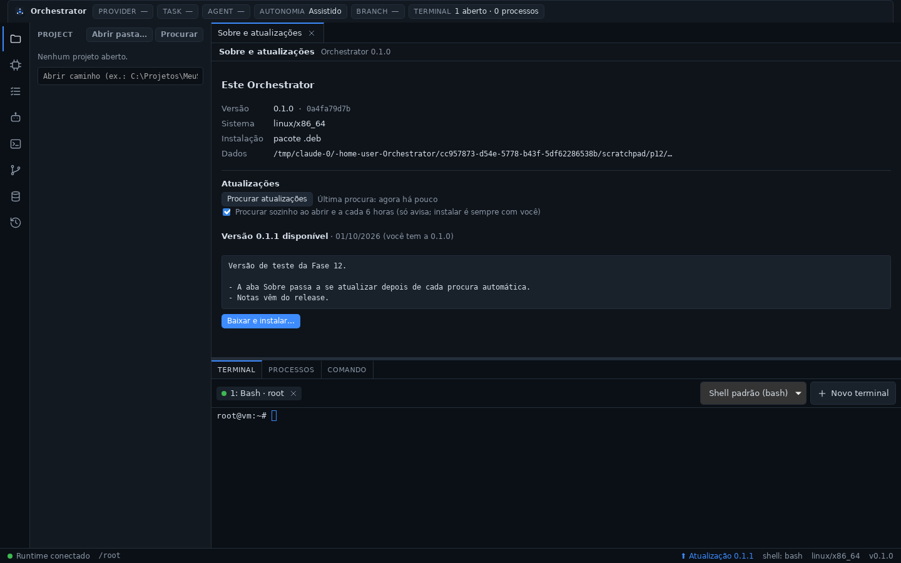

Referência: [`docs/release.md`](./docs/release.md).

### Fase 11 — tokens, cache, compactação e escalonamento

- **Custo real:** o custo de cada turno é o que o fornecedor cobra, com o
  cache — tokens lidos do cache a preço de cache (coluna "$ cache" do
  modelo; na Anthropic, 10% da entrada) e gravações a 1,25× ou 2× — e a
  sessão mostra quanto o cache economizou.
- **Cache de prompt:** instruções, ferramentas e conversa repetem o mesmo
  começo a cada requisição; na Anthropic, três marcadores `cache_control`
  (as ferramentas ficam compartilhadas entre agentes do mesmo modelo); na
  OpenAI oficial, `prompt_cache_key` por sessão. Opções "Cache de prompt"
  e "Validade" (5 min ou 1 h) na conexão.
- **Compactação de contexto:** quando a conversa passa do limite (aba
  Contexto: 150.000 tokens ou 80% da janela, o que vier primeiro), a
  própria IA a resume — lendo do cache — e o resumo passa a abrir a
  próxima mensagem. Também pelo botão "Compactar". A tela continua
  mostrando a conversa inteira.
- **Retentativas:** 429, 5xx, 529 e falhas de conexão são repetidos até
  duas vezes, respeitando o `retry-after`; a sessão diz "tentando de novo
  em N s".
- **Escalonamento de agentes:** a fila anda por prioridade da task e
  depois por chegada, sem que um agente parado segure os de trás; limite
  de agentes por provider; teto de custo por agente (também ao executar a
  task) e orçamento diário do projeto, que para os agentes com handoff e
  nunca bloqueia as sessões do usuário; `maxSubagents` configurável.
- **Tokens e custo:** gasto de hoje na barra de status e no painel AGENTS;
  aba com 1, 7 ou 30 dias por provider e modelo, cache, economia e
  compactações.
- **Supervisão de processos:** no Windows, todo processo iniciado entra num
  Job Object que o encerra se o app cair; no Linux e no macOS, o que
  sobrou de uma queda é encerrado quando o app abre de novo (conferindo
  que o pid ainda é o mesmo processo).

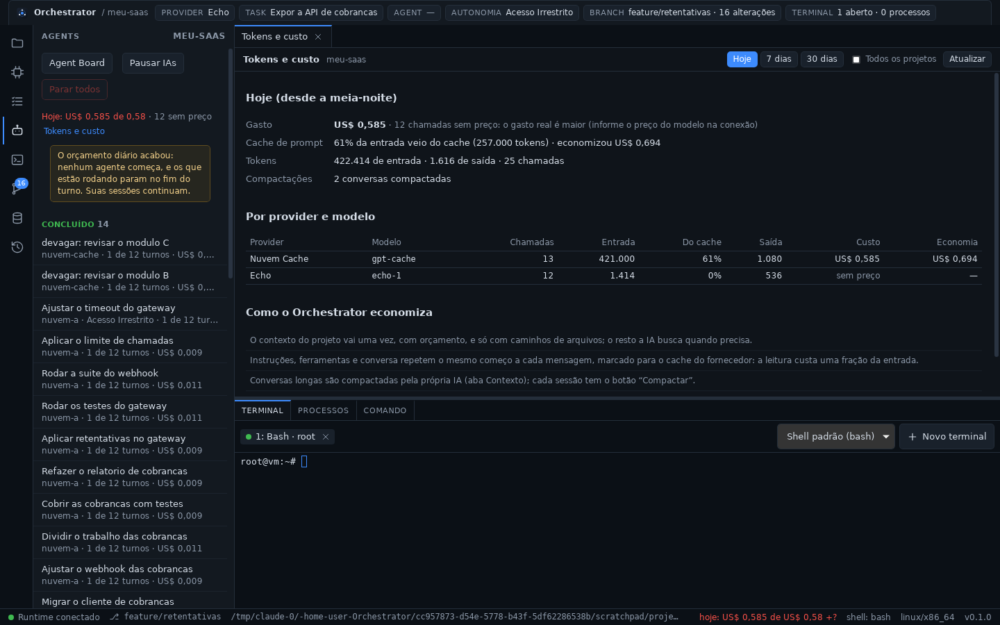

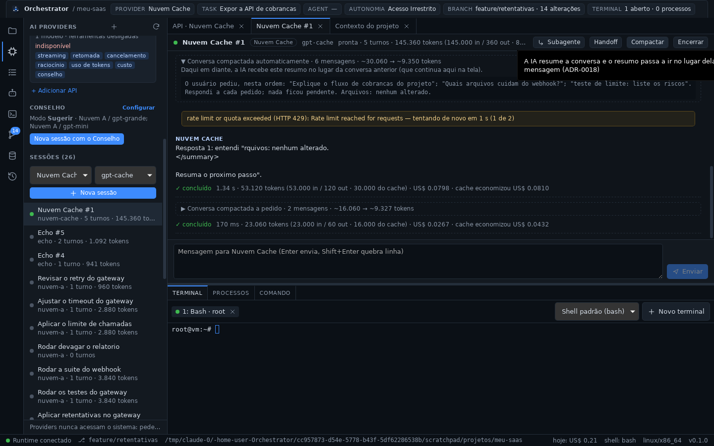

Referência: [`docs/tokens.md`](./docs/tokens.md).

### Fase 10 — GitHub e pull requests

- **Do commit ao merge sem sair do Orchestrator:** a seção GitHub do painel
  GIT mostra o repositório, a conta, o pull request da branch atual com a
  CI (✓ ✗ ●), os PRs e as issues abertos; "Criar pull request" abre o
  formulário, que pode vir de uma task (título, descrição, resultado e
  arquivos) e avisa — e oferece o push — quando a branch ainda não está
  no GitHub.
- **Aba do PR:** descrição, CI com o link de cada verificação, a revisão
  de cada revisor, comentários (e caixa para comentar) e o merge (merge,
  squash ou rebase, apagando a branch), com o motivo quando o GitHub não
  deixa. O Orchestrator não bloqueia nada que o repositório permita.
- **Conexão:** o token vai para o cofre do sistema (aba GitHub); também
  valem `GH_TOKEN`/`GITHUB_TOKEN` e o `gh auth login`. GitHub Enterprise
  pelo host e pela URL da API.
- **As IAs também usam o GitHub** (`github.*`), sob o modo de autonomia:
  no Autônomo padrão, abrir PR, comentar e fazer merge perguntam antes.
- **Fetch** no painel GIT; PRs e issues criados ou integrados entram no
  histórico e na busca do projeto.

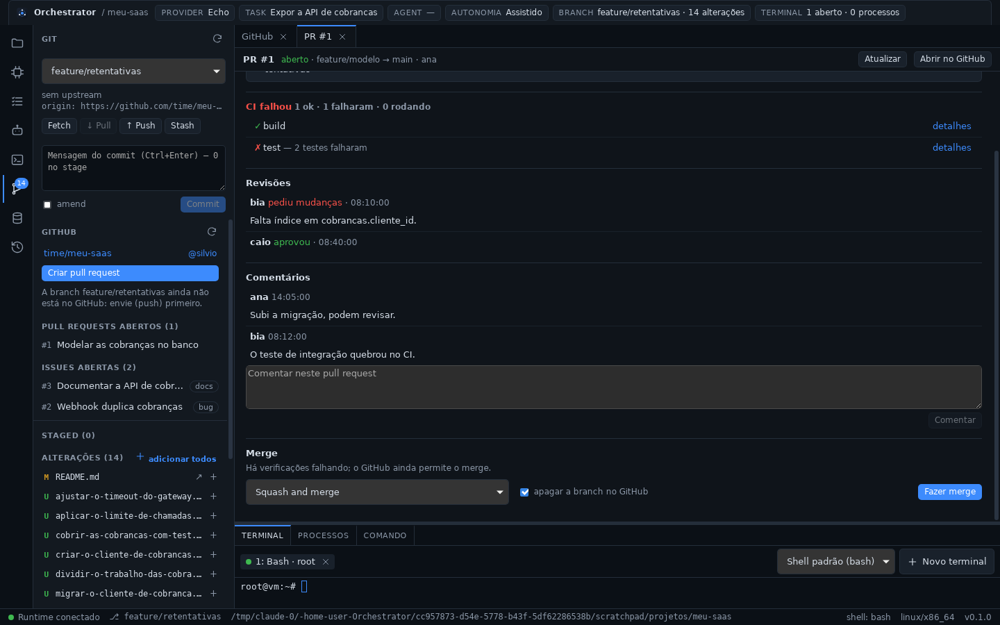

Referência: [`docs/github.md`](./docs/github.md).

### Fase 9 — autonomia e pausa

- **Você decide o que as IAs fazem sozinhas**, por projeto (chip
  `Autonomia` na barra superior e aba Autonomia) ou por agente, ao pô-lo
  para executar a task:
  - **Assistido** (o padrão): consultas rodam; toda ação pede a sua
    autorização, e também ler fora do projeto ou arquivos `.env*`;
  - **Autônomo:** as suas regras decidem — permitir, perguntar ou negar —
    por ferramenta, tipo, comando, caminho e dentro/fora do projeto; as
    regras padrão perguntam pelo que é destrutivo ou remoto;
  - **Acesso Irrestrito:** o Orchestrator não impõe nada. Sem confirmações,
    sem comandos proibidos.
- **Pedidos de autorização** aparecem numa faixa sob a barra superior, em
  qualquer tela: Permitir, Permitir nesta sessão ou Negar com um motivo que
  a IA recebe. Cancelar o turno ou parar o agente cancela o pedido.
- **Pausar:** as IAs todas ou um agente só. Nada age até você retomar, e o
  agente não perde a vaga nem os arquivos.
- **"Experimentar"** mostra qual regra decide uma chamada antes de salvar.
- **Tudo continua no histórico**, inclusive as chamadas negadas: quem pediu,
  quem autorizou, em quanto tempo e o que foi executado.

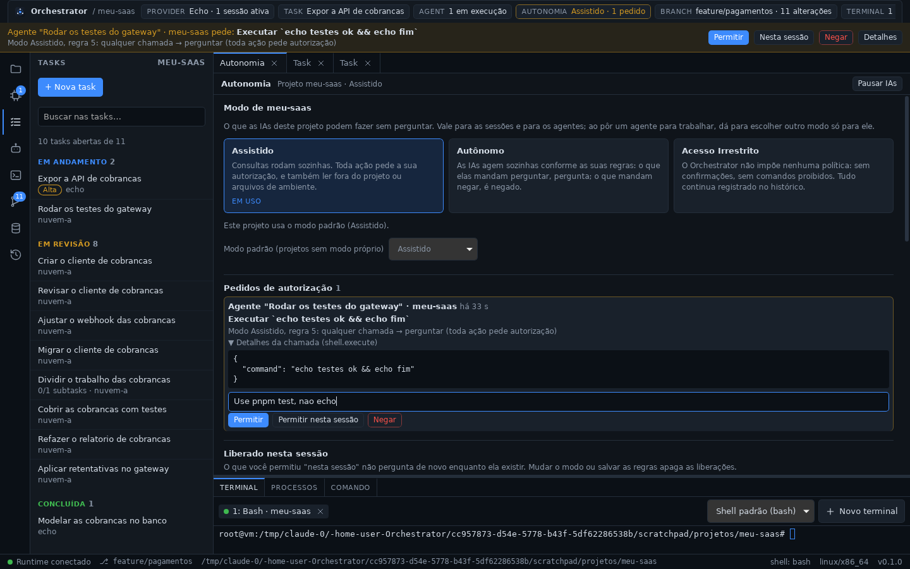

Referência: [`docs/autonomy.md`](./docs/autonomy.md).

### Fase 8b — agentes, subagentes e travas de arquivo

- **Um agente executa a task sozinho:** ele abre a sessão com o contexto da
  task, conduz os turnos, usa as ferramentas e encerra chamando
  `agent.finish`. O resultado vai para a task, que fica **em revisão** —
  quem conclui é você.
- **Mais de uma task ao mesmo tempo**, quando não há conflito: a fila
  respeita o limite de agentes em paralelo (padrão 2) e espera os arquivos
  ficarem livres, dizendo o que está no caminho.
- **Dois agentes nunca alteram o mesmo arquivo.** A trava é do banco, por
  arquivo: escrever num arquivo de outro agente é recusado com o motivo.
  Leitura nunca trava, e **você nunca é bloqueado no seu próprio projeto**.
- **Subagentes:** um agente divide o trabalho com `agent.delegate`, que cria
  a subtask e enfileira quem vai fazê-la.
- **Quem para no meio deixa handoff** com os fatos da sessão, para outra IA
  continuar de onde parou.
- **Agent Board** (a fazer / em andamento / em revisão) com task, agente,
  provider, estado e progresso; painel AGENTS com "Parar" e "Parar todos".
- A barra superior passa a mostrar o **agente atual**.

> O que um agente pode fazer sem perguntar é o modo de autonomia (Fase 9);
> quanto ele roda são os tetos de turnos e de paralelismo.

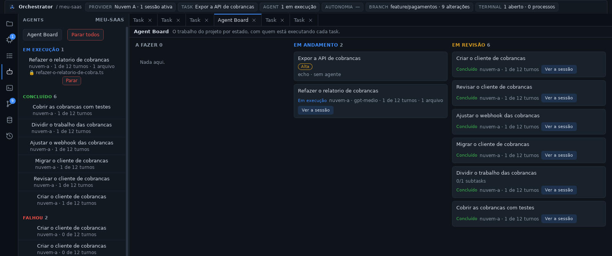

Referência: [`docs/agents.md`](./docs/agents.md).

### Fase 8a — tasks

- **Todo trabalho relevante é uma task**, no painel TASKS: título,
  descrição, estado (a fazer, em andamento, bloqueada, em revisão,
  concluída, cancelada), prioridade e a IA escolhida.
- **Dependências e subtasks:** uma task só inicia quando o que ela espera
  está concluído — o Orchestrator recusa e diz o que falta. Ciclos entre
  dependências são recusados na hora de salvar.
- **A task vira o contexto:** abrir uma sessão a partir dela monta o
  contexto do projeto com o título, a descrição e os arquivos da task, e
  começa a conversa por ela.
- **Roteador:** "Sugerir com o roteador" escolhe provider e modelo pelo
  texto da task, sem gastar tokens.
- **Histórico e busca:** `TASK_CREATED`, `TASK_STARTED`, `TASK_COMPLETED` e
  `TASK_UPDATED` no HISTORY; as tasks entram na busca do projeto.
- A barra superior passa a mostrar a **task atual**.

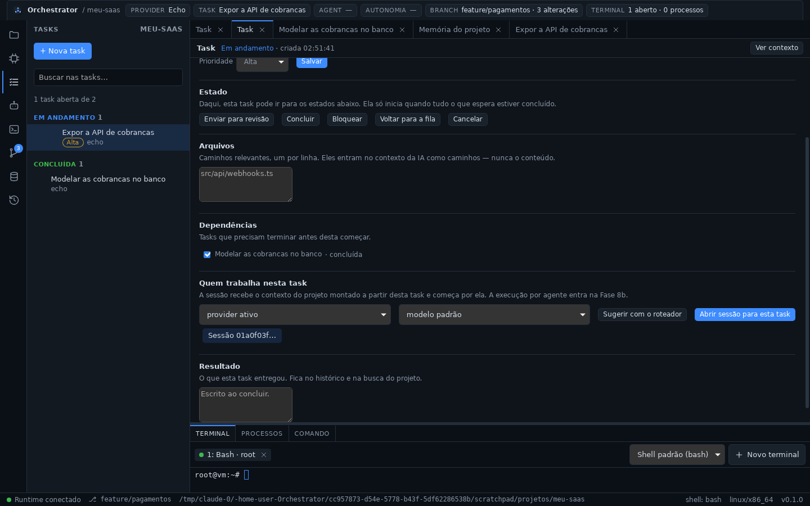

Referência: [`docs/tasks.md`](./docs/tasks.md).

### Fase 7 — contexto do projeto e handoff entre IAs

- **Toda sessão começa sabendo o essencial do projeto.** Na primeira
  mensagem, o Orchestrator anexa só o que é relevante para a tarefa, dentro
  de um orçamento de tokens (padrão 1.500):
  - memória de trabalho (outras sessões e últimos comandos);
  - regras fixadas, entradas e decisões que casam com a tarefa;
  - caminhos de arquivos citados ou alterados (nunca o conteúdo);
  - erros recentes, trechos do histórico e o estado do Git.

  A escolha é por regras e busca, sem chamar IA. Nunca vão o histórico
  inteiro nem o repositório.
- **Tudo visível:** antes de enviar, a sessão mostra a estimativa e a
  opção de não anexar. A aba "Contexto do projeto" mostra as seções, os
  tokens, o que o orçamento cortou e o texto exato.
- **As IAs consultam e registram a memória** por ferramentas
  (`memory.search`, `memory.save`, `decision.save`…). O que elas gravam fica
  marcado como da IA; elas não alteram o que você escreveu nem apagam nada.
- **Handoff:** passe o trabalho de uma sessão para outra IA sem colar a
  conversa:
  - o rascunho junta os fatos do histórico (arquivos, comandos, testes,
    erros), que não custam nada, e o resumo da própria IA (objetivo,
    estado, feito, falta, próxima ação);
  - você revisa, escolhe quem assume (com a sugestão do roteador) e passa;
  - a nova sessão recebe o pacote no contexto e começa pela próxima ação;
    a conversa anterior não vai junto;
  - `HANDOFF_CREATED` e `HANDOFF_ACCEPTED` no HISTORY, e os handoffs na
    MEMORY.

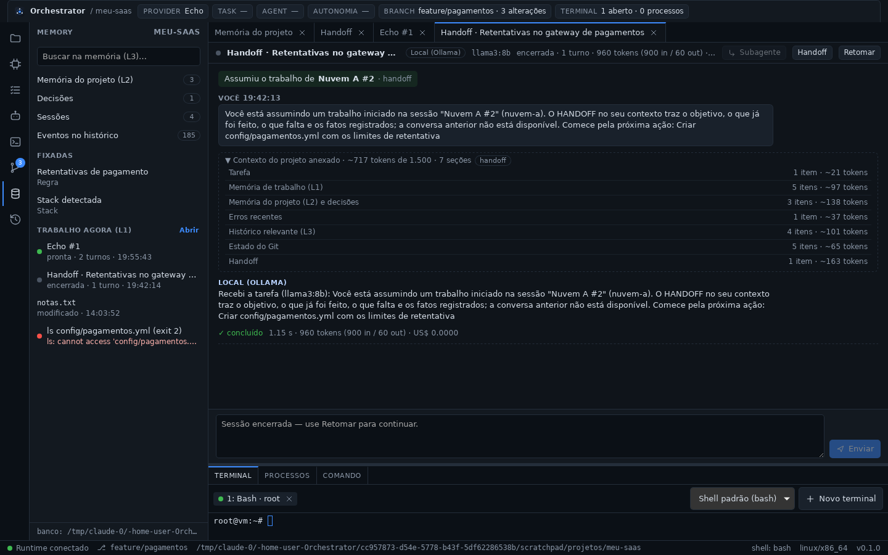

Referência: [`docs/context.md`](./docs/context.md).

### Fase 6 — banco local, memória e histórico

- **Um banco local** (`orchestrator.db`, SQLite embutido) no diretório de
  dados do app. Nada é gravado dentro do projeto, e as chaves de API
  continuam só no cofre do sistema.
- **O app lembra depois de fechar:**
  - as sessões voltam com o transcript, o uso e o custo;
  - "Retomar" continua a **mesma conversa** com a API;
  - as deliberações e o cache do Conselho continuam valendo.
- **Memória do projeto** (MEMORY), que pertence ao projeto e não à IA:
  - **Trabalho (L1):** sessões, arquivos alterados, comandos com código de
    saída e erros recentes, tirados do histórico;
  - **Projeto (L2):** arquitetura, stack, convenções, regras e notas, com
    etiquetas e fixação. A stack detectada entra sozinha ao abrir o projeto;
  - **Decisões:** contexto, decisão, consequências e estado (proposta,
    aceita, substituída, rejeitada). Nunca são apagadas;
  - **Busca (L3):** sem acento e por prefixo, na memória, nas decisões, nas
    mensagens das sessões e nos eventos notáveis.
- **HISTORY sem limite:**
  - cada evento é marcado com o projeto, e "Só este projeto" filtra por ele;
  - "Carregar mais antigos" pagina o histórico inteiro;
  - o `audit.jsonl` das fases anteriores é importado na primeira execução.

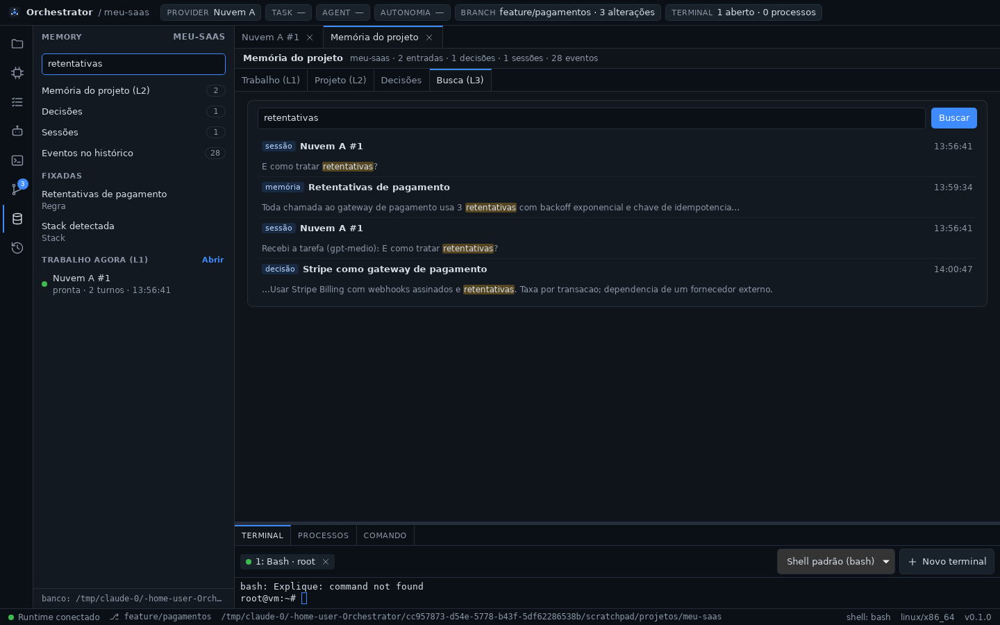

Referência: [`docs/memory.md`](./docs/memory.md).

### Fase 5 — Roteador de modelos e Conselho de IAs

- **Nova sessão com o Conselho** (AI PROVIDERS): descreva a demanda e o
  Conselho trabalha nela (ADR-0024).
- **Conselho de 1 a 5 IAs que analisam juntas:**
  - cada membro analisa a demanda com o contexto do projeto (perfil,
    regras, memória, decisões e tasks), sem ferramentas nem chaves;
  - o 1º que respondeu junta as análises num **Plano do Conselho**:
    consenso, divergências, passos e cuidados;
  - o 1º membro disponível executa o plano. **Só os membros trabalham**:
    modelos de fora do Conselho nunca são usados por ele.
- **Reserva entre os membros:** se quem executa falha (sobrecarga, servidor
  fora do ar, erro), a sessão passa sozinha para o próximo membro, no mesmo
  pedido. Ele recebe um resumo do que já foi feito. A ordem dos membros,
  que você define, é a fila.
- **Roteador:** dá nota de 0 a 100 a todos os modelos cadastrados, pelas
  etiquetas, preço, contexto, ferramentas e perfil, **sem gastar tokens**.
  Cada nota e cada exclusão vêm com o motivo. Serve para escolher um modelo
  à mão.
- **Modos:**
  - *Desligado:* só o roteador;
  - *Sugerir:* o Conselho analisa e você aprova a execução;
  - *Full:* o Conselho analisa e executa sozinho.
- **Custo visível e cache:** o custo das análises aparece na tela, e a
  mesma demanda no mesmo projeto não gasta tokens de novo.
- **Histórico:** tudo vai para o HISTORY (`COUNCIL_DELIBERATED`,
  `ROUTE_DECIDED`, `SESSION_FAILOVER`), com a origem "Conselho (Full)"
  quando ele agiu sozinho.

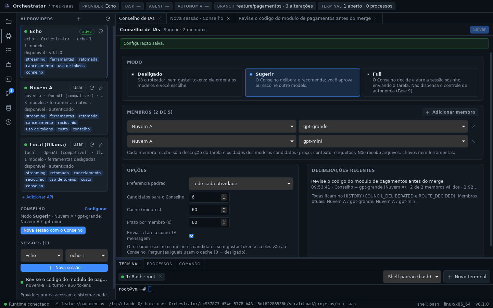

Referência: [`docs/router.md`](./docs/router.md).

### Fase 4 — APIs de IA com cadastro livre

- **Quantas APIs você quiser**, pelo painel AI PROVIDERS → *Adicionar API*.
  Há pontos de partida para OpenAI, Anthropic, Gemini, OpenRouter, APIs
  compatíveis com a OpenAI (DeepSeek, Groq, Mistral, xAI, vLLM, LM Studio…).
  O **perfil genérico** descreve qualquer outra API HTTP/JSON sem
  código: endpoint, autenticação, corpo, SSE/NDJSON e onde ler a resposta.
- **Chave no cofre do sistema** (Windows Credential Manager, macOS Keychain,
  Secret Service) ou numa variável de ambiente. Ela nunca vai para arquivo,
  histórico, log ou interface.
- **Modelos**: *Buscar modelos* na própria API. Cada modelo tem contexto,
  preços por milhão de tokens (para o custo de cada turno), etiquetas livres
  e o modelo padrão. A sessão nova escolhe provider e modelo.
- **Ferramentas para qualquer modelo**:
  - chamada de funções nativa (OpenAI, Anthropic, Gemini);
  - protocolo por prompt, para qualquer modelo de texto;
  - o modelo recebe o JSON Schema de cada ferramenta. Ele só **pede**; o
    Orchestrator executa e registra no HISTORY.
- **Testar conexão**: resposta, latência, uso, custo e se o modelo chamou a
  ferramenta de teste, antes mesmo de salvar.
- **Editar a conexão** (chave, URL, modelos) vale para as sessões abertas,
  sem perder a conversa. Conexão removida ou desativada deixa a sessão com
  um aviso claro.

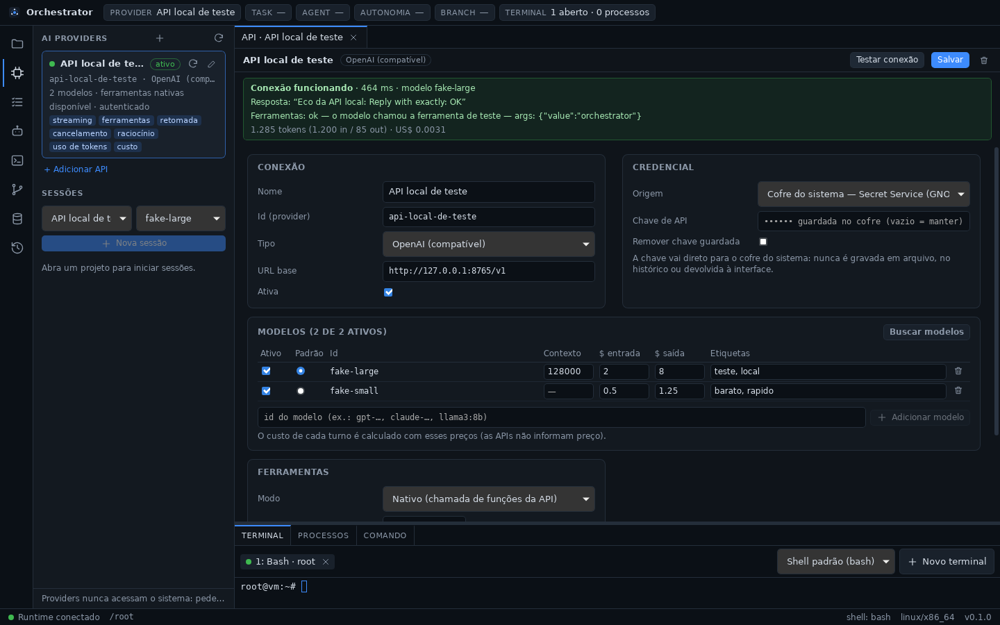

Referência: [`docs/api-connections.md`](./docs/api-connections.md).

### Fase 3 — camada de providers

- **Interface `AIProvider`** comum a qualquer IA: `start`, `resume`,
  `execute`, `stream`, `cancel`, `spawnAgent`, `inspect`, `capabilities`. O
  núcleo não conhece nenhum fornecedor.
- **Provider Registry**: providers registrados, disponibilidade (versão,
  autenticação), capacidades e provider ativo — trocar de provider fica
  registrado (`PROVIDER_SWITCHED`).
- **Provider Sessions**: a sessão pertence ao Orchestrator. Resposta em
  streaming, um turno por vez, cancelamento, encerrar/retomar, subagentes
  (com o mesmo provider ou delegando a outro) e uso de tokens/custo por turno
  e por sessão.
- **Tool calls pelo Orchestrator**: o provider nunca toca no sistema; pede a
  ferramenta e o Tool Runtime executa, com a sessão e o provider registrados
  como origem no HISTORY.
- **Provider `echo`** (builds de desenvolvimento): sem IA, exercita tudo isso
  no app — `/help`, `/tool filesystem.list {"path": "."}`, `/wait 10`,
  `/fail`.

Referência: [`docs/providers.md`](./docs/providers.md).

### Fase 2 — projeto e Git

- **Projeto**: abrir pasta (seletor nativo ou caminho), projetos recentes e
  **descoberta** de projetos no disco (`.git`, `package.json`,
  `pyproject.toml`, `Cargo.toml`, `go.mod`, Dockerfile…). O projeto aberto vira
  o diretório base de terminais, processos e caminhos relativos.
- **PROJECT PROFILE**: linguagem, framework, package manager, runtime (com a
  versão pedida pelo projeto), Docker, bancos (Prisma, compose, dependências),
  ferramentas, Git (root, branch, upstream, remote, status), scripts
  (executáveis com um clique), arquivos importantes e as evidências de cada
  conclusão. Runtimes instalados (Node, Python, Docker) sob demanda.
- **Git**: branch atual e troca/criação de branch, arquivos modificados, novos
  e removidos, stage/unstage, diff colorido, commit (com amend), pull, push
  (configura upstream), stash e últimos commits. Atualiza sozinho após
  comandos, terminal e salvamentos.
- **Ferramentas para agentes**: `project.*`, `git.*`, `package.install`,
  `package.run`, `runtime.node/python/docker` — todas auditadas.

### Fase 1 — runtime local

- **Desktop shell** com layout de IDE: barra de atividades (PROJECT, AI
  PROVIDERS, TASKS, AGENTS, GIT, MEMORY, HISTORY), área principal, painel
  inferior (Terminal / Processos / Comando) e barra de status.
- **Terminal real** (PTY): PowerShell, pwsh, CMD, WSL e Git Bash no Windows;
  bash, zsh, fish e sh no Linux/macOS — detectados automaticamente. Múltiplas
  abas, redimensionamento, saída em tempo real.
- **Filesystem**: navegar, abrir, editar e salvar arquivos; mover e excluir.
- **Shell**: execução não interativa de comandos com stdout, stderr, exit code
  e timeout.
- **Process manager**: iniciar processos de longa duração (`npm run dev`),
  acompanhar a saída, listar e encerrar (árvore de processos inteira).
- **Observabilidade**: toda chamada de ferramenta gera eventos de auditoria
  (`TOOL_CALLED`, `COMMAND_EXECUTED`, `FILE_CHANGED`, …), exibidos no painel
  HISTORY e gravados no diretório de dados do app (no banco local desde a
  Fase 6).

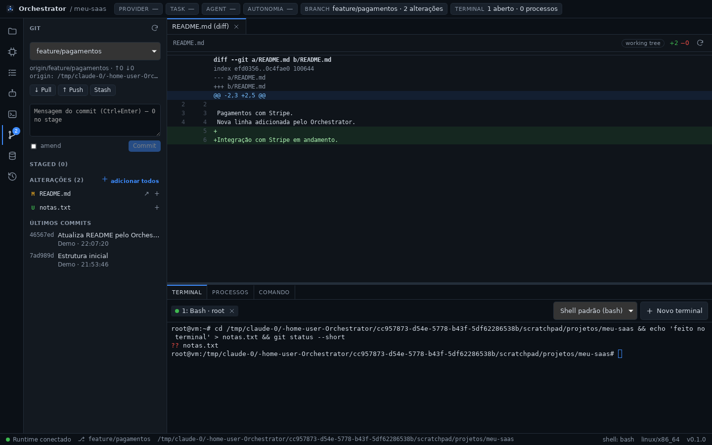

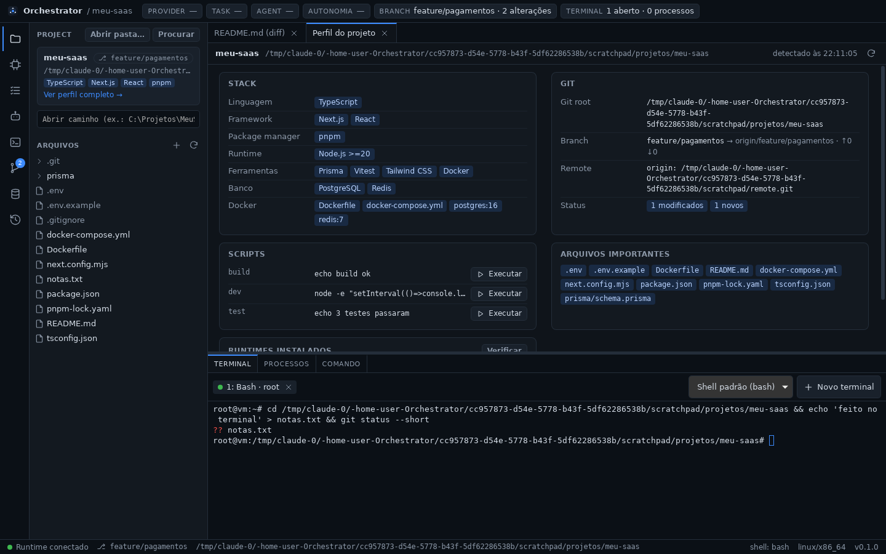

A referência completa das ferramentas está em
[`docs/tool-runtime.md`](./docs/tool-runtime.md), a camada de providers em
[`docs/providers.md`](./docs/providers.md), as conexões de API em
[`docs/api-connections.md`](./docs/api-connections.md), o roteador em
[`docs/router.md`](./docs/router.md), o banco e a memória em
[`docs/memory.md`](./docs/memory.md), o contexto e o handoff em
[`docs/context.md`](./docs/context.md), as tasks em
[`docs/tasks.md`](./docs/tasks.md), tokens, custo e compactação em
[`docs/tokens.md`](./docs/tokens.md), instalação e release em
[`docs/release.md`](./docs/release.md) e a camada IPC em
[`docs/ipc.md`](./docs/ipc.md).
