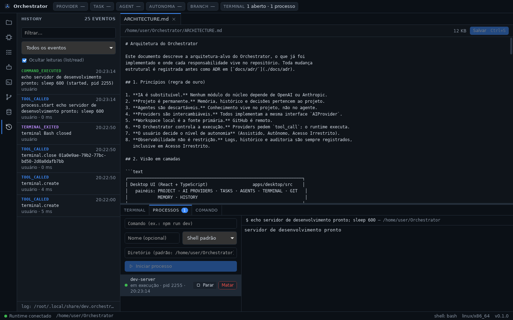

# Orchestrator

> **A IA é substituível. O projeto é permanente.**

Orchestrator é uma plataforma desktop/local de desenvolvimento assistido e
autônomo por múltiplas IAs. Diferentes agentes de programação (OpenAI/Codex,
Claude Code e, no futuro, outros) trabalham sobre o **mesmo projeto**,
compartilham memória, assumem tarefas uns dos outros e operam sobre um
ambiente real de desenvolvimento — sempre através do runtime do Orchestrator.

- O projeto, o código e o Git pertencem ao usuário.
- A memória e o histórico pertencem ao projeto.
- Agentes são descartáveis; providers são intercambiáveis.
- O workspace local é a fonte primária; o GitHub é remoto.
- O Orchestrator controla a execução; o usuário decide o nível de autonomia.

A arquitetura completa está em [`ARCHITECTURE.md`](./ARCHITECTURE.md). As
decisões arquiteturais estão em [`docs/adr/`](./docs/adr) e o relatório de
cada fase em [`docs/phases/`](./docs/phases).



## Estado atual

| Fase | Escopo | Estado |
| ---- | ------ | ------ |
| 0 | README, ARCHITECTURE, estrutura do monorepo | ✅ concluída |
| 1 | Tauri + React + TypeScript + Rust; filesystem, shell, terminal, process manager | ✅ concluída |
| 2 | Project Discovery, Project Profile, Git | ⏳ próxima |
| 3–11 | Providers, memória, contexto, tasks/agentes, autonomia, GitHub, otimização | planejadas |

## Estrutura do repositório

```text
orchestrator/
├── apps/
│   └── desktop/            # Tauri 2 + React + TypeScript (UI) e src-tauri (ponte IPC)
├── packages/
│   ├── core/               # [Rust] contratos do domínio: ToolCall, ToolResult, eventos
│   ├── runtime/            # [Rust] Tool Runtime: filesystem, shell, terminal, processos
│   ├── orchestrator/       # (Fases 7–8) Orchestrator Engine, Context Builder, Handoff
│   ├── agents/             # (Fase 8) Agent Manager, subagentes, File Lock Manager
│   ├── memory/             # (Fase 6) SQLite, memória L1/L2/L3, histórico, decisões
│   ├── git/                # (Fase 2) Git local
│   └── providers/
│       ├── openai/         # (Fase 4) OpenAI / Codex
│       └── claude/         # (Fase 5) Claude Code
├── docs/                   # ADRs, relatórios de fase, referência de IPC e ferramentas
├── ARCHITECTURE.md
├── Cargo.toml              # workspace Cargo (crates Rust)
├── package.json            # workspace pnpm (apps TypeScript)
└── pnpm-workspace.yaml
```

## Pré-requisitos

| Ferramenta | Versão mínima | Observação |
| ---------- | ------------- | ---------- |
| Node.js | 20 | testado com 22 |
| pnpm | 9 | testado com 10 |
| Rust (rustup) | 1.90 | exigido pelo Tauri 2.12 |
| Git | 2.30 | |
| Tauri CLI | 2.x | instalado como dependência do projeto (`@tauri-apps/cli`) |

Dependências de sistema do Tauri por SO:

- **Windows 10/11**: Microsoft C++ Build Tools (workload “Desktop development
  with C++”) e WebView2 (já presente no Windows 11).
- **macOS**: Xcode Command Line Tools (`xcode-select --install`).
- **Linux (Debian/Ubuntu)**:
  ```bash
  sudo apt install libwebkit2gtk-4.1-dev build-essential curl wget file \
    libxdo-dev libssl-dev libayatana-appindicator3-dev librsvg2-dev
  ```

Referência: <https://v2.tauri.app/start/prerequisites/>.

## Como executar

```bash
pnpm install          # dependências do frontend e do Tauri CLI
pnpm dev              # abre o app desktop em modo desenvolvimento
pnpm build            # gera o executável/instalador de produção
```

## Como testar

```bash
pnpm test             # testes Rust (core + runtime + desktop) e testes do frontend
pnpm test:rust        # somente cargo test --workspace
pnpm test:web         # somente vitest
pnpm typecheck        # checagem de tipos TypeScript
pnpm check            # typecheck + cargo fmt --check + cargo clippy -D warnings
```

## O que já funciona (Fase 1)

- **Desktop shell** com layout de IDE: barra de atividades (PROJECT, AI
  PROVIDERS, TASKS, AGENTS, GIT, MEMORY, HISTORY), área principal, painel
  inferior (Terminal / Processos / Comando) e barra de status.
- **Terminal real** (PTY): PowerShell, pwsh, CMD, WSL e Git Bash no Windows;
  bash, zsh, fish e sh no Linux/macOS — detectados automaticamente. Múltiplas
  abas, redimensionamento, saída em tempo real.
- **Filesystem**: navegar, abrir, editar e salvar arquivos; mover e excluir.
- **Shell**: execução não interativa de comandos com stdout, stderr, exit code
  e timeout.
- **Process manager**: iniciar processos de longa duração (`npm run dev`),
  acompanhar a saída, listar e encerrar (árvore de processos inteira).
- **Observabilidade**: toda chamada de ferramenta gera eventos de auditoria
  (`TOOL_CALLED`, `COMMAND_EXECUTED`, `FILE_CHANGED`, …), exibidos no painel
  HISTORY e gravados em `audit.jsonl` no diretório de dados do app.

A referência completa das ferramentas está em
[`docs/tool-runtime.md`](./docs/tool-runtime.md) e a camada IPC em
[`docs/ipc.md`](./docs/ipc.md).
