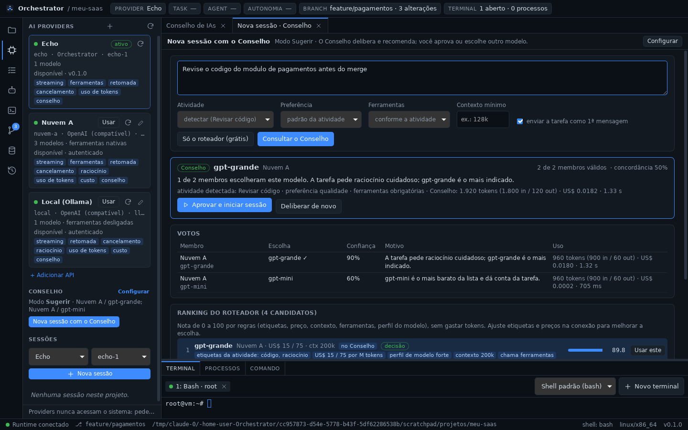

# Orchestrator

> **A IA é substituível. O projeto é permanente.**

Orchestrator é uma plataforma desktop/local de desenvolvimento assistido e
autônomo por múltiplas IAs. O usuário conecta **quantas APIs de IA quiser**:
OpenAI e compatíveis, Anthropic, Gemini, modelos locais ou qualquer API
HTTP. Os agentes trabalham sobre o **mesmo projeto**, compartilham memória,
assumem tarefas uns dos outros e operam sobre um ambiente real de
desenvolvimento — sempre através do runtime do Orchestrator.

- O projeto, o código e o Git pertencem ao usuário.
- A memória e o histórico pertencem ao projeto.
- Agentes são descartáveis; providers são intercambiáveis.
- O workspace local é a fonte primária; o GitHub é remoto.
- O Orchestrator controla a execução; o usuário decide o nível de autonomia.

A arquitetura completa está em [`ARCHITECTURE.md`](./ARCHITECTURE.md). As
decisões arquiteturais estão em [`docs/adr/`](./docs/adr) e o relatório de
cada fase em [`docs/phases/`](./docs/phases).



## Estado atual

| Fase | Escopo | Estado |
| ---- | ------ | ------ |
| 0 | README, ARCHITECTURE, estrutura do monorepo | ✅ concluída |
| 1 | Tauri + React + TypeScript + Rust; filesystem, shell, terminal, process manager | ✅ concluída |
| 2 | Project Discovery, Project Profile, Git | ✅ concluída |
| 3 | AIProvider, Provider Registry, Provider Sessions | ✅ concluída |
| 4 | Providers por API com cadastro livre (OpenAI e compatíveis, Anthropic, Gemini, qualquer API por perfil) | ✅ concluída |
| 5 | Roteador de modelos e Conselho de IAs (modos Sugerir e Full) | ✅ concluída |
| 6 | SQLite, memória L1/L2/L3, histórico e decisões | ⏳ próxima |
| 7–11 | contexto e handoff, tasks/agentes, autonomia, GitHub, otimização | planejadas |

A ordem das Fases 4–5 foi redefinida na
[ADR-0010](./docs/adr/0010-providers-por-api-com-cadastro-livre.md):
providers só por API, e não por CLIs.

## Estrutura do repositório

```text
orchestrator/
├── apps/
│   └── desktop/            # Tauri 2 + React + TypeScript (UI) e src-tauri (ponte IPC)
├── packages/
│   ├── core/               # [Rust] contratos: ToolCall, ToolResult, eventos, ProjectProfile,
│   │                       #        sessões de provider
│   ├── runtime/            # [Rust] Tool Runtime: filesystem, shell, terminal, processos,
│   │                       #        projeto, git, package managers, runtimes
│   ├── orchestrator/       # (Fases 7–8) Orchestrator Engine, Context Builder, Handoff
│   ├── agents/             # (Fase 8) Agent Manager, subagentes, File Lock Manager
│   ├── memory/             # (Fase 6) SQLite, memória L1/L2/L3, histórico, decisões
│   ├── git/                # [Rust] Git local via `git` do sistema (GitHub na Fase 10)
│   ├── providers/          # [Rust] AIProvider, Provider Registry, Provider Sessions
│   │   └── api/            # [Rust] conexões de API: OpenAI e compatíveis, Anthropic,
│   │                       #        Gemini e perfil genérico (qualquer API HTTP/JSON)
│   └── router/             # [Rust] roteador de modelos e Conselho de IAs
├── docs/                   # ADRs, relatórios de fase, referência de IPC e ferramentas
├── ARCHITECTURE.md
├── Cargo.toml              # workspace Cargo (crates Rust)
├── package.json            # workspace pnpm (apps TypeScript)
└── pnpm-workspace.yaml
```

## Pré-requisitos

| Ferramenta | Versão mínima | Observação |
| ---------- | ------------- | ---------- |
| Node.js | 20 | testado com 22 |
| pnpm | 9 | testado com 10 |
| Rust (rustup) | 1.90 | exigido pelo Tauri 2.12 |
| Git | 2.30 | |
| Tauri CLI | 2.x | instalado como dependência do projeto (`@tauri-apps/cli`) |

Dependências de sistema do Tauri por SO:

- **Windows 10/11**: Microsoft C++ Build Tools (workload “Desktop development
  with C++”) e WebView2 (já presente no Windows 11).
- **macOS**: Xcode Command Line Tools (`xcode-select --install`).
- **Linux (Debian/Ubuntu)**:
  ```bash
  sudo apt install libwebkit2gtk-4.1-dev build-essential curl wget file \
    libxdo-dev libssl-dev libayatana-appindicator3-dev librsvg2-dev
  ```

Referência: <https://v2.tauri.app/start/prerequisites/>.

## Como executar

```bash
pnpm install          # dependências do frontend e do Tauri CLI
pnpm dev              # abre o app desktop em modo desenvolvimento
pnpm build            # gera o executável/instalador de produção
```

## Como testar

```bash
pnpm test             # testes Rust (core, git, runtime, providers, router, desktop) e do frontend
pnpm test:rust        # somente cargo test --workspace
pnpm test:web         # somente vitest
pnpm typecheck        # checagem de tipos TypeScript
pnpm check            # typecheck + cargo fmt --check + cargo clippy -D warnings
```

## O que já funciona

### Fase 5 — Roteador de modelos e Conselho de IAs

- **Nova sessão com o Conselho** (AI PROVIDERS): descreva a tarefa e o
  Orchestrator escolhe o modelo. A atividade (código, depuração, revisão,
  testes, planejamento, documentação, resumo) é detectada pela descrição.
- **Roteador:** dá nota de 0 a 100 a todos os modelos cadastrados, pelas
  etiquetas, preço, contexto, ferramentas e perfil, **sem gastar tokens**.
  Cada nota e cada exclusão vêm com o motivo.
- **Conselho de 1 a 5 IAs** (com uma, ela é o "gerenciador"). Os membros
  recebem os melhores candidatos do roteador, votam em paralelo com motivo e
  confiança, e o Orchestrator soma os votos. Um membro que falha ou demora
  só se abstém. Os membros não recebem arquivos, chaves nem ferramentas.
- **Modos:**
  - *Desligado:* só o roteador;
  - *Sugerir:* você aprova, ou usa outro modelo do ranking;
  - *Full:* o Conselho abre a sessão com o modelo escolhido e envia a
    tarefa sozinho.
- **Custo visível e cache:** o custo de cada deliberação aparece na tela, e
  a mesma pergunta não gasta tokens de novo.
- **Histórico:** tudo vai para o HISTORY (`COUNCIL_DELIBERATED`,
  `ROUTE_DECIDED`), com a origem "Conselho (Full)" quando ele agiu sozinho.


Referência: [`docs/router.md`](./docs/router.md).

### Fase 4 — APIs de IA com cadastro livre

- **Quantas APIs você quiser**, pelo painel AI PROVIDERS → *Adicionar API*.
  Há pontos de partida para OpenAI, Anthropic, Gemini, OpenRouter, APIs
  compatíveis com a OpenAI (DeepSeek, Groq, Mistral, xAI, vLLM, LM Studio…) e
  Ollama. O **perfil genérico** descreve qualquer outra API HTTP/JSON sem
  código: endpoint, autenticação, corpo, SSE/NDJSON e onde ler a resposta.
- **Chave no cofre do sistema** (Windows Credential Manager, macOS Keychain,
  Secret Service) ou numa variável de ambiente. Ela nunca vai para arquivo,
  histórico, log ou interface.
- **Modelos**: *Buscar modelos* na própria API. Cada modelo tem contexto,
  preços por milhão de tokens (para o custo de cada turno), etiquetas livres
  e o modelo padrão. A sessão nova escolhe provider e modelo.
- **Ferramentas para qualquer modelo**:
  - chamada de funções nativa (OpenAI, Anthropic, Gemini);
  - protocolo por prompt, para qualquer modelo de texto;
  - o modelo recebe o JSON Schema de cada ferramenta. Ele só **pede**; o
    Orchestrator executa e registra no HISTORY.
- **Testar conexão**: resposta, latência, uso, custo e se o modelo chamou a
  ferramenta de teste, antes mesmo de salvar.
- **Editar a conexão** (chave, URL, modelos) vale para as sessões abertas,
  sem perder a conversa. Conexão removida ou desativada deixa a sessão com
  um aviso claro.


Referência: [`docs/api-connections.md`](./docs/api-connections.md).

### Fase 3 — camada de providers

- **Interface `AIProvider`** comum a qualquer IA: `start`, `resume`,
  `execute`, `stream`, `cancel`, `spawnAgent`, `inspect`, `capabilities`. O
  núcleo não conhece nenhum fornecedor.
- **Provider Registry**: providers registrados, disponibilidade (versão,
  autenticação), capacidades e provider ativo — trocar de provider fica
  registrado (`PROVIDER_SWITCHED`).
- **Provider Sessions**: a sessão pertence ao Orchestrator. Resposta em
  streaming, um turno por vez, cancelamento, encerrar/retomar, subagentes
  (com o mesmo provider ou delegando a outro) e uso de tokens/custo por turno
  e por sessão.
- **Tool calls pelo Orchestrator**: o provider nunca toca no sistema; pede a
  ferramenta e o Tool Runtime executa, com a sessão e o provider registrados
  como origem no HISTORY.
- **Provider `echo`** (builds de desenvolvimento): sem IA, exercita tudo isso
  no app — `/help`, `/tool filesystem.list {"path": "."}`, `/wait 10`,
  `/fail`.

Referência: [`docs/providers.md`](./docs/providers.md).

### Fase 2 — projeto e Git

- **Projeto**: abrir pasta (seletor nativo ou caminho), projetos recentes e
  **descoberta** de projetos no disco (`.git`, `package.json`,
  `pyproject.toml`, `Cargo.toml`, `go.mod`, Dockerfile…). O projeto aberto vira
  o diretório base de terminais, processos e caminhos relativos.
- **PROJECT PROFILE**: linguagem, framework, package manager, runtime (com a
  versão pedida pelo projeto), Docker, bancos (Prisma, compose, dependências),
  ferramentas, Git (root, branch, upstream, remote, status), scripts
  (executáveis com um clique), arquivos importantes e as evidências de cada
  conclusão. Runtimes instalados (Node, Python, Docker) sob demanda.
- **Git**: branch atual e troca/criação de branch, arquivos modificados, novos
  e removidos, stage/unstage, diff colorido, commit (com amend), pull, push
  (configura upstream), stash e últimos commits. Atualiza sozinho após
  comandos, terminal e salvamentos.
- **Ferramentas para agentes**: `project.*`, `git.*`, `package.install`,
  `package.run`, `runtime.node/python/docker` — todas auditadas.

### Fase 1 — runtime local

- **Desktop shell** com layout de IDE: barra de atividades (PROJECT, AI
  PROVIDERS, TASKS, AGENTS, GIT, MEMORY, HISTORY), área principal, painel
  inferior (Terminal / Processos / Comando) e barra de status.
- **Terminal real** (PTY): PowerShell, pwsh, CMD, WSL e Git Bash no Windows;
  bash, zsh, fish e sh no Linux/macOS — detectados automaticamente. Múltiplas
  abas, redimensionamento, saída em tempo real.
- **Filesystem**: navegar, abrir, editar e salvar arquivos; mover e excluir.
- **Shell**: execução não interativa de comandos com stdout, stderr, exit code
  e timeout.
- **Process manager**: iniciar processos de longa duração (`npm run dev`),
  acompanhar a saída, listar e encerrar (árvore de processos inteira).
- **Observabilidade**: toda chamada de ferramenta gera eventos de auditoria
  (`TOOL_CALLED`, `COMMAND_EXECUTED`, `FILE_CHANGED`, …), exibidos no painel
  HISTORY e gravados em `audit.jsonl` no diretório de dados do app.


A referência completa das ferramentas está em
[`docs/tool-runtime.md`](./docs/tool-runtime.md), a camada de providers em
[`docs/providers.md`](./docs/providers.md), as conexões de API em
[`docs/api-connections.md`](./docs/api-connections.md) e a camada IPC em
[`docs/ipc.md`](./docs/ipc.md).
