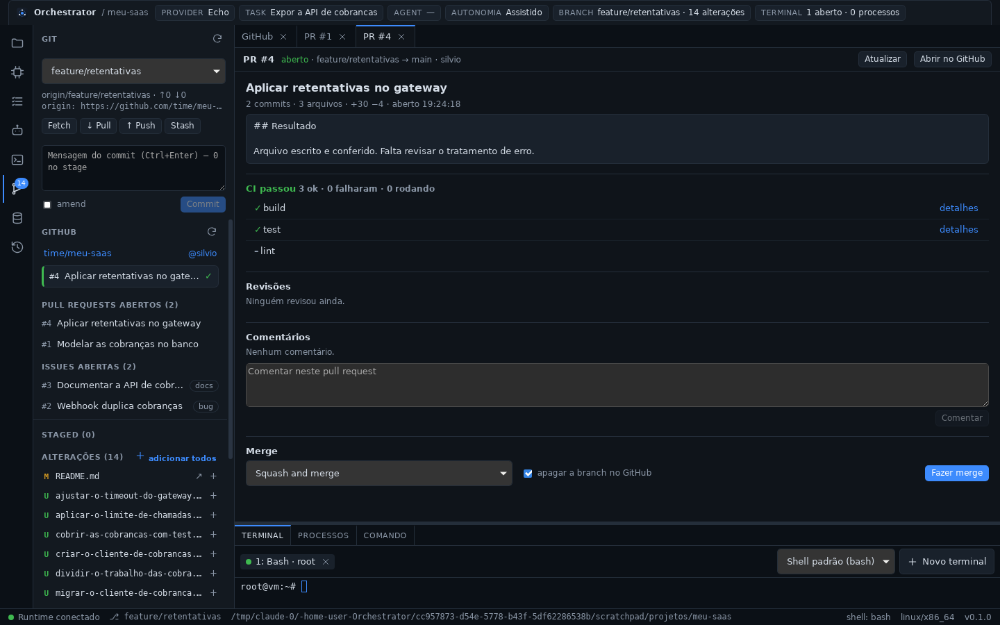
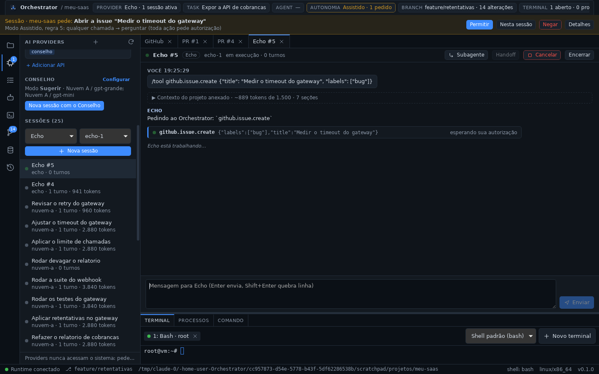

# Fase 10 — GitHub, pull requests e operações remotas

## STATUS

✅ **Concluída.** O ciclo "task → agente → commit → push → PR → CI →
revisão → merge" passa a acontecer dentro do Orchestrator:

- **seção GitHub no painel GIT:** repositório e conta, o pull request da
  branch atual com a CI (✓ ✗ ●) — ou o último, se já foi integrado —,
  "Criar pull request", os PRs e as issues abertos; botão **Fetch**;
- **aba do PR:** descrição, CI com o link de cada verificação, a revisão de
  cada revisor, comentários (e caixa para comentar), merge (merge, squash
  ou rebase, apagando a branch) com o motivo quando o GitHub não deixa;
- **novo PR:** título pela branch ou por uma task (que traz a descrição, o
  resultado e os arquivos), base, rascunho; se a branch não está no GitHub,
  o formulário avisa e oferece "Enviar (push)";
- **aba GitHub:** token no cofre do sistema (ou `GH_TOKEN`/`GITHUB_TOKEN`,
  ou `gh auth login`), de onde vem o token em uso, a conta, e o servidor
  para GitHub Enterprise;
- **as IAs também usam o GitHub** (`github.*`), sob o modo de autonomia;
- **histórico e busca:** `GITHUB_PR_CREATED`, `GITHUB_PR_MERGED` e
  `GITHUB_ISSUE_CREATED`.






## Andamento

A fase foi feita em oito passos, cada um commitado e enviado ao terminar,
para poder ser retomada depois de um limite de uso — o que aconteceu entre
os passos 2 e 3, sem perda.

1. ✅ ADR-0017 e este arquivo.
2. ✅ Core: três eventos (e indexados na busca do projeto).
3. ✅ `orchestrator-git`, módulo `github`; testes com uma API falsa.
4. ✅ Runtime: `github.*`, `git.fetch`, `git.remotes`; testes.
5. ✅ Motor: regra padrão do Autônomo e resumo dos pedidos; testes.
6. ✅ Desktop: `github.json`, token no cofre, comandos.
7. ✅ UI: seção GitHub, aba do PR, novo PR, aba GitHub, HISTORY; testes.
8. ✅ Validação no app real, documentação e publicação.

## Decisões registradas antes do código

- [ADR-0017](../adr/0017-github-e-operacoes-remotas.md):
  - **onde:** módulo `github` no `orchestrator-git` (`packages/git`), como a
    tabela de módulos previa desde a Fase 0; cliente assíncrono da API REST
    v3 com `reqwest`; ferramentas `github.*` no Tool Runtime, pelo mesmo
    `invoke` auditado; nenhum crate novo;
  - **sem `gh` para as operações** (nem sempre está instalado; a API é
    estruturada) — o `gh` só é aceito como **fonte do token**;
  - **token:** cofre do sistema → `GH_TOKEN`/`GITHUB_TOKEN` → `gh auth
    token`; nunca em argumentos, eventos, saídas, logs ou UI — o que aparece
    é a fonte e o login;
  - **repositório:** `repo: "dono/nome"`, senão o remoto do *upstream* da
    branch, senão `origin`, senão o primeiro remoto no host; GitHub
    Enterprise por `host`/`apiUrl` em `github.json`;
  - **o PR sai do que está no GitHub:** `github.pr.create` recusa uma
    branch sem *upstream* ou com commits não enviados e não faz o push
    sozinho — enviar é outra operação remota, com a sua própria decisão de
    autonomia;
  - **nada é bloqueado pelo Orchestrator:** merge com CI vermelha ou sem
    revisão é decisão do repositório (proteção de branch);
  - **autonomia:** regra padrão nova do Autônomo, "`github.*` · ações →
    perguntar — publica no GitHub em nome da sua conta";
  - três eventos novos; `git.fetch` e `git.remotes`; **nenhuma migração**.

## Arquivos criados

**Rust**
- `packages/git/src/github/`:
  - `mod.rs`: `GitHubSettings` (host, API, validação) e `GitHubError`;
  - `auth.rs`: `Secret` (nunca aparece em `Debug`), `TokenSource`,
    `resolve_token`/`resolve_with` e o `gh auth token`;
  - `remote.rs`: URL de remoto → `RepoRef` (https, ssh, scp, git://) e
    `pick_remote`;
  - `client.rs`: `GitHubClient` (conta, repositório, PRs, PR com CI,
    revisões e os comentários mais recentes — buscando a última página —,
    checks, criar PR, comentar, merge e apagar a branch, issues) e o
    mapeamento de erros (401, 403, limite de requisições, 404, 422, rede,
    5xx);
  - `types.rs`: saídas montadas com leitura tolerante, resumo da CI e a
    última revisão decisiva de cada revisor.
- `packages/git/tests/github.rs`: o cliente contra uma API falsa.
- `packages/runtime/src/github_tools.rs`: estado (configuração, token do
  cofre, credencial em cache por um minuto e descartada num 401),
  argumentos, resolução do repositório, as onze ferramentas `github.*`,
  `git.remotes` e a conferência da branch antes do PR.
- `packages/runtime/tests/github.rs`: as ferramentas pelo `invoke`, com um
  repositório real e um GitHub falso com estado.
- `apps/desktop/src-tauri/src/github_commands.rs`: `github.json`, token no
  cofre, `github_settings_get/save`, `github_token_save/clear`, `open_url`.

**TypeScript — `apps/desktop/src`**
- `components/GitHubSection.tsx`: seção GitHub do painel GIT.
- `components/PullRequestView.tsx`: aba do PR e formulário de novo PR.
- `components/GitHubView.tsx`: aba GitHub (conta, token, servidor).
- `lib/github.ts` (+ teste): rótulos, fonte do token, o que falta antes do
  PR, motivo do merge não liberado, título pela branch e PR a partir de uma
  task.

**Documentação**
- ADR-0017, `docs/github.md`, este relatório e
  `docs/assets/fase-10-pr.png`, `fase-10-novo-pr.png`, `fase-10-ia.png`.

## Arquivos modificados

- `packages/core/src/event.rs`: três eventos.
- `packages/memory/src/search.rs`: os três eventos entram na busca (L3).
- `packages/git`: `lib.rs` (`fetch`, módulo `github`), `Cargo.toml`,
  `README.md`.
- `packages/runtime`: `lib.rs` (estado do GitHub, `set_github_settings`,
  `set_github_token`, `git.remotes`, `git.fetch`, despacho de `github.*`,
  resumo com `#número`/título no histórico), `catalog.rs` (13
  ferramentas), `schema.rs`, `Cargo.toml`.
- `packages/orchestrator/src/autonomy`: `policy.rs` (regra padrão 11) e
  `describe.rs` (resumos dos pedidos do GitHub e do fetch).
- `apps/desktop/src-tauri`: `lib.rs` (configuração e token ao iniciar,
  comandos), `Cargo.toml`.
- `apps/desktop/src`: `App.tsx` (abas PR e GitHub, texto de boas-vindas),
  `GitPanel.tsx` (Fetch e seção GitHub), `HistoryPanel.tsx` (filtros),
  `lib/types.ts`, `lib/runtime.ts` (`githubApi`, `gitApi.fetch`),
  `styles.css`.
- Documentação: `README.md`, `ARCHITECTURE.md`, `docs/tool-runtime.md`,
  `docs/ipc.md`, `docs/autonomy.md`, índices de ADRs e de fases.

## Dependências instaladas

Nenhuma nova no workspace: `reqwest`, `serde_json` e `chrono` já eram
dependências do workspace e passaram a ser usadas pelo `orchestrator-git`.

## Comandos executados

```bash
cargo test -p orchestrator-git -p orchestrator-runtime -p orchestrator-engine
cargo test --workspace
pnpm check        # tsc + cargo fmt --check + cargo clippy -D warnings (workspace)
pnpm test:web
pnpm tauri dev    # app real sob Xvfb, sobre o perfil da Fase 9, GitHub simulado
```

## Testes executados

| Suíte | Qtde | Cobre |
| ----- | ---- | ----- |
| `orchestrator-git` unitários (novos) | 11 | configuração (host, API, Enterprise, validação); `Secret` nunca aparece e a ordem cofre → ambiente → `gh`; todas as formas de URL de remoto (e as que não são GitHub); qual remoto representa o projeto; `dono/nome` do usuário; resumo da CI; a aprovação não some por um comentário posterior; estados e *head* de fork; última página de comentários; erros com o motivo do GitHub (422 com detalhes, limite com a hora, 401, 403, 5xx) |
| `orchestrator-git` integração (`tests/github.rs`) | 4 | cabeçalhos (`Bearer`, `Accept`, versão da API, `User-Agent`), escopos do token, repositório e filtro `head`; PR com CI (check runs e statuses), revisões e a última página de comentários; criar PR, comentar, merge squash com título e exclusão da branch, issues sem os PRs misturados e issue com labels; 401, 404, 422, limite e rede fora do ar sem vazar o token |
| `orchestrator-runtime` integração (`tests/github.rs`) | 2 | de uma branch local a um PR integrado: `git.remotes`, `github.status` (conta, fonte, repositório, remoto, branch), PR recusado sem push (dizendo `git.push`), push, PR aberto com a base padrão, CI no status, PR recusado com commit não enviado, merge com exclusão da branch, issue; eventos no histórico e o token em nenhum lugar dele; `repo` explícito e inválido, 404, comentário vazio, projeto sem remoto do GitHub, `git.fetch` com `--prune` e remoto inválido |
| `orchestrator-engine` (ampliados) | — | regra padrão: consultas do GitHub rodam, abrir PR e merge perguntam (regra 11), `git.fetch` roda; resumos dos pedidos (abrir PR como rascunho, merge squash apagando a branch, comentário em uma linha, fetch) |
| Desktop | 1 | `github.json` ida e volta; arquivo quebrado ou host inválido caem em github.com com aviso |
| Frontend (novos) | 4 | fonte do token em palavras, o que falta antes do PR (singular/plural), motivo do merge, título pela branch e PR a partir de uma task |
| Manual (app real) | — | ver abaixo |

Validação manual (dev, sobre o perfil da Fase 9; o projeto `meu-saas` com
`origin` = `github.com/time/meu-saas` e push para um repositório local; uma
API do GitHub simulada com estado — PR #1 com CI falhando, revisões e
comentários, duas issues):

- **Sem token:** a seção GitHub explicou as três formas de conectar;
  "Conectar ao GitHub" abriu a aba, que mostrou cofre vazio, variáveis
  vazias, `gh` não encontrado e a API em uso.
- **Token errado:** salvo no cofre, o GitHub recusou ("Bad credentials") e
  a aba disse isso em vermelho (antes, a faixa verde de "salvo" enganava —
  corrigido).
- **Token certo:** "Conectado como @silvio", escopos, repositório
  `time/meu-saas` (remoto `origin`, privado). Nenhum `ghp_` no
  `github.json` nem no banco.
- **PR #1:** CI falhou (build ✓, test ✗ "2 testes falharam"), bia pediu
  mudanças e caio aprovou, dois comentários, e o merge com "há verificações
  falhando; o GitHub ainda permite o merge". Um comentário enviado pela
  aba apareceu na lista.
- **Novo PR a partir da branch local:** o formulário avisou que a branch
  não estava no GitHub e deixou "Abrir" desabilitado; a task "Aplicar
  retentativas no gateway" preencheu título e descrição; "Enviar (push)"
  enviou a branch com *upstream*; o PR #4 foi aberto com a base padrão
  (`main`), a aba virou "PR #4" e a seção passou a mostrar "#4 … ✓".
- **Merge:** "Squash and merge" com confirmação; "integrado", "Merge feito
  (94c0ffe). Branch apagada no GitHub."; `PUT …/merge` e `DELETE
  …/git/refs/heads/feature/retentativas` no servidor;
  `GITHUB_PR_CREATED` e `GITHUB_PR_MERGED` no histórico.
- **Uma IA no GitHub:** uma sessão `echo` pediu `github.issue.create`; no
  modo Assistido a faixa disse "Sessão · meu-saas pede: Abrir a issue
  "Medir o timeout do gateway"" e o transcript "esperando sua
  autorização"; permitido, a issue #5 foi criada (`GITHUB_ISSUE_CREATED`).
  Uma consulta da IA (`github.pr.list`) rodou sem pedido nenhum.
- **Reinício:** o token voltou do cofre e a issue #5 apareceu na seção.
- **Cofre indisponível:** num arranque sem sessão D-Bus, o app abriu,
  registrou "token do GitHub no cofre: …" e seguiu funcionando (as outras
  fontes continuam valendo).
- Números: 89 chamadas à API, todas com o token certo, exceto as 3 do
  teste de token errado; 19 `github.status`, 10 `github.pr.list`, 9
  `github.issue.list`, 4 `github.pr.get` e uma de cada ação; banco no
  esquema 4, `integrity_check` ok.

## Resultado dos testes

- Rust: **288/288** (core 22, agents 13, desktop 2, engine 42, git 34,
  memory 23, provider-api 33, providers 25, router 25, runtime 69; 1 teste
  de inspeção ignorado de propósito).
- Frontend: **64/64**; `tsc` limpo.
- `cargo clippy -D warnings` e `cargo fmt --check` limpos.

## Problemas encontrados

| Problema | Resolução |
| -------- | --------- |
| Depois de salvar um token recusado, a aba mostrava a faixa verde "Token salvo no cofre." | Se o GitHub recusa, a mensagem é de erro: "Token salvo no cofre. Mas: O GitHub recusou o token…" |
| Depois do merge, a seção voltava a oferecer "Criar pull request" sem dizer que a branch já teve um PR integrado | `github.status` traz o PR mais recente da branch em qualquer estado; a seção mostra "#4 … integrado" |
| O app não tinha como abrir links externos (PR, CI, issues) | Comando `open_url`, só para `http(s)`, usado pelos cliques do usuário |
| `git remote -v` lista os remotos em ordem alfabética; um teste assumia outra ordem | O teste procura o remoto pelo nome |
| O índice das regras começa em zero (a tela mostra "regra 11") | Asserção com o índice certo e o comentário |
| A resolução do token pode chamar o `gh` (um processo) a cada chamada | Credencial em cache por um minuto, descartada ao mudar configuração/token e num 401 |

**Limitações conhecidas:**

- Sem OAuth pelo navegador nem GitHub App: token pessoal ou `gh`.
- Sem webhooks: a UI consulta ao abrir, quando a branch muda, depois de
  cada ação e em "Atualizar".
- Sem revisão de código pelo Orchestrator (aprovar, pedir mudanças), sem
  editar PR (título, reviewers, labels) e sem GitLab/Bitbucket.
- Comentários: os 20 mais recentes; revisões: a última decisiva de cada
  revisor.
- O contexto das IAs não consulta o GitHub; a IA pede `github.status`
  quando precisa.
- O `open_url` depende de `xdg-open`/`open`/`rundll32` no sistema.

## Próxima fase

**Fase 11 — Otimização de tokens, cache, compactação de contexto e agent
scheduling.**

- Compactar conversas longas e o transcript regravado a cada turno.
- Cache entre agentes e scheduling por custo e afinidade.
- A supervisão de processos contra queda do app (herdada da ADR-0016).
- A arquitetura será registrada em ADR própria antes do código.
