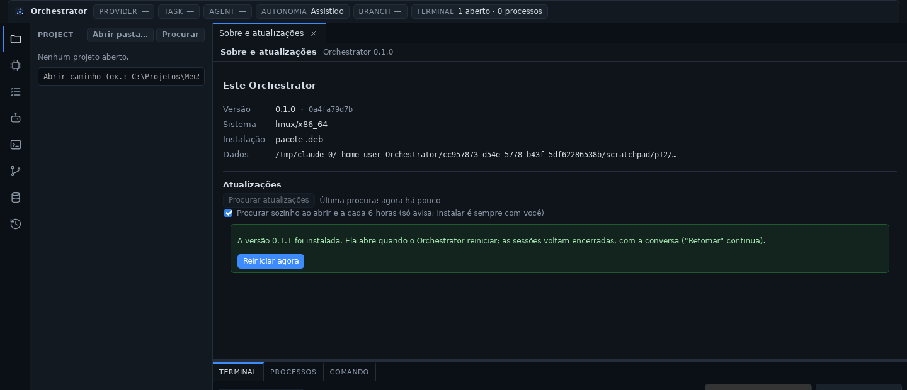

# Fase 12 — Instaladores, release e atualização automática

## STATUS

✅ **Concluída.** O plano do documento mestre terminou na Fase 11; o escopo
desta fase foi escolhido pelo usuário. Com ela o Orchestrator passa a ser
instalado e atualizado como um produto:

- **instaladores** para Windows (`.exe` por usuário e `.msi`), macOS
  (`.app`/`.dmg` universal) e Linux (`.deb`, `.rpm`, AppImage);
- **uma versão só**, gravada e conferida por `scripts/version.mjs` (também
  contra a tag do release, e na CI);
- **release pelo GitHub Actions**: a tag `vX.Y.Z` gera os instaladores nos
  três sistemas e um release em rascunho com o manifesto de atualização;
- **atualização automática assinada**: o app procura, avisa e, quando o
  usuário pede, para os agentes com handoff, baixa, confere a assinatura e
  instala; "Reiniciar agora" abre a versão nova;
- **aba "Sobre e atualizações"**, chip na barra de status e o evento
  `APP_UPDATED` no histórico.




## Andamento

A fase foi feita em seis passos, cada um commitado e enviado ao terminar,
para poder ser retomada de onde parou.

1. ✅ ADR-0019 e este arquivo.
2. ✅ Empacotamento: metadados e pacotes por sistema no `tauri.conf.json`,
   `scripts/version.mjs` (gravar e conferir a versão) e o `--check` na CI.
3. ✅ Workflow `release.yml`: pacotes nos três sistemas, release em
   rascunho por tag, artefatos quando um push mexe no empacotamento.
4. ✅ Updater no desktop: plugin, `updates.json`, comandos, progresso,
   `APP_UPDATED`; testes.
5. ✅ UI: aba "Sobre e atualizações" e chip na barra de status; testes.
6. ✅ Validação: pacotes Linux gerados e instalados no container, uma
   atualização assinada de ponta a ponta, documentação e publicação.

## Decisões registradas antes do código

- [ADR-0019](../adr/0019-instaladores-release-e-atualizacao.md):
  - **pacotes:** `nsis` (por usuário, pt-BR e inglês) e `msi`; `app`/`dmg`
    universal, macOS 11+; `deb`/`rpm` (recomendam `git`) e AppImage;
  - **versão:** o `package.json` da raiz manda; o script grava e confere;
  - **release:** rascunho criado pelo workflow, publicado pelo usuário;
    push que mexe no empacotamento gera os pacotes como artefatos;
  - **assinatura das atualizações:** chave privada e senha só nos segredos
    do GitHub, chave pública numa variável; sem elas, instaladores sem
    updater (e um aviso);
  - **updater só do lado Rust**, registrado só quando o build traz a chave
    pública; a webview não ganha as permissões do plugin;
  - **o usuário instala**: o app só procura e avisa; instalar para os
    agentes com handoff antes;
  - `APP_UPDATED` na primeira abertura de uma versão nova; **nenhuma
    migração**.

## Arquivos criados

- `docs/adr/0019-instaladores-release-e-atualizacao.md`.
- `scripts/version.mjs` e `scripts/version.test.mjs`.
- `.github/workflows/release.yml`.
- `apps/desktop/src-tauri/src/update_commands.rs`: configuração embutida
  (chave, endereço, commit), `updates.json`, estado do updater, procura
  (manual e automática), instalação com progresso, reinício, erros em
  português, `APP_UPDATED`; testes.
- `apps/desktop/src/components/AboutView.tsx`: aba "Sobre e atualizações".
- `apps/desktop/src/lib/updates.ts` (+ teste) e `lib/useUpdates.ts`.
- `docs/release.md`, este relatório e `docs/assets/fase-12-atualizacao.png`,
  `fase-12-instalada.png`.

## Arquivos modificados

- `apps/desktop/src-tauri/tauri.conf.json`: pacotes, metadados, NSIS,
  macOS, `deb`/`rpm`, versão lida do `package.json`, configuração do
  updater.
- `apps/desktop/src-tauri`: `Cargo.toml` (`tauri-plugin-updater`, `tokio`
  em todos os sistemas), `build.rs` (variáveis embutidas), `lib.rs`
  (plugin, estado, `APP_UPDATED`, procura automática, comandos).
- `packages/core/src/event.rs`: `APP_UPDATED`.
- `apps/desktop/src`: `App.tsx` (aba, chip, texto de boas-vindas),
  `StatusBar.tsx` (chip e versão clicável), `HistoryPanel.tsx`,
  `lib/types.ts`, `lib/runtime.ts` (`updateApi`), `lib/events.ts`
  (`runtime://update`), `styles.css`.
- `package.json` (`version:set`, `version:check`, `test:scripts`),
  `Cargo.toml` (workspace), `Cargo.lock`, `.github/workflows/ci.yml`.
- Documentação: `README.md`, `ARCHITECTURE.md`, `docs/ipc.md`, índices de
  ADRs e de fases.

## Dependências instaladas

- `tauri-plugin-updater` 2.13 (Rust; traz `minisign-verify` para conferir
  as assinaturas).
- Na CI: `tauri-apps/tauri-action@v0` e `actions/upload-artifact@v4`.

## Comandos executados

```bash
node --test scripts/version.test.mjs
pnpm version:check
cargo test --workspace
cargo +1.98.0 clippy -p orchestrator-desktop -p orchestrator-core --all-targets -- -D warnings
pnpm check
pnpm test:web
pnpm tauri signer generate --ci -p … -w <scratchpad>/orchestrator.key   # chave de TESTE, fora do repositório
pnpm tauri build --config <conf com a chave pública e o servidor local>  # 0.1.0, 0.1.1 e 0.1.2 assinadas
dpkg -i Orchestrator_0.1.0_amd64.deb                                    # e o app instalado sob Xvfb
```

## Testes executados

| Suíte | Qtde | Cobre |
| ----- | ---- | ----- |
| `scripts/version.test.mjs` (novo) | 6 | tag → versão; só a versão do workspace muda no `Cargo.toml`; o `Cargo.lock` só pelos crates do workspace; versão do Tauri por caminho de `package.json`; o que diverge (e a tag) em palavras; um repositório montado como este |
| Desktop (novos) | 5 | `updates.json` ida e volta e arquivo quebrado; versão nova notada, com `updater` ou `installer`; abrir grava a versão uma vez e mantém a escolha do usuário; erros do updater em português; build sem a chave não procura |
| Frontend (novos) | 4 | tipo de instalação, tamanhos e progresso, "última procura", chip da barra de status |
| CI de instaladores | 3 | `release.yml` gerou `nsis`/`msi`, `app`/`dmg` universal e `deb`/`rpm`/AppImage nos runners do GitHub |
| Manual (pacotes reais) | — | ver abaixo |

Validação manual, com uma chave de teste (só no scratchpad) e um servidor
de atualização local:

- **Pacotes:** o build assinado gerou `Orchestrator_0.1.0_amd64.deb`,
  `Orchestrator-0.1.0-1.x86_64.rpm` e `Orchestrator_0.1.0_amd64.AppImage`,
  cada um com a sua `.sig`. O `.deb` declara `Depends: libwebkit2gtk-4.1-0,
  libgtk-3-0`, `Recommends: git`, a página do projeto e a descrição longa.
- **Instalação:** `dpkg -i` instalou `/usr/bin/orchestrator-desktop`, o
  ícone e o atalho; o app instalado abriu num perfil limpo, e a aba "Sobre
  e atualizações" mostrou versão, commit, "Instalação: pacote .deb" e as
  pastas de dados.
- **Procura automática sem servidor:** 15 s depois de abrir, a procura
  falhou (servidor ainda não estava no ar) e ficou registrada.
- **Versão nova:** com o `latest.json` anunciando a 0.1.1, "Procurar
  atualizações" mostrou "Versão 0.1.1 disponível", a data e as notas, e a
  barra de status "⬆ Atualização 0.1.1".
- **Assinatura adulterada:** com a assinatura de outro arquivo no
  manifesto, "Baixar e instalar" baixou o pacote e **recusou**, e o `dpkg`
  seguiu na versão anterior.
- **Atualização de verdade:** com a assinatura certa, o pacote foi baixado,
  conferido e instalado (`dpkg` 0.1.1); "Reiniciar agora" abriu a 0.1.1, e
  o histórico registrou `APP_UPDATED` "0.1.0 → 0.1.1", `via: updater`.
- **De novo, da 0.1.1 para a 0.1.2**, e da 0.1.2 o manifesto adulterado de
  uma "0.1.3" (encontrado pela procura automática, com o chip) foi
  recusado com "a assinatura do pacote não confere com a chave deste
  Orchestrator (nada foi instalado)".
- **Instalador manual:** `dpkg -i` da 0.1.1 por cima da 0.1.2 →
  `APP_UPDATED` "0.1.2 → 0.1.1", `via: installer`.
- **AppImage:** abriu como "Instalação: AppImage" e procurou o pacote
  `linux-x86_64-appimage` no manifesto (o de teste só tinha o `deb`).
- **Procurar sozinho:** desligar e ligar gravou `autoCheck` no
  `updates.json`.
- Banco no esquema 4, `integrity_check` ok.

## Resultado dos testes

- Rust: **317/317** (desktop 8, demais como na Fase 11; 1 teste de
  inspeção ignorado de propósito). `cargo clippy` do Rust 1.98 (o da CI)
  limpo no desktop e no core.
- Frontend: **72/72**; `tsc` limpo. Script de versão: **6/6**.
- `cargo clippy -D warnings` e `cargo fmt --check` limpos.

## Problemas encontrados

| Problema | Resolução |
| -------- | --------- |
| O bundler do macOS tentava assinar o app (e falhava no `security import`) porque `APPLE_CERTIFICATE` existia vazia sem o segredo | As variáveis `APPLE_*` só são exportadas quando os segredos existem; sem eles, um aviso |
| Gerar os artefatos de atualização falhava: o CLI confere cada assinatura com a chave pública do `tauri.conf.json`, que é vazia no repositório | O workflow (e o build de validação) passam a chave pública também na configuração do build |
| Um filtro de caminhos por pull request compara o PR inteiro com a base: com o PR #1, os instaladores seriam gerados a cada push | Filtro por push (só os commits enviados); tags sempre geram |
| A procura automática que falhava não avisava a interface, que seguia em "ainda não procurou" | Evento `checked` ao fim de toda procura |
| Erros do plugin chegavam em inglês ("The signature verification failed") | Os principais em português: assinatura, rede, manifesto, sistema sem pacote, senha, gerenciador de pacotes |
| O resumo de `APP_UPDATED` dizia "atualizado" também ao voltar para uma versão anterior | "mudou de versão: A → B" |
| Os avisos da aba ficavam recuados em relação ao resto | Margens próprias na aba |
| O disco do container encheu durante um build extra do Rust 1.98 | Builds de conferência sem cache incremental e apagados ao fim |

**Limitações conhecidas:**

- Nenhum release foi publicado: criar e publicar o primeiro é do usuário
  (`docs/release.md`), depois de gerar a chave e os segredos.
- Assinatura de código: macOS pronto para os segredos `APPLE_*`; Windows
  ainda sem certificado (SmartScreen avisa).
- Validação manual só no Linux (`deb`; AppImage aberto, sem atualizar,
  porque o container não tem FUSE). Windows e macOS: pacotes gerados na
  CI, sem instalar.
- A parada dos agentes antes de instalar usa o "Parar todos" (testado na
  Fase 8b), mas não foi exercida com um agente rodando nesta validação.
- `deb`/`rpm` instalam pelo `pkexec`/`sudo`: num desktop sem eles a
  instalação falha e o usuário instala pelo terminal.
- Sem canais (estável/beta), sem ARM no Windows e no Linux.

## Próxima fase

Não há próxima fase definida. O que ficou para depois está nas seções
"Fica para depois" das ADRs — da 0019: canais e instalação ao fechar,
assinatura no Windows, lojas (Microsoft Store, Mac App Store, Flathub,
Homebrew, winget) e ARM.
