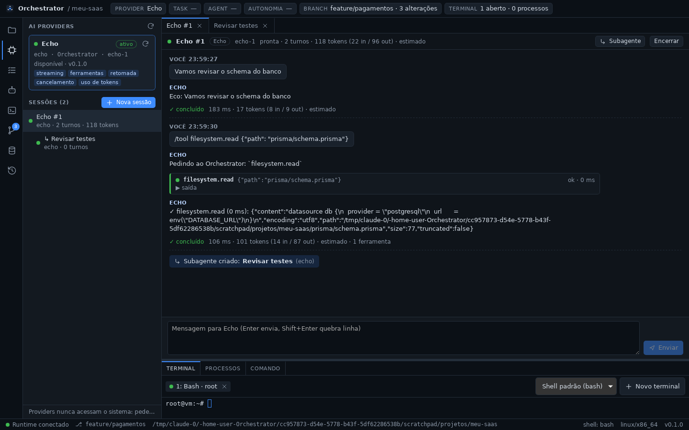

# Fase 3 — AIProvider, Provider Registry e Provider Sessions

## STATUS

✅ **Concluída.** O Orchestrator tem a camada de providers: a interface comum
`AIProvider`, o registro de providers com provider ativo e as sessões, que
pertencem ao Orchestrator. As sessões têm streaming, tool calls executadas
pelo Tool Runtime, cancelamento, encerrar/retomar, subagentes e uso de
tokens. Nenhum fornecedor está conectado ainda: OpenAI/Codex é a Fase 4 e
Claude Code a Fase 5. O contrato é exercitado de ponta a ponta pelo provider
de desenvolvimento `echo` (sem IA).



## Decisões registradas antes do código

- [ADR-0009](../adr/0009-camada-de-providers-e-sessoes.md):
  - onde ficam trait, registro e sessões (`packages/providers`) e os
    contratos compartilhados (`core/session.rs`);
  - mapeamento 1:1 da interface da seção 18;
  - `TurnContext::call_tool` como única saída do provider para o sistema,
    com origem montada pelo Orchestrator;
  - sessão dona do Orchestrator, um turno por vez, transcript numerado;
  - eventos `SESSION_STARTED`/`SESSION_RESUMED`/`SESSION_CLOSED`/`TURN_COMPLETED`
    e `StreamEvent::Session`;
  - `PROVIDER_SWITCHED` ao trocar o provider ativo;
  - comandos IPC próprios e cancelamento com prazo;
  - provider `echo` só em builds de desenvolvimento (ou com variável de
    ambiente).

## Arquivos criados

**Rust — `packages/providers` (`orchestrator-providers`, novo crate)**
- `src/provider.rs`: trait `AIProvider`, descritor, capacidades, status,
  `NativeSession`, `SessionSpec`.
- `src/context.rs`: `TurnContext` (saída, uso, avisos, cancelamento,
  `call_tool`), `ToolExecutor`, `TurnObserver`.
- `src/registry.rs`: `ProviderRegistry`.
- `src/manager.rs`: `SessionManager` (sessões, turnos, cancelar,
  encerrar/retomar, subagentes, histórico).
- `src/log.rs`: transcript com fusão de trechos e limite.
- `src/echo.rs`: provider de desenvolvimento.
- `src/error.rs`, `src/lib.rs`.
- `tests/sessions.rs`: contrato de ponta a ponta com o Tool Runtime real.
- `Cargo.toml`.

**Rust — `packages/core`**
- `src/session.rs`: `SessionInfo`, `SessionEvent`, `SessionLogEntry`,
  `TokenUsage`, `SessionStatus`, `TurnStatus`, `NoticeLevel`.

**Rust — `apps/desktop/src-tauri`**
- `src/provider_commands.rs`: 11 comandos de providers/sessões e
  `RuntimeTools` (executor sobre o `ToolRuntime`).

**TypeScript — `apps/desktop/src`**
- `components/ProvidersPanel.tsx`: painel AI PROVIDERS com providers,
  disponibilidade, capacidades, provider ativo e árvore de sessões do projeto.
- `components/SessionView.tsx`: transcript ao vivo, entrada, cancelar,
  encerrar/retomar, subagente.
- `lib/transcript.ts` (+ teste): transcript = snapshot + eventos, por `seq`.
- `lib/useProviders.ts`.

**Documentação**
- ADR-0009, `docs/providers.md`, `docs/phases/fase-3.md`,
  `docs/assets/fase-3-sessao.png`.

## Arquivos modificados

- `packages/core`:
  - `ids.rs`: `SessionId`, `TurnId`, `ProviderId`;
  - `tool.rs`: `CallOrigin::Agent` ganhou `sessionId`/`provider` e surgiu
    `ToolErrorKind::Cancelled`;
  - `event.rs`: 4 `EventKind` novos e `StreamEvent::Session`;
  - `lib.rs`, `README.md`.
- `apps/desktop/src-tauri`: `lib.rs` registra providers, cria o
  `SessionManager` e cancela turnos ao sair; `Cargo.toml`.
- `apps/desktop/src`:
  - `App.tsx`: painel AI PROVIDERS, abas de sessão e badge de sessões ativas;
  - `ContextBar`: provider atual real;
  - `HistoryPanel`: origem "IA · sessão" e filtros dos novos eventos;
  - `icons.tsx`, `lib/types.ts`, `lib/runtime.ts` (`providerApi`,
    `sessionApi`, `ProviderCallError`), `styles.css`.
- Documentação e configuração:
  - `ARCHITECTURE.md`, `README.md`, `docs/ipc.md`, `docs/tool-runtime.md`;
  - ADR-0006 e o índice de ADRs;
  - `packages/providers/README.md`;
  - `.github/workflows/ci.yml` (clippy e testes do novo crate nos 3 SOs);
  - `Cargo.toml`, `Cargo.lock`.

## Dependências instaladas

| Onde | Dependência | Motivo |
| ---- | ----------- | ------ |
| Rust (providers, desktop) | `async-trait` 0.1 | trait async usada como `dyn AIProvider` |
| Rust (providers) | `tokio-util` 0.7 | `CancellationToken` (já estava no lockfile como dependência transitiva) |

## Comandos executados

```bash
cargo test -p orchestrator-core
cargo test -p orchestrator-providers            # repetido 5× sem falhas
pnpm check        # tsc + cargo fmt --check + cargo clippy -D warnings (workspace)
pnpm test         # cargo test --workspace + vitest
cargo clippy -p orchestrator-core -p orchestrator-providers -p orchestrator-runtime \
  -p orchestrator-git -p orchestrator-desktop --all-targets --target x86_64-pc-windows-gnu -- -D warnings
cargo check -p orchestrator-providers --all-targets --target x86_64-apple-darwin
pnpm tauri dev                     # app real sob Xvfb
pnpm tauri build --no-bundle       # build de release, com e sem ORCHESTRATOR_ECHO_PROVIDER=1
```

## Testes executados

| Suíte | Qtde | Cobre |
| ----- | ---- | ----- |
| `orchestrator-core` (novos) | 4 | serialização de `SessionEvent` e `StreamEvent::Session`, soma de `TokenUsage`, `CallOrigin` de sessão (e compatibilidade com o formato antigo) |
| `orchestrator-providers` (unit) | 7 | comandos do `echo`, estimativa de tokens, fusão de trechos e limite do transcript, erros |
| `orchestrator-providers` (integração) | 12 | streaming com uso de tokens e `seq` crescente; tool call executada pelo Tool Runtime real com a sessão como origem (`TOOL_CALLED`); erro de ferramenta devolvido ao provider; cancelar (e `BUSY` durante o turno); falha sem matar a sessão; encerrar cancela e retomar reabre; `execute` sem streaming; subagentes (mesmo provider e outro); registro (ativo, `PROVIDER_SWITCHED`, duplicado, inexistente, sem providers); provider que ignora o cancelamento é abandonado e não inicia ferramentas; ferramenta em andamento termina e é registrada após o abandono; **provider que entra em pânico** falha o turno sem travar a sessão |
| Frontend (vitest, novos) | 7 | transcript: turno completo, turno em andamento, junção snapshot + eventos sem duplicar, trechos fundidos, resultado de ferramenta sem pedido, subagente e aviso, formatação de uso |
| Manual (app real) | — | painel AI PROVIDERS (disponibilidade, capacidades, ativo); nova sessão no projeto; `/help`; streaming; `/tool filesystem.read`/`process.list`/`git.status`; `/tool filesystem.write` → arquivo aparece no GIT e no explorer, `FILE_CHANGED` com origem "IA echo"; `/wait` + Cancelar; `/fail`; subagente pela UI (árvore e link de volta); encerrar/retomar; barra de contexto e badge com sessão ativa; HISTORY com `SESSION_*`, `TURN_COMPLETED`; release sem providers (estado vazio) e com `ORCHESTRATOR_ECHO_PROVIDER=1`; encerramento por SIGTERM |

## Resultado dos testes

- Rust: **119/119** (core 13, desktop 3, git 19, providers 19, runtime 65);
  integração de providers repetida 5× sem falhas.
- Frontend: **27/27**; `tsc` limpo.
- `cargo clippy -D warnings` limpo no Linux e no alvo Windows (incluindo o
  crate Tauri); `cargo fmt --check` limpo; checagem cruzada para macOS OK.
- Windows e macOS: testes rodam no CI.

## Problemas encontrados

| Problema | Resolução |
| -------- | --------- |
| Um adapter que entrasse em pânico deixaria a sessão "em execução" para sempre | O provider roda numa tarefa própria: pânico vira turno `failed` e a sessão continua utilizável (teste dedicado) |
| Chamada de ferramenta interrompida no meio perderia o `TOOL_CALLED` | Cada chamada roda numa tarefa própria: termina e é registrada mesmo com o turno abandonado |
| O transcript deixava de acompanhar a saída: eventos de rolagem causados pela própria rolagem automática chegavam depois de mais conteúdo | Rolagens automáticas são ignoradas ao decidir se o usuário saiu do fim |
| Erro de turno aparecia duas vezes e a faixa extra escondia o fim do transcript | Erro mostrado só no fim do turno |
| Ajuda do `echo` perdia a indentação (continuação `\` do Rust remove espaços iniciais) | Texto reescrito como lista |
| Saída grande de ferramenta demorava a aparecer (streaming palavra por palavra) e poluía o transcript | Resultado citado de uma vez e resumido (o completo fica no cartão da ferramenta) |
| "1 tool calls" no histórico; cabeçalho de sessões quebrando linha | Corrigidos |

**Limitações conhecidas:**

- Sessões e transcripts ficam em memória e se perdem ao fechar o app. A
  `NativeSession` já é guardada para retomada; a persistência vem na Fase 6
  (`agent_sessions`, `messages`).
- Tool calls de IA não passam por gate de autonomia até a Fase 9; são
  auditadas como qualquer outra.
- Com um só provider no app (`echo`), a troca de provider foi validada pelos
  testes, não pela UI.
- O xdotool não digita caracteres acentuados sob Xvfb; mensagens com acento
  foram cobertas pelos testes Rust e de frontend.

## Próxima fase

**Fase 4 — OpenAI/Codex provider:** adapter em `packages/providers/openai`
implementando `AIProvider`, com as ferramentas do Orchestrator oferecidas ao
modelo via `ctx.tools()`/`ctx.call_tool`, uso de tokens/custo reportado e
cancelamento. A forma de integração (API ou CLI do Codex) será registrada
em ADR antes do código.
