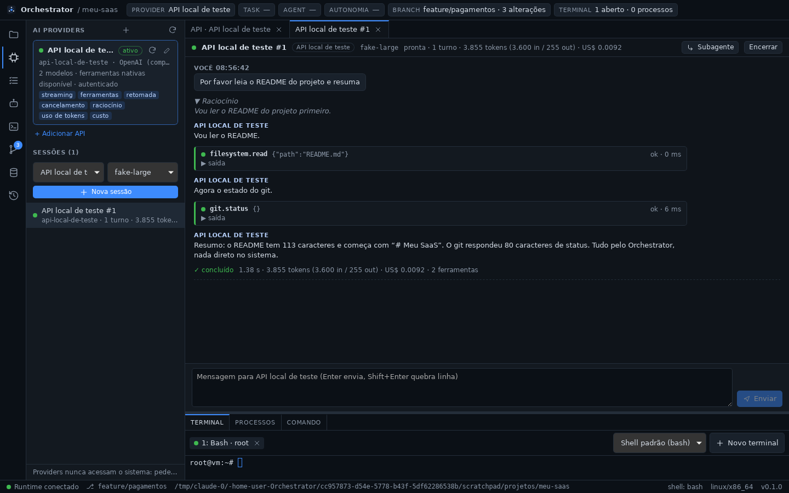

# Fase 4 — Providers por API com cadastro livre

## STATUS

✅ **Concluída.** O usuário cadastra **quantas APIs de IA quiser**, e cada
conexão vira um provider:

- tipos nativos: OpenAI e qualquer API compatível, Anthropic e Gemini;
- tipo genérico: qualquer API HTTP/JSON descrita por perfil, sem código;
- chave no cofre do sistema ou em variável de ambiente, nunca em arquivo,
  histórico, log ou interface;
- modelos descobertos na própria API, com preços para o custo por turno;
- ferramentas para qualquer modelo (chamada nativa ou protocolo por prompt),
  sempre executadas pelo Orchestrator;
- teste de conexão antes de salvar.

A direção da fase mudou a pedido do usuário: **APIs em vez de CLIs**
(Codex CLI, Claude Code), cadastro livre e, na Fase 5, um roteador com
Conselho de IAs. A mudança foi registrada na ADR-0010 antes do código.




## Decisões registradas antes do código

- [ADR-0010](../adr/0010-providers-por-api-com-cadastro-livre.md):
  - providers só por API. `packages/providers/openai` e `claude` dão lugar a
    um único crate, `packages/providers/api`;
  - tipos `openai`, `anthropic`, `gemini` e `generic` (perfil que descreve
    qualquer API);
  - modos de ferramentas `native`, `prompt` e `none`. O catálogo vai ao
    modelo com o JSON Schema gerado dos próprios tipos do runtime;
  - credenciais no cofre do SO ou em variável de ambiente;
  - conexões em `connections.json`, sem segredos, com eventos
    `CONNECTION_SAVED`/`CONNECTION_REMOVED`;
  - limite de rodadas visível (não é restrição de operações), custo pelos
    preços informados e teste de conexão;
  - nova ordem: Fase 5 = Roteador de modelos + Conselho (Sugerir / Full).
- Durante a validação no app, a ADR-0010 foi complementada (item 6): a
  sessão usa o provider registrado **a cada turno**. Editar a conexão vale
  para as sessões abertas sem perder a conversa. Remover ou desativar faz
  o próximo turno falhar com mensagem clara.
- ADR-0009 marcada como parcialmente substituída (adapters) e ADR-0006
  atualizada (CI).

## Arquivos criados

**Rust — `packages/providers/api` (`orchestrator-provider-api`, novo crate)**
- `src/config.rs`: `Connection`, `ModelEntry`, credencial, `ToolMode`,
  opções de protocolo, `GenericProfile`, validação.
- `src/manager.rs`: `ConnectionManager`:
  - `connections.json` gravado de forma atômica;
  - cofre (gravar, mover ao renomear, apagar ao remover);
  - registro (`replace`/`unregister`) e histórico de conversa por conexão;
  - eventos `CONNECTION_*`, teste e descoberta de modelos.
- `src/provider.rs`: `ApiProvider` (`AIProvider`):
  - loop modelo → ferramentas → modelo com limite de rodadas;
  - custo, descoberta de modelos, `inspect` e teste de conexão.
- `src/protocol.rs`: trait `Protocol` (requisição, decodificador, modelos).
- `src/openai.rs`, `src/anthropic.rs`, `src/gemini.rs`, `src/generic.rs`:
  um módulo por protocolo.
- `src/tools.rs`: nomes `grupo__acao`, protocolo por prompt
  (`<tool_call>`/`<tool_result>`), `MarkupFilter`, schema do Gemini,
  ferramenta de teste `orchestrator.ping`.
- `src/conversation.rs`: conversa append-only com as partes nativas
  preservadas.
- `src/http.rs`: cliente `reqwest` com cancelamento, leitor SSE/NDJSON,
  mapeamento de erros HTTP sem URL.
- `src/jsonpath.rs`: caminhos com pontos, modelo de corpo, mescla profunda.
- `src/secrets.rs`: `SecretStore` e cofre em memória.
- `src/presets.rs`: pontos de partida (OpenAI, Anthropic, Gemini,
  OpenRouter, compatível, Ollama, Ollama nativo por perfil, genérico).
- `tests/api.rs`, `tests/support/mod.rs`: servidor HTTP falso que imita cada
  protocolo e harness com o Tool Runtime real.
- `Cargo.toml`, `README.md`.

**Rust — outros**
- `packages/runtime/src/schema.rs`: JSON Schema dos argumentos de cada
  ferramenta (`ToolRuntime::definitions()`).
- `apps/desktop/src-tauri/src/vault.rs`: `OsVault` sobre `keyring`
  (Windows, macOS, Secret Service).

**TypeScript — `apps/desktop/src`**
- `components/ConnectionEditor.tsx`:
  - escolha do ponto de partida e formulário da conexão;
  - credencial com indicação de chave guardada e opção de removê-la;
  - tabela de modelos (ativo, padrão, contexto, preços, etiquetas),
    "Buscar modelos" e modo de ferramentas;
  - perfil genérico e seção avançada (headers, corpo extra, opções);
  - Testar / Salvar / Excluir, com o relatório do teste.
- `lib/connections.ts` (+ teste): slug do id, mescla de modelos
  descobertos, JSON, preços.
- `lib/useConnections.ts`.

**Documentação**
- ADR-0010, `docs/api-connections.md`, `docs/phases/fase-4.md`,
  `packages/providers/api/README.md`, `docs/assets/fase-4-sessao.png`,
  `docs/assets/fase-4-conexao.png`.

## Arquivos modificados

- `packages/core`:
  - `tool.rs`: `ToolDefinition` (com `parameters`);
  - `event.rs`: `CONNECTION_SAVED`, `CONNECTION_REMOVED`;
  - `lib.rs`; comentários em `session.rs`.
- `packages/runtime`: `schemars::JsonSchema` e comentários de campo (viram
  `description`) nos argumentos de todas as ferramentas; `lib.rs`
  (`definitions()`); `Cargo.toml`.
- `packages/git`: `JsonSchema` em `ResetMode` e `PullMode`; `Cargo.toml`.
- `packages/providers`:
  - `context.rs`: `ToolExecutor::tools()` devolve `ToolDefinition`;
  - `provider.rs`: `ModelInfo` com preços, suporte a ferramentas e
    etiquetas;
  - `registry.rs`: `replace`/`unregister`;
  - `manager.rs`: provider resolvido pelo registro a cada turno, retomada e
    subagente;
  - `echo.rs`, `lib.rs`, `tests/sessions.rs` (1 teste novo, 1 ampliado),
    `README.md`.
- `packages/providers/openai/README.md` e `claude/README.md`: removidos
  (ADR-0010).
- `apps/desktop/src-tauri`:
  - `lib.rs`: `ConnectionManager` com o cofre do SO, registrado antes do
    `SessionManager`;
  - `provider_commands.rs`: 5 comandos de conexões e `tools()` com schemas;
  - `Cargo.toml`.
- `apps/desktop/src`:
  - `App.tsx`: aba de conexão, sessão com provider e modelo, tela inicial;
  - `ProvidersPanel.tsx`:
    - "Adicionar API" e edição de cada conexão;
    - conexões desativadas, avisos, estado da chave;
    - escolha de provider e modelo da sessão nova;
    - sessões de provider indisponível;
  - `SessionView.tsx`: aviso e envio bloqueado quando o provider saiu do
    registro;
  - `HistoryPanel.tsx`: filtros `CONNECTION_*`;
  - `ContextBar.tsx`, `lib/types.ts`, `lib/runtime.ts` (`connectionApi`);
  - `lib/useProviders.ts`: atualiza e reinspeciona ao salvar ou remover;
  - `styles.css`, incluindo a correção de layout no WebKitGTK (abaixo).
- Documentação e configuração:
  - `ARCHITECTURE.md`, `README.md`, `docs/providers.md`, `docs/ipc.md`,
    `docs/tool-runtime.md`;
  - ADR-0006, ADR-0009 e o índice de ADRs;
  - `.github/workflows/ci.yml` (clippy e testes do novo crate nos 3 SOs);
  - `Cargo.toml`, `Cargo.lock`.

## Dependências instaladas

| Onde | Dependência | Motivo |
| ---- | ----------- | ------ |
| Rust (provider-api) | `reqwest` 0.12 (rustls + certificados do sistema, streaming, http2) | HTTP para as APIs de IA; sem OpenSSL |
| Rust (provider-api) | `futures-util` 0.3 (só `std`) | já no lockfile como dependência transitiva |
| Rust (runtime, git) | `schemars` 1 | JSON Schema dos argumentos a partir dos tipos |
| Rust (desktop) | `keyring` 3 (`windows-native`, `apple-native`, `sync-secret-service`, `crypto-rust`) | cofre do sistema operacional |

No Linux, `keyring` usa D-Bus, que o Tauri já exigia (via `tao`): nenhuma
dependência de sistema nova.

## Comandos executados

```bash
cargo test -p orchestrator-provider-api          # unitários + integração
cargo test -p orchestrator-provider-api -p orchestrator-providers   # 5× seguidas, sem falhas
cargo test --workspace
pnpm check        # tsc + cargo fmt --check + cargo clippy -D warnings (workspace)
pnpm test:web
cargo clippy -p orchestrator-core -p orchestrator-providers -p orchestrator-provider-api \
  -p orchestrator-runtime -p orchestrator-git -p orchestrator-desktop \
  --all-targets --target x86_64-pc-windows-gnu -- -D warnings
cargo check -p orchestrator-providers --all-targets --target x86_64-apple-darwin
pnpm tauri dev                  # app real sob Xvfb, com GNOME Keyring num D-Bus privado
pnpm tauri build --no-bundle    # release, validado num perfil limpo
```

Validação no app com uma API compatível com OpenAI simulada localmente
(servidor Python que emite SSE com raciocínio e chamadas de ferramenta, e
exige a chave), e com as APIs reais da Anthropic e do Gemini usando chaves
inválidas (para validar TLS, rede e erros sem gastar créditos).

## Testes executados

| Suíte | Qtde | Cobre |
| ----- | ---- | ----- |
| `orchestrator-provider-api` (unit) | 16 | presets válidos; nomes `grupo__acao`; resultados truncados; protocolo por prompt (parse e ocultação, inclusive entre pedaços do stream); schema do Gemini; fallback da Anthropic (quando entra, proxy, desligado) e fallback no meio do stream; caminhos, modelo de corpo e mescla; SSE e linhas com UTF-8 partido/CRLF; erros HTTP (incl. chave inválida do Gemini); padrões e validação da conexão |
| `orchestrator-provider-api` (integração) | 14 | OpenAI com streaming e ferramentas executadas pelo Tool Runtime real; Anthropic devolvendo `thinking`/`tool_use` intactos; recusa da Anthropic sem executar nada; assinaturas do Gemini e dialeto de schema; API genérica com protocolo por prompt; erros HTTP e API fora do ar; credencial ausente; descoberta de modelos nos 4 tipos; persistência sem chaves, renomear e remover; teste de conexão; limite de rodadas; argumentos inválidos devolvidos sem executar; cancelamento no meio do stream; **editar a conexão com sessão aberta** (nova chave e header valem no turno seguinte, com a conversa) e remover (turno falha e nada é enviado) |
| `orchestrator-providers` (integração) | 1 novo, 1 ampliado | sessão segue o provider registrado: substituído → nova instância; subagente; removido → `UNAVAILABLE`; reabilitado → volta a funcionar. O teste do registro passou a cobrir `replace`/`unregister` e `PROVIDER_SWITCHED` com `reason: "removed"` |
| `orchestrator-runtime` (novos) | 2 | toda ferramenta do catálogo tem schema de objeto; formato (`camelCase`, `required`, sem `$ref`/`title`) |
| Frontend (vitest, novos) | 5 | slug do id, mescla de modelos descobertos sem sobrescrever edições, ativação automática na primeira descoberta, JSON, preços |
| Manual (app real, dev e release) | — | ver abaixo |

Validação manual:

- **Cadastro e teste:**
  - estado vazio e pontos de partida;
  - formulário com id automático, "Buscar modelos" (padrão escolhido
    sozinho), preços decimais com vírgula e etiquetas;
  - Testar conexão antes de salvar (resposta, latência, ferramenta de teste,
    tokens e custo);
  - salvar com a chave no **GNOME Keyring**: o arquivo e o histórico não
    têm a chave, e a UI mostra "guardada no cofre".
- **Sessões:**
  - sessão com provider e modelo escolhidos;
  - turno com raciocínio, `filesystem.read` e `git.status` executados pelo
    Orchestrator, e custo batendo com os preços;
  - reinício do app: conexão recarregada e chave lida do cofre
    ("autenticado").
- **Credenciais e APIs reais:**
  - credencial por variável de ambiente (e variável ausente);
  - TLS real: api.anthropic.com → 401 com mensagem clara;
    Gemini via proxy → chave inválida reconhecida.
- **Edição e remoção:**
  - desativar a conexão: sessão com aviso e envio bloqueado;
  - reativar: a conversa continua, e a API recebeu o histórico;
  - excluir (confirmação, chave apagada, provider ativo passa ao próximo);
  - `CONNECTION_*` no HISTORY.
- **Release:** perfil limpo, cadastro com cofre, sessão com ferramentas e
  encerramento por SIGTERM.

## Resultado dos testes

- Rust: **152/152** (core 13, desktop 3, git 19, provider-api 30,
  providers 20, runtime 67; 1 teste de inspeção ignorado de propósito).
  Suítes de providers repetidas 5× sem falhas.
- Frontend: **32/32**; `tsc` limpo.
- `cargo clippy -D warnings` limpo no Linux e no alvo Windows (incluindo o
  crate Tauri com o cofre do Windows); `cargo fmt --check` limpo.
- Checagem cruzada para macOS OK em `orchestrator-providers`. Para o novo
  crate, a checagem não roda aqui: o `ring` precisa do SDK da Apple. O CI
  compila e testa em macOS nativo.

## Problemas encontrados

| Problema | Resolução |
| -------- | --------- |
| Sessão aberta continuava com a instância antiga do provider: após editar a conexão ignorava a nova chave/URL; após removê-la seguia chamando a API com a chave em cache | A sessão resolve o provider pelo registro a cada turno. As instâncias de uma conexão compartilham o histórico de conversa. Removida ou desativada, o turno falha com mensagem clara e a UI avisa (testes nas duas camadas) |
| Barra de rolagem horizontal fantasma no formulário (só no WebKitGTK): o texto de um `<option>` longo vazava para a área rolável | `contain: paint` nos `<select>`. A coluna da área principal virou `minmax(0, 1fr)` (medido no inspetor do WebKit) |
| Não dava para digitar vírgula nas etiquetas nem decimais nos preços (o campo era normalizado a cada tecla) | Campo com texto próprio enquanto focado (`DraftInput`); o valor normalizado aparece ao sair |
| Chave inválida no Gemini aparecia como "requisição inválida" (a API responde 400) | `API_KEY_INVALID` tratado como erro de autenticação (teste) |
| Schema de ferramenta sem argumentos não tinha `properties`, exigido por algumas APIs | `properties` sempre presente (teste) |
| Após "Buscar modelos" nenhum modelo ficava como padrão | O primeiro modelo ativo vira o padrão quando não há um |
| Abas de conexão mostravam o id em vez do nome | Título pelo nome da conexão |
| Tela inicial e barra de contexto ainda citavam OpenAI/Codex e Claude Code | Textos atualizados para a nova ordem de fases |
| api.openai.com bloqueado pelo proxy do ambiente de desenvolvimento | TLS e erros validados com api.anthropic.com (direto) e Gemini (via proxy); o protocolo OpenAI foi validado com a API local simulada e os testes |

**Limitações conhecidas:**

- A conversa enviada à API, as sessões e os transcripts ficam em memória e
  se perdem ao fechar o app. A persistência vem na Fase 6.
- Não houve teste com chaves válidas de contas reais (dependem do usuário).
  Os protocolos foram validados por servidor falso e pelas respostas de erro
  reais das APIs.
- O custo não aplica desconto de cache de prompt.
- O provider ativo não é lembrado entre execuções (o primeiro registrado
  volta a ser o ativo). A escolha de modelo por atividade é o assunto da
  Fase 5.
- Imagens não são enviadas: `supportsVision` é só um dado do modelo por
  enquanto.
- Fechar a aba de uma conexão com alterações não salvas as descarta sem
  aviso.
- O xdotool não digita caracteres acentuados sob Xvfb; textos com acento
  foram cobertos pelos testes.

## Próxima fase

**Fase 5 — Roteador de modelos e Conselho de IAs.**

- Usar os dados de cada modelo das conexões (contexto, preços, suporte a
  ferramentas, etiquetas, disponibilidade) para recomendar o melhor modelo
  por atividade.
- O Conselho tem de 1 a N membros; com um membro, ele é o "gerenciador".
- Modo *Sugerir*: o usuário aprova. Modo *Full*: o conselho decide e aplica,
  ligado aos modos Autônomo e Acesso Irrestrito na Fase 9.
- Deliberações registradas no histórico, com cache para economizar tokens.
- A arquitetura será registrada em ADR própria antes do código.
