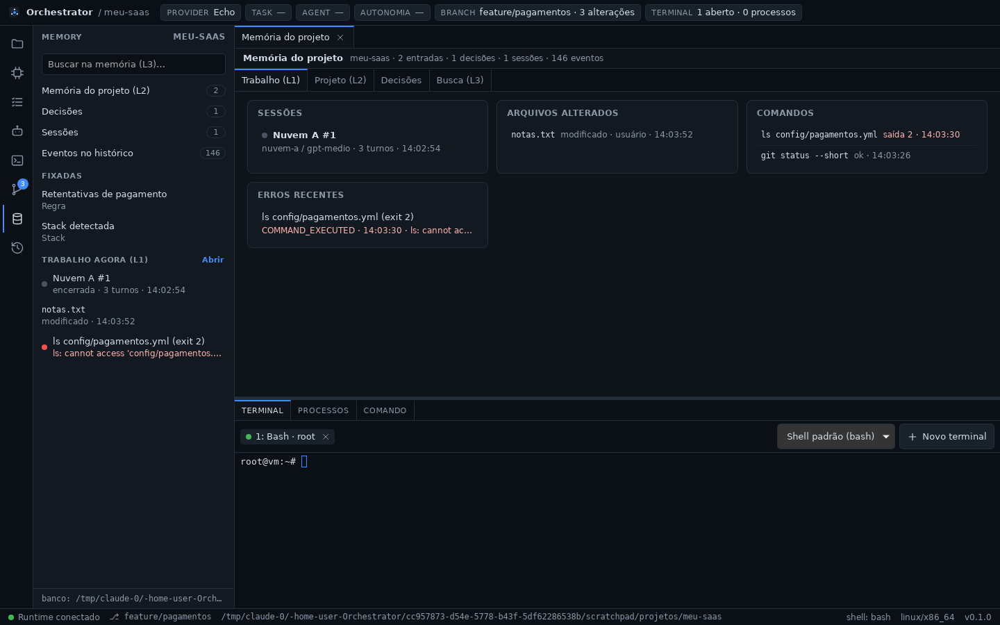
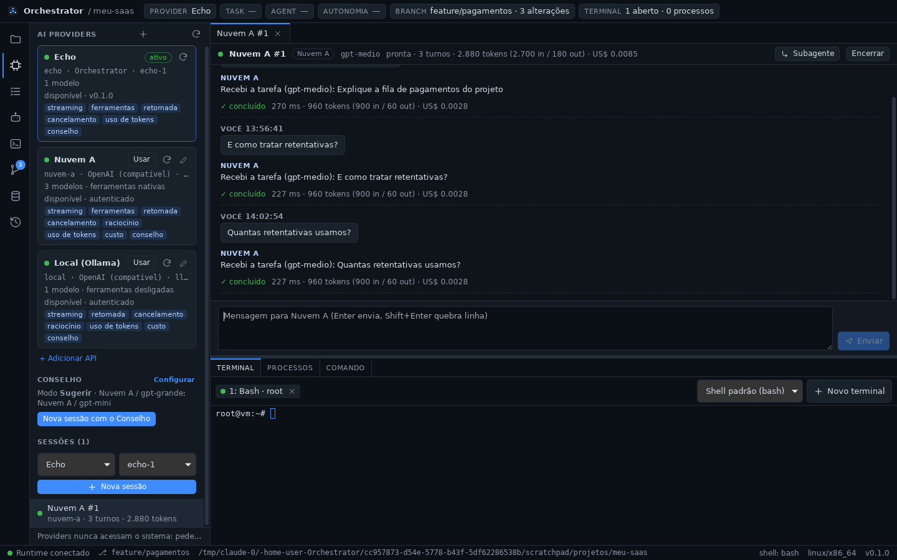

# Fase 6 — SQLite, memória e histórico

## STATUS

✅ **Concluída.** O Orchestrator passa a ter um banco local e a lembrar do
projeto depois de fechar:

- **banco local:** `orchestrator.db` (SQLite embutido) no diretório de dados
  do app, nunca dentro do projeto. Se o arquivo não abrir, o app usa um banco
  em memória e avisa;
- **histórico durável:** cada evento vai para o banco marcado com o projeto
  e a sessão. O HISTORY filtra por projeto e pagina sem limite. O
  `audit.jsonl` das fases anteriores é importado uma vez;
- **projetos:** registrados ao abrir (`PROJECT_CREATED` na primeira vez). A
  lista de recentes vem do banco;
- **sessões e conversas sobrevivem ao reinício:** transcript, uso e custo
  voltam, e "Retomar" continua a mesma conversa com a API;
- **memória do projeto:**
  - L1 (trabalho): sessões, arquivos, comandos e erros, derivados do
    histórico;
  - L2 (projeto): entradas editáveis, com a stack detectada entrando
    sozinha;
  - decisões, que nunca são apagadas;
  - L3: busca sem acento em memória, decisões, mensagens e eventos;
- **Conselho:** deliberações e cache continuam valendo entre execuções.






## Decisões registradas antes do código

- [ADR-0012](../adr/0012-sqlite-memoria-e-historico.md):
  - crate `packages/memory` (`orchestrator-memory`), com `rusqlite` e SQLite
    embutido, dependendo só de `core`;
  - um banco por instalação, em WAL, com migrações por `user_version`; tudo
    o que é de um projeto tem `project_id`;
  - esquema v1: `projects`, `audit_events` (+ view `tool_calls`),
    `sessions`, `session_entries`, `memory_entries`, `decisions`,
    `deliberations`, `search_index` (FTS5);
  - regra de marcação do projeto dos eventos e importação do JSONL;
  - `AIProvider::snapshot` e `SessionStore`: sessões voltam encerradas e
    retomáveis;
  - L1 derivada, L2 com origem (`user`, `agent`, `detector`), decisões por
    estado, L3 por FTS5;
  - eventos `MEMORY_SAVED`, `MEMORY_REMOVED`, `DECISION_SAVED`;
  - configuração continua em arquivos (`connections.json`, `council.json`);
    segredos só no cofre do SO.
- ADR-0005 marcada como substituída na parte do JSONL; ADR-0006 atualizada
  (CI com o crate novo).
- Refinamentos que surgiram na validação e foram registrados na ADR-0012:
  - a chamada `project.open` é remarcada pelo `PROJECT_OPENED` que ela
    gerou;
  - sessões restauradas são gravadas como encerradas.

## Arquivos criados

**Rust — `packages/memory` (`orchestrator-memory`, crate novo)**
- `src/db.rs`: abrir (WAL, `synchronous=NORMAL`, chaves estrangeiras,
  espera de 5 s), banco em memória, migração v1, recusa de esquema mais
  novo.
- `src/model.rs`: `Project`, `RecentImport`, `HistoryQuery`, `HistoryPage`,
  `MemoryKind`, `Source`, `MemoryEntry`/`MemoryInput`, `DecisionStatus`,
  `Decision`/`DecisionInput`, `StoredSession`, `WorkingMemory` e itens,
  `MemoryOverview`, `SearchHit`.
- `src/store.rs`: `MemoryStore`:
  - `record` marca o projeto e devolve eventos derivados (`PROJECT_CREATED`
    e a stack);
  - `import_jsonl`, `history` (cursor);
  - projetos recentes, atual, esquecer, importar a lista antiga.
- `src/notes.rs`: memória L2 e decisões (validação, eventos, entrada
  "Stack detectada").
- `src/working.rs`: L1 e `overview`.
- `src/search.rs`: índice e busca FTS5 (prefixo, trecho marcado).
- `src/sessions.rs`: sessões e transcripts.
- `src/deliberations.rs`: deliberações e cache.
- `src/lib.rs`, `tests/store.rs`, `Cargo.toml`, `README.md` (reescrito).

**Rust — providers e roteador**
- `packages/providers/src/store.rs`: `SessionStore`, `PersistedSession`,
  `MemorySessionStore`.
- `packages/router/src/store.rs`: `DeliberationStore`.

**Rust — desktop**
- `apps/desktop/src-tauri/src/persistence.rs`: `StoreSessions` e
  `StoreDeliberations` (ligam os traits ao banco).
- `apps/desktop/src-tauri/src/memory_commands.rs`: `history_query`,
  `projects_recent`, `project_current`, `project_forget`,
  `projects_import_recent`, `memory_overview`, `memory_list`,
  `memory_save`, `memory_delete`, `memory_search`, `decisions_list`,
  `decision_save`.

**TypeScript — `apps/desktop/src`**
- `components/MemoryView.tsx`: aba "Memória do projeto" com as seções
  Trabalho (L1), Projeto (L2), Decisões e Busca (L3), e os editores.
- `components/MemoryPanel.tsx`: painel MEMORY (busca, contagens, fixadas,
  resumo do L1 e o banco).
- `lib/memory.ts` (+ teste), `lib/useMemory.ts`, `lib/useProjects.ts`.

**Documentação**
- ADR-0012, `docs/memory.md`, `docs/phases/fase-6.md`,
  `docs/assets/fase-6-memoria.png`, `docs/assets/fase-6-busca.png`,
  `docs/assets/fase-6-sessao.png`.

## Arquivos modificados

- `packages/core/src/event.rs`: `MEMORY_SAVED`, `MEMORY_REMOVED`,
  `DECISION_SAVED`.
- `packages/runtime/src/lib.rs`: `PROJECT_OPENED` leva também
  gerenciadores de pacote, runtimes, bancos, ferramentas, Docker e
  monorepo.
- `packages/providers`:
  - `provider.rs`: `AIProvider::snapshot`;
  - `manager.rs`: `SessionManager::with_store`, gravação ao abrir,
    encerrar, retomar e ao fim de cada turno, restauração como encerradas;
  - `log.rs`: `SessionLog::restore` e `since`;
  - `lib.rs`, `tests/sessions.rs` (teste novo), `README.md`.
- `packages/providers/api`:
  - `conversation.rs`: a conversa é serializável;
  - `provider.rs`: `snapshot` guarda a conversa, e `resume` a reconstrói;
  - `tests/api.rs` (teste novo), `tests/support/mod.rs`, `README.md`.
- `packages/router`:
  - `service.rs`: `with_store`, cache com fallback no banco, histórico
    carregado ao iniciar, salvar a configuração limpa o cache guardado;
  - `council.rs`, `score.rs`: tipos desserializáveis;
  - `lib.rs`, `tests/council.rs` (teste novo), `README.md`.
- `apps/desktop/src-tauri`:
  - `lib.rs`: `DesktopSink` grava no banco, emite e audita os eventos
    derivados; abre o banco, importa o JSONL e liga os stores;
  - `commands.rs`: `app_info` com `database` e `databaseWarning`;
  - `audit_log.rs`: removido (substituído pelo banco);
  - `Cargo.toml`.
- `apps/desktop/src`:
  - `App.tsx`: projetos do banco, aba de memória, painel MEMORY, caminhos
    relativos ao abrir arquivos, tela inicial;
  - `HistoryPanel.tsx`: consulta paginada, "Só este projeto", "Carregar
    mais antigos", filtros novos, rodapé com o banco;
  - `StatusBar.tsx`: aviso quando o banco não abriu;
  - `lib/format.ts` (+ teste): `relativePath`;
  - `lib/recent.ts`, `lib/runtime.ts` (`memoryApi`), `lib/types.ts`,
    `styles.css`.
- Documentação e configuração:
  - `ARCHITECTURE.md`, `README.md`, `docs/ipc.md`, `docs/providers.md`,
    `docs/api-connections.md`, `docs/router.md`;
  - ADR-0006 e o índice de ADRs;
  - `.github/workflows/ci.yml`: clippy e testes do crate novo nos 3 SOs;
  - `Cargo.toml` (workspace), `Cargo.lock`.

## Dependências instaladas

| Dependência | Versão | Uso |
| ----------- | ------ | --- |
| `rusqlite` (feature `bundled`) | 0.40 | SQLite embutido (traz `libsqlite3-sys` 0.38, que compila o SQLite em C; o compilador C já era exigido pelo Tauri e pelo `ring`) |

As demais dependências do crate novo (`chrono`, `parking_lot`, `serde`,
`serde_json`, `uuid`; `tempfile` nos testes) já estavam no workspace.

## Comandos executados

```bash
cargo test -p orchestrator-memory
cargo test --workspace
pnpm check        # tsc + cargo fmt --check + cargo clippy -D warnings (workspace)
pnpm test:web
cargo clippy -p orchestrator-core -p orchestrator-providers -p orchestrator-provider-api \
  -p orchestrator-router -p orchestrator-memory -p orchestrator-runtime -p orchestrator-git \
  -p orchestrator-desktop --all-targets --target x86_64-pc-windows-gnu -- -D warnings
cargo check -p orchestrator-providers -p orchestrator-router --all-targets --target x86_64-apple-darwin
pnpm tauri dev                  # app real sob Xvfb
pnpm tauri build --no-bundle    # release, validado num perfil limpo
```

Validação no app com a mesma API compatível com OpenAI simulada da Fase 5.
Ela registra cada requisição, o que permite contar as mensagens enviadas.

## Testes executados

| Suíte | Qtde | Cobre |
| ----- | ---- | ----- |
| `orchestrator-memory` (unit) | 4 | migração única com dados preservados e WAL; esquema mais novo recusado; FTS5 sem acento; consulta de busca higienizada |
| `orchestrator-memory` (integração) | 8 | projetos registrados pelo histórico, `PROJECT_CREATED`, stack como L2 (atualizada pelo detector até o usuário editar), recentes, esquecer e importar; eventos marcados pelo projeto (dados, sessão, aberto, `project.open` remarcado) e paginados por cursor, com filtros; JSONL importado uma vez; L1 de sessões, arquivos, comandos e erros; memória e decisões (validação, eventos, estados, nunca apagadas); busca L3; sessões e transcripts reabertos; deliberações e cache entre aberturas; arquivo inutilizável → banco em memória com aviso |
| `orchestrator-providers` (integração, novo) | 1 | sessões e transcripts sobrevivem a um reinício: voltam encerradas (também no store), com uso, subagentes e o mesmo `seq`; retomar e continuar |
| `orchestrator-provider-api` (integração, novo) | 1 | a conversa continua após reiniciar: a requisição depois de "Retomar" leva as mensagens anteriores |
| `orchestrator-router` (integração, novo) | 1 | deliberações e cache sobrevivem a um reinício; salvar a configuração limpa o cache guardado |
| `orchestrator-desktop` (unit, novos) | 2 | stores do app: sessão e deliberação gravadas e relidas pelo banco |
| Frontend (vitest, novos) | 4 | rótulos, etiquetas, trechos com termos marcados, código de saída e caminhos relativos ao projeto |
| Manual (app real, dev e release) | — | ver abaixo |

Validação manual:

- **Migração:** 69 eventos do `audit.jsonl` importados (arquivo renomeado
  para `.imported`); a lista de recentes veio do banco.
- **Projeto:** abrir `meu-saas` criou a entrada fixada "Stack detectada"
  (TypeScript, Next.js, React…).
- **L2:** entrada "Retentativas de pagamento" (Regra, etiquetas, fixada),
  com `MEMORY_SAVED` no HISTORY.
- **Decisões:** "Stripe como gateway de pagamento", aceita, com
  `DECISION_SAVED`.
- **L3:** "retentativas" encontrou as duas mensagens da sessão, a entrada
  e a decisão, com os termos marcados.
- **L1:** `git status` (ok) e `ls config/pagamentos.yml` (saída 2, em
  "Erros recentes"), além de `notas.txt` editado no app. Tudo apareceu ao
  vivo, também no resumo da barra lateral.
- **Reinício:**
  - a sessão "Nuvem A #1" voltou encerrada, com os 2 turnos, 1.920 tokens e
    o custo;
  - "Retomar" + nova mensagem: a requisição levou 6 mensagens (a conversa
    anterior veio do banco), e a sessão ficou com 3 turnos e 2.880 tokens.
- **HISTORY:** "Só este projeto" filtrou pelo projeto aberto.
- **Segurança:** a chave da API não aparece em nenhum arquivo do app,
  inclusive no banco e no WAL.
- **Release, perfil limpo:**
  - o banco foi criado na primeira execução (`integrity_check` ok,
    esquema 1);
  - abrir o projeto gerou `PROJECT_OPENED`, `PROJECT_CREATED` e a entrada
    "Stack detectada", e a primeira chamada `project.open` ficou com o
    projeto;
  - SIGTERM encerrou o app normalmente.
- **Release com o banco inutilizável** (`orchestrator.db` sendo uma
  pasta): o app abriu e o histórico funcionou em memória. A barra de status
  avisou "Banco indisponível: nada será guardado ao fechar", e o rodapé do
  HISTORY mostrou `banco: (memória)`.

## Resultado dos testes

- Rust: **192/192** (core 13, desktop 2, git 19, memory 12, provider-api
  32, providers 22, router 25, runtime 67; 1 teste de inspeção ignorado de
  propósito).
- Frontend: **41/41**; `tsc` limpo.
- `cargo clippy -D warnings` limpo no Linux e no alvo Windows (inclui o
  crate Tauri e o SQLite compilado para mingw); `cargo fmt --check` limpo.
- Checagem cruzada para macOS OK em `orchestrator-providers` e
  `orchestrator-router`. O `orchestrator-memory` compila C (SQLite) e
  precisa do SDK da Apple, que o contêiner não tem; ele é validado pelo job
  macOS do CI.

## Problemas encontrados

| Problema | Resolução |
| -------- | --------- |
| Datas perdiam precisão ao voltar do banco, e o evento relido não era igual ao gravado | Datas gravadas em RFC 3339 com nanossegundos |
| Expectativas erradas nos testes da memória: os eventos derivados também pertencem ao projeto, e a entrada da stack continua depois de apagar outra entrada | Testes corrigidos |
| Depois de criar um subagente, o último `seq` restaurado não batia no teste | O teste compara com o estado final da sessão, e não com o de antes do subagente |
| Nome `Decision` repetido no TypeScript (roteador e memória) | Tipos da memória renomeados para `ProjectDecision`/`ProjectDecisionInput` |
| Campo de busca do painel MEMORY estreito | Largura total |
| O resumo do L1 dizia "Nada registrado" com uma sessão no projeto | O resumo mostra as sessões recentes, que abrem com um clique |
| Caminhos absolutos longos no L1 | Mostrados relativos ao projeto (caminho inteiro no tooltip), com teste |
| Logo após iniciar o app, a chamada `project.open` ficava sem projeto: é gravada antes do seu `PROJECT_OPENED` | O `PROJECT_OPENED` remarca a chamada com o mesmo `call_id` (teste de integração) |
| Após reiniciar, o L1 mostrava a sessão restaurada como "pronta": o banco guardava o estado anterior | A restauração grava a sessão como encerrada (teste) |
| O aviso de banco indisponível não aparecia na tela | Aviso na barra de status |
| Disco do contêiner cheio durante os builds | Artefatos antigos do `target` removidos |

**Limitações conhecidas:**

- O projeto é identificado pelo caminho: mover ou renomear a pasta cria
  outro projeto.
- A conversa inteira de cada sessão é regravada a cada turno. Sessões muito
  longas ocupam espaço; compactação é a Fase 11.
- Um turno interrompido pela queda do app perde o próprio andamento.
- As IAs ainda não leem nem escrevem a memória: as ferramentas para isso
  entram com o Context Builder (Fase 7). Hoje só a UI escreve (origem
  `user`), além do detector de stack.
- Busca L3 por palavras (FTS5), sem busca semântica.
- Um evento sem projeto nos dados recebe o projeto aberto (o app abre um
  projeto por vez).

## Próxima fase

**Fase 7 — Context Builder e Handoff entre IAs.**

- Montar o contexto de cada IA com a tarefa, o L1, a parte relevante do L2,
  arquivos e erros recentes, o histórico relevante e o estado do Git, sem
  mandar L3 inteiro nem o repositório.
- Ferramentas para as IAs consultarem e registrarem memória e decisões.
- `HandoffPacket` (objetivo, estado, feito, falta, arquivos, comandos,
  erros, decisões, testes, próxima ação) para outra IA continuar sem a
  conversa anterior.
- A arquitetura será registrada em ADR própria antes do código.
