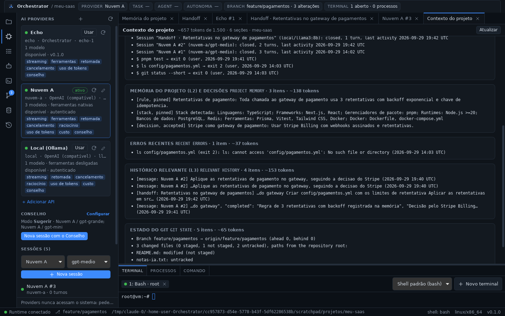

# Fase 7 — Context Builder e Handoff entre IAs

## STATUS

✅ **Concluída.** A memória do projeto passa a chegar às IAs, e uma IA pode
assumir o trabalho de outra sem a conversa anterior:

- **contexto do projeto no primeiro turno** de toda sessão (nova, Conselho
  Full, subagente, handoff), montado por regras e busca, sem chamar IA:
  - seções `TASK`, `WORKING MEMORY`, `PROJECT MEMORY`, `RELEVANT FILES`,
    `RECENT ERRORS`, `RELEVANT HISTORY`, `GIT STATE` e `HANDOFF`;
  - orçamento de tokens (padrão 1.500), com corte por prioridade e o que
    ficou de fora informado;
  - só caminhos de arquivos, nunca o conteúdo; nunca o histórico inteiro
    nem o repositório;
- **tudo visível:** estimativa antes de enviar, opção de não anexar, a aba
  "Contexto do projeto" com as seções e o texto exato, e o registro no
  transcript e no histórico (`CONTEXT_BUILT`);
- **ferramentas de memória para as IAs:** `memory.working`,
  `memory.search`, `memory.list`, `memory.save`, `decision.list` e
  `decision.save`, auditadas como as outras. A IA grava com origem
  `agent`, não altera o que o usuário escreveu e não apaga nada;
- **handoff:** `HandoffPacket` (`goal, status, completed, remaining, files,
  commands, errors, decisions, tests, nextAction`):
  - o rascunho junta os fatos do histórico (sem custo) e a narrativa da
    própria IA (um turno, opcional);
  - o usuário revisa, escolhe quem assume (com a sugestão do roteador) e
    passa;
  - a nova sessão recebe o pacote no contexto, nunca a conversa anterior
    (`HANDOFF_CREATED`, `HANDOFF_ACCEPTED`).





## Decisões registradas antes do código

- [ADR-0013](../adr/0013-context-builder-e-handoff.md):
  - crate `packages/orchestrator` (`orchestrator-engine`), dependendo de
    `core`, `providers`, `memory` e `git`; o executor de ferramentas chega
    como `ToolExecutor`, sem depender do runtime;
  - seções, relevância por regras e FTS, orçamento e ordem de corte;
  - o contexto entra uma vez, no primeiro turno, por um gancho no
    `SessionManager` (`ContextSource`) e `TurnInput.context`; nas APIs, nas
    instruções de sistema;
  - opções por sessão (`enabled`, `budget`, `handoffId`) e configuração em
    `context.json`;
  - `SessionEvent::ContextAttached` e o evento novo `CONTEXT_BUILT`;
  - ferramentas de memória das IAs, com autoria e sem remoção;
  - `HandoffPacket`/`Handoff` no `core`, fluxo preparar → criar → assumir,
    uso único;
  - migração 2 do banco (`handoffs`), comandos Tauri e UI.
- ADR-0006 atualizada (CI com o crate novo).
- Refinamentos da implementação registrados na ADR-0013:
  - `TASK` não repete a primeira mensagem, que já vai na conversa;
  - relevância por qualquer palavra significativa (consulta `OR`);
  - o histórico relevante não repete `RECENT ERRORS` nem a própria
    sessão, e num handoff não traz a sessão de origem;
  - sem ferramentas no provider, o contexto não aponta para elas;
  - os exemplos do pedido do resumo não valem como resposta da IA;
  - uma sessão que assumiu um handoff, ao passar adiante, mantém o objetivo
    dele;
  - `StoreSessions` muda do app para o crate novo;
  - o pedido do resumo aparece no transcript como do Orchestrator;
  - comando `handoff_get`.

## Arquivos criados

**Rust — `packages/orchestrator` (`orchestrator-engine`, crate novo)**
- `src/builder.rs`: `ContextBuilder`, `BuildRequest`, `ContextPack`,
  `ContextSection`, `SectionKind`; seções, corte por prioridade, texto;
  implementação do `ContextSource`.
- `src/settings.rs`: `ContextSettings` e `context.json`.
- `src/tools.rs`: `EngineTools` e as 6 ferramentas de memória, com JSON
  Schema gerado dos tipos.
- `src/packet.rs`: limites do pacote, fatos do histórico, pedido e leitura
  da narrativa da IA, mistura, texto para a próxima IA, primeira mensagem.
- `src/handoff.rs`: `HandoffService` (`prepare`, `create`, `start`, `list`,
  `get`) e `ContextBuilder::preview`.
- `src/persistence.rs`: `StoreSessions` (movido do app).
- `src/text.rs`, `src/lib.rs`, `tests/engine.rs`, `Cargo.toml`,
  `README.md` (reescrito).

**Rust — outros crates**
- `packages/core/src/handoff.rs`: `HandoffPacket`, `Handoff`, `HandoffEnd`,
  `HandoffStatus`.
- `packages/core/src/context.rs`: `ContextSummary`,
  `ContextSectionSummary`.
- `packages/providers/src/project_context.rs`: `ContextSource`,
  `ContextOptions`, `ContextRequest`, `AttachedContext`.
- `packages/memory/src/handoffs.rs`: handoffs no banco e `session_facts`.
- `apps/desktop/src-tauri/src/context_commands.rs`: `context_preview`,
  `context_settings_get`, `context_settings_save`, `handoff_prepare`,
  `handoff_create`, `handoff_start`, `handoffs_list`, `handoff_get`.

**TypeScript — `apps/desktop/src`**
- `components/ContextView.tsx`: aba "Contexto do projeto" (configuração,
  prévia, seções, o que ficou de fora, texto exato).
- `components/HandoffView.tsx`: aba Handoff (rascunho, revisão, quem
  assume, salvar ou passar).
- `lib/context.ts` (+ teste): rótulos das seções e do pacote, resumo,
  estado do handoff, tarefa para o roteador.

**Documentação**
- ADR-0013, `docs/context.md`, `docs/phases/fase-7.md`,
  `docs/assets/fase-7-handoff.png`, `docs/assets/fase-7-contexto.png`,
  `docs/assets/fase-7-sessao.png`.

## Arquivos modificados

- `packages/core`: `ids.rs` (`HandoffId`), `event.rs` (`CONTEXT_BUILT`),
  `session.rs` (`ContextAttached`, `HandedOff`), `lib.rs`.
- `packages/providers`:
  - `provider.rs`: `TurnInput { text, context }`;
  - `manager.rs`: `StartRequest.context`, `set_context_source`, contexto
    no primeiro turno (com `CONTEXT_BUILT` e aviso em caso de falha),
    `context_options`/`set_context_options`, `annotate`;
  - `store.rs`: as opções de contexto vão com a sessão;
  - `echo.rs`: `/context`, e o contexto conta como entrada;
  - `lib.rs`, `tests/sessions.rs` (3 testes novos), `README.md`.
- `packages/providers/api`: `provider.rs` (o contexto entra nas instruções
  de sistema), `tests/api.rs` (teste novo).
- `packages/router/src/service.rs`: `StartRequest` com o contexto padrão.
- `packages/memory`:
  - `db.rs`: migração 2 (`handoffs`), com teste de atualização de um banco
    da Fase 6;
  - `search.rs`: `search_related` (consulta `OR` sem palavras comuns) e
    handoffs no índice;
  - `working.rs`, `model.rs` (`SessionFacts`), `lib.rs`,
    `tests/store.rs` (2 testes novos), `README.md`.
- `apps/desktop/src-tauri`:
  - `lib.rs`: liga o `ContextBuilder` ao `SessionManager`, envolve o
    `RuntimeTools` com o `EngineTools`, cria o `HandoffService`, registra
    os comandos;
  - `provider_commands.rs`: `session_context_get`, `session_context_set`;
  - `persistence.rs`: só `StoreDeliberations`;
  - `Cargo.toml`.
- `apps/desktop/src`:
  - `components/SessionView.tsx`: barra do contexto antes da primeira
    mensagem, linha do contexto anexado, botão Handoff, ligações entre as
    sessões do handoff, pedido do resumo mostrado como do Orchestrator;
  - `components/MemoryView.tsx`: handoffs em Trabalho (L1) e na busca;
  - `components/HistoryPanel.tsx`: filtros `CONTEXT_BUILT`,
    `HANDOFF_CREATED`, `HANDOFF_ACCEPTED`;
  - `App.tsx`: abas Contexto e Handoff, tela inicial;
  - `lib/transcript.ts` (+ teste), `lib/runtime.ts` (`contextApi`,
    `handoffApi`), `lib/types.ts`, `lib/useMemory.ts`, `styles.css`.
- Documentação e configuração:
  - `ARCHITECTURE.md`, `README.md`, `docs/ipc.md`, `docs/providers.md`,
    `docs/memory.md`, `docs/router.md`, `docs/api-connections.md`;
  - ADR-0006 e o índice de ADRs;
  - `.github/workflows/ci.yml`: clippy e testes do crate novo nos 3 SOs;
  - `Cargo.toml` (workspace), `Cargo.lock`.

## Dependências instaladas

Nenhuma dependência externa nova. O crate `orchestrator-engine` usa o que
o workspace já tinha (`async-trait`, `chrono`, `parking_lot`, `schemars`,
`serde`, `serde_json`, `tokio`; `tempfile` nos testes).

## Comandos executados

```bash
cargo test -p orchestrator-engine
cargo test --workspace
pnpm check        # tsc + cargo fmt --check + cargo clippy -D warnings (workspace)
pnpm test:web
cargo clippy -p orchestrator-core -p orchestrator-providers -p orchestrator-provider-api \
  -p orchestrator-router -p orchestrator-memory -p orchestrator-engine -p orchestrator-runtime \
  -p orchestrator-git -p orchestrator-desktop --all-targets --target x86_64-pc-windows-gnu -- -D warnings
cargo check -p orchestrator-providers -p orchestrator-router --all-targets --target x86_64-apple-darwin
pnpm tauri dev                  # app real sob Xvfb, com o perfil da Fase 6
pnpm tauri build --no-bundle    # release
```

Validação no app com a API compatível com OpenAI simulada das fases
anteriores, que agora também responde ao pedido de resumo do handoff com
JSON. Ela registra cada requisição, o que permite ver exatamente o que cada
IA recebeu.

## Testes executados

| Suíte | Qtde | Cobre |
| ----- | ---- | ----- |
| `orchestrator-engine` (unit, novo) | 13 | corte por prioridade que mantém tarefa e handoff; caminhos citados na tarefa (só os que existem, dentro do projeto); `context.json` (ida e volta, validação); schemas das ferramentas portáveis; comandos de teste reconhecidos; leitura tolerante da resposta da IA; os exemplos do pedido não valem como resposta; limites do pacote; mistura de fatos e narrativa; o pedido do resumo não vira objetivo; texto para a próxima IA; auxiliares de texto; `StoreSessions` pelo banco |
| `orchestrator-engine` (integração, novo) | 4 | contexto relevante e no orçamento (seções na ordem, só caminhos, conteúdo de arquivo nunca enviado, falha sem repetição no histórico, corte por prioridade, cabeçalho sem ferramentas); contexto no primeiro turno e ferramentas de memória pelas sessões (`TOOL_CALLED`, `MEMORY_SAVED`, autoria, sem alterar entrada do usuário); handoff completo (rascunho pela IA, criar, assumir, sem a conversa anterior, uso único, eventos nas duas sessões, objetivo mantido ao passar adiante de novo); rascunho só com os fatos quando a IA falha ou só repete o pedido |
| `orchestrator-memory` (novos) | 4 | atualização de um banco da Fase 6 para o esquema 2; consulta de relevância sem palavras comuns; handoffs (gravar, listar, aceitar uma vez) e fatos de uma sessão; busca por qualquer palavra significativa |
| `orchestrator-providers` (integração, novos) | 3 | o primeiro turno leva o contexto (uma vez, com a mensagem como tarefa, `ContextAttached`, `CONTEXT_BUILT`, opções só antes do primeiro turno); falha do contexto não derruba o turno; opções e contexto recebido sobrevivem a um reinício |
| `orchestrator-provider-api` (integração, novo) | 1 | o contexto entra nas instruções de sistema uma vez, continua igual nos turnos seguintes e após reiniciar, não vira mensagem do usuário; conexão sem ferramentas recebe `tools: false` |
| `orchestrator-core` (novo) | 1 | nomes do documento mestre no `HandoffPacket` |
| Frontend (vitest, novos) | 4 | rótulos e resumo do contexto, estado do handoff, tarefa para o roteador, itens de contexto e handoff no transcript |
| Manual (app real, dev e release) | — | ver abaixo |

Validação manual (dev, com o perfil usado na Fase 6):

- **Migração:** o banco da Fase 6 abriu no esquema 2, com o histórico, as
  sessões e a memória intactos.
- **Contexto antes de enviar:** numa sessão nova da "Nuvem A", a barra
  mostrou "~657 tokens de 1.500 · 6 seções" para a tarefa digitada; "Ver
  prévia" abriu a aba com as seções (tarefa, trabalho, a regra e a stack
  fixadas, a decisão do Stripe, o erro do `ls`, histórico e Git) e o texto
  exato.
- **O que a API recebeu** (registro do servidor simulado):
  - 1º turno: instruções de sistema com o `# PROJECT CONTEXT` e o catálogo
    com 41 ferramentas, 6 delas de memória (`memory__search`…);
  - 2º turno: as mesmas instruções, sem montar o contexto de novo.
- **Handoff da "Nuvem A #2":**
  - "Gerar rascunho" pediu o resumo à IA (turno "Orchestrator · pedido do
    resumo do handoff", 960 tokens, US$ 0,0028) e juntou os fatos: `pnpm
    test → ok (passou)`, o erro do `config/pagamentos.yml`, a decisão;
  - "Sugerir com o roteador": Nuvem A / gpt-medio (nota 64);
  - passado para o Local (Ollama) / llama3:8b.
- **A sessão que assumiu:**
  - a requisição trouxe a seção `HANDOFF` com objetivo, estado, feito,
    falta, comandos, erros, decisões, testes e próxima ação;
  - nenhuma mensagem da "Nuvem A #2" no histórico relevante: a conversa
    anterior não foi junto;
  - primeira mensagem em português pedindo para começar pela próxima ação;
  - "Assumiu o trabalho de Nuvem A #2 · handoff" no transcript, com o link
    de volta; na origem, "Handoff criado" e o link para a nova sessão.
- **MEMORY:** o handoff em Trabalho (L1), aceito; a busca L3 o encontrou.
- **HISTORY:** `CONTEXT_BUILT`, `HANDOFF_CREATED`, `SESSION_STARTED` e
  `HANDOFF_ACCEPTED`, todos marcados com o projeto.
- **Ferramentas de memória pelo `echo`:** `/tool memory.save` criou a
  entrada "Idempotencia nas cobrancas" com origem `agent`, e
  `/tool memory.search` a encontrou junto com a mensagem da sessão.
- **Reinício:** a sessão do handoff voltou encerrada, com a linha do
  contexto (7 seções, ~717 tokens) e o vínculo com a origem.

Validação no release (`pnpm tauri build --no-bundle`, perfil limpo, com o
provider `echo` ligado):

- **Banco novo** no esquema 2 (`integrity_check` ok, tabela `handoffs`);
  abrir o projeto criou a entrada "Stack detectada".
- **Contexto:** a primeira mensagem "Corrija o README.md do projeto" levou
  a stack fixada, `README.md (mentioned in the task)` e o estado do Git
  (`/context` no `echo`), com `CONTEXT_BUILT` de origem `system`.
- **Handoff sem narrativa:** o `echo` só repete o pedido. O rascunho ficou
  com os fatos e o aviso "a resposta só repetiu o modelo do pedido",
  mostrando o custo do turno. A sessão de origem, encerrada pelo reinício,
  foi retomada para isso.
- **Passar adiante:** `HANDOFF_CREATED`, `SESSION_STARTED`,
  `HANDOFF_ACCEPTED` e `CONTEXT_BUILT` (6 seções, com `HANDOFF`) no banco;
  o handoff ficou `accepted` com as duas sessões e o projeto.
- **Handoff em cadeia:** o rascunho a partir da sessão que assumiu manteve
  o objetivo original.
- **Configuração:** orçamento padrão 1.200 salvo em `context.json`.
- **Reinício e SIGTERM:** as sessões voltaram encerradas, com o
  transcript; o app encerrou normalmente nas três vezes.

## Resultado dos testes

- Rust: **217/217** (core 14, desktop 1, engine 17, git 19, memory 16,
  provider-api 33, providers 25, router 25, runtime 67; 1 teste de inspeção
  ignorado de propósito). O teste do `StoreSessions` saiu do app para o
  crate novo.
- Frontend: **45/45**; `tsc` limpo.
- `cargo clippy -D warnings` limpo no Linux e no alvo Windows (inclui o
  crate Tauri e o crate novo); `cargo fmt --check` limpo.
- Checagem cruzada para macOS OK em `orchestrator-providers` e
  `orchestrator-router`. O `orchestrator-engine` depende do
  `orchestrator-memory`, que compila C (SQLite) e precisa do SDK da Apple;
  os dois são validados pelo job macOS do CI.
- Release: build sem erros e validado como descrito acima.
- Segurança: a chave da API simulada (variável de ambiente) não aparece em
  nenhum arquivo do perfil do app, inclusive no banco e no WAL, nem no
  diff.

## Problemas encontrados

| Problema | Resolução |
| -------- | --------- |
| Nome `ContextBar` já usado por outro componente | Barra do contexto do projeto renomeada para `ProjectContextBar` |
| Arquivos não rastreados apareciam como `?` no `GIT STATE` | Estado descrito em palavras ("untracked", "modified (not staged)") |
| Clippy: continuação de lista em doc e `cloned_ref_to_slice_refs` | Doc reescrita; `std::slice::from_ref` |
| O pedido do resumo do handoff aparecia no transcript como mensagem do usuário ("VOCÊ") | Mostrado como "Orchestrator · pedido do resumo do handoff" |
| A mesma falha aparecia em `RECENT ERRORS` e em `RELEVANT HISTORY` | O histórico relevante não repete falhas já listadas (teste) |
| Itens do contexto anexado desalinhados na linha do transcript | Layout da lista corrigido |
| Na aba Handoff, o cabeçalho aparecia antes do rascunho sem a sessão de origem | Origem mostrada desde o início |
| Título longo da sessão quebrava a barra da sessão | Título cortado com reticências |
| O contexto apontava para as ferramentas de memória mesmo quando a conexão estava com ferramentas desligadas (visto na requisição da sessão Local) | `ContextRequest.tools` vem das capacidades do provider; sem ferramentas, o cabeçalho diz para pedir ao usuário (testes no engine e na API) |
| No release, o rascunho do handoff pelo `echo` aceitou como resposta os exemplos do próprio pedido ("what the work is for", "done items"…), porque o `echo` repete o texto. Um modelo que cite o pedido faria o mesmo | Os exemplos do pedido são descartados; se só eles vierem, o rascunho fica com os fatos e o aviso "a resposta só repetiu o modelo do pedido" (testes unitário e de integração) |
| Ao passar adiante uma sessão que já tinha assumido um handoff, o objetivo virava a mensagem "Você está assumindo um trabalho…" | O objetivo vem do handoff que a sessão assumiu (teste de integração) |
| Na validação automatizada, o clique em "Passar" chegou antes das últimas teclas digitadas, e a próxima ação foi salva cortada | Não é defeito do app: o WebKitGTK entrega as teclas de forma assíncrona e o clique veio milissegundos depois. Com uma pausa, o texto inteiro foi salvo |
| `rustfmt` apontou uma asserção longa de teste | `cargo fmt` |

**Limitações conhecidas:**

- Relevância por palavras (FTS5), sem busca semântica: uma tarefa vaga
  recebe pouco contexto específico (fixadas, L1 e Git).
- O contexto é o do primeiro turno. Numa sessão longa, a IA deve consultar
  as ferramentas de memória.
- O contexto vai em todas as requisições da sessão (instruções de
  sistema). Cache de prompt e compactação ficam para a Fase 11.
- A prévia "Contexto da nova IA" de um handoff supõe que ela terá
  ferramentas; a sessão real ajusta o cabeçalho ao provider escolhido.
- O handoff é manual; o automático ao fim de um agente é da Fase 8.
- A estimativa de tokens é aproximada (~4 caracteres por token); o uso real
  vem da API em cada turno.

## Próxima fase

**Fase 8 — Task Manager, agentes e subagentes, File Locks.**

- Tasks com estados (`TODO`, `IN_PROGRESS`, `BLOCKED`, `REVIEW`, `DONE`,
  `CANCELLED`), dependências e o painel TASKS.
- Agent Manager: agentes que executam tasks em sessões de provider, com o
  Context Builder partindo da task e o modelo escolhido pelo roteador.
- Subagentes e File Lock Manager para trabalho em paralelo sem conflito.
- Handoff automático ao fim de um agente.
- A arquitetura será registrada em ADR própria antes do código.
