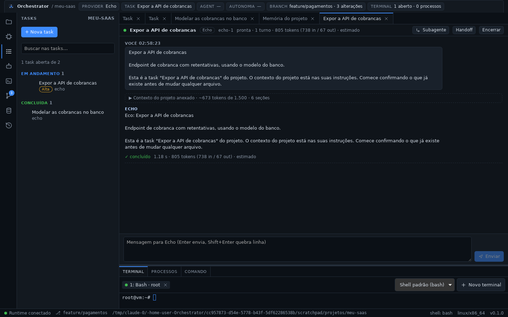
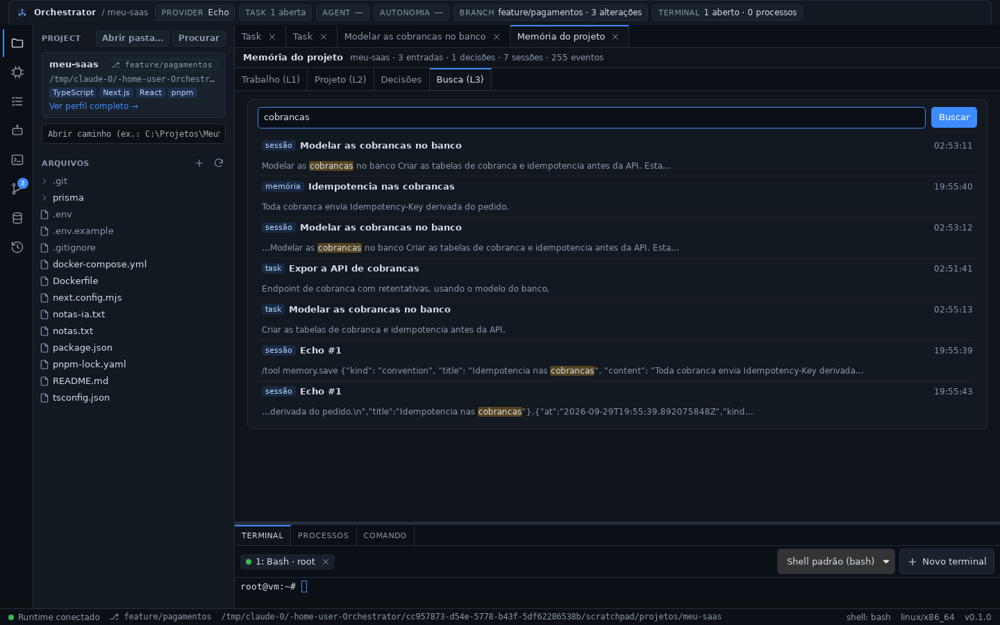

# Fase 8a — Task Manager

## STATUS

✅ **Concluída.** Todo trabalho relevante do projeto passa a ser uma task,
com estado durável, ordem explícita e ligação com o que já existia:

- **tasks no painel TASKS** (que era um placeholder): título, descrição,
  estado (`TODO`, `IN_PROGRESS`, `BLOCKED`, `REVIEW`, `DONE`,
  `CANCELLED`), prioridade, provider/modelo, subtasks, arquivos e
  resultado;
- **dependências que valem alguma coisa:** uma task só inicia quando tudo
  o que ela espera está concluído, e o Orchestrator recusa dizendo o que
  falta; ciclos são recusados na hora de salvar;
- **as regras moram no motor:** a UI só mostra os botões dos estados que
  o `TaskService` aceitaria (`TaskView.can`), então tela e regra não
  divergem;
- **a task vira o contexto:** abrir uma sessão a partir dela monta o
  contexto do projeto com o título, a descrição e os arquivos da task, e
  começa a conversa por ela (*task-scoped context*, seção 23 do documento
  mestre);
- **roteador:** "Sugerir com o roteador" recomenda provider e modelo pelo
  texto da task, sem gastar tokens;
- **histórico e busca:** `TASK_CREATED`, `TASK_STARTED`, `TASK_COMPLETED` e
  `TASK_UPDATED`, e as tasks no índice L3;
- **barra superior:** `TASK` deixa de ser um traço e mostra a task da
  sessão aberta (ou a que está em andamento), como pede a seção 24.

A Fase 8 do documento mestre foi dividida a pedido do usuário: agentes,
subagentes, File Locks e o Agent Board são a Fase 8b.






## Decisões registradas antes do código

- [ADR-0014](../adr/0014-task-manager.md):
  - contratos no `core`, persistência no `memory` (migração 3), regras no
    `orchestrator-engine`; nenhum crate novo;
  - campos da seção 12 do documento mestre, com limites explícitos;
  - tasks não são apagadas: são canceladas (como as decisões, ADR-0012);
  - tabela de transições, com `DONE`/`CANCELLED` reabertos e não editados;
  - **`BLOCKED` é sempre do usuário**; dependência pendente deixa a task em
    `TODO` marcada como não liberada — "ainda não posso" e "estou
    impedido" são coisas diferentes;
  - dependências do mesmo projeto, sem repetição e sem ciclo; `parentTask`
    é hierarquia, não dependência;
  - a task alimenta o Context Builder, o roteador e a busca L3;
  - `TASK_UPDATED` estende a lista da seção 22 pelo mesmo motivo de
    `PROCESS_EXITED` na ADR-0005: sem ele, metade das mudanças de estado
    sumiria do histórico;
  - Agent Board fica para a 8b, porque sem agentes as colunas seriam as do
    painel lateral.

## Arquivos criados

**Rust**
- `packages/core/src/task.rs`: `Task`, `TaskStatus` (com a ordem do
  painel), `TaskPriority`, `TaskInput`.
- `packages/memory/src/tasks.rs`: gravar, ler, listar em ordem do painel,
  dependentes e a task de uma sessão.
- `packages/orchestrator/src/task.rs`: `TaskService` (listar com o que o
  motor calcula, salvar, mudar estado, abrir sessão, contexto da task),
  `TaskView`, `next_states`, verificação de ciclo.
- `apps/desktop/src-tauri/src/task_commands.rs`: `tasks_list`, `task_get`,
  `task_save`, `task_status`, `task_start_session`, `task_context`.

**TypeScript — `apps/desktop/src`**
- `components/TasksPanel.tsx`: painel TASKS (tasks por estado, busca,
  prioridade, "espera N", subtasks).
- `components/TaskView.tsx`: aba da task (edição, estados válidos,
  arquivos, dependências, quem assume, sessões, resultado).
- `lib/tasks.ts` (+ teste): rótulos, agrupamento, filtro sem acento, texto
  da task e o rótulo de cada transição.
- `lib/useTasks.ts`: tasks do projeto, atualizadas pelos eventos do
  histórico.

**Documentação**
- ADR-0014, `docs/tasks.md`, `docs/phases/fase-8a.md`,
  `docs/assets/fase-8a-task.png`, `fase-8a-sessao.png`,
  `fase-8a-busca.png`.

## Arquivos modificados

- `packages/core`: `ids.rs` (`TaskId`), `event.rs` (`TASK_UPDATED`),
  `lib.rs`.
- `packages/memory`: `db.rs` (esquema 3: `tasks`, `task_dependencies`, com
  teste de atualização de um banco da Fase 7), `search.rs` (tasks no
  índice), `lib.rs`, `tests/store.rs` (teste novo), `README.md`.
- `packages/orchestrator`: `lib.rs`, `tests/engine.rs` (teste novo),
  `README.md`.
- `apps/desktop/src-tauri`: `lib.rs` (liga o `TaskService` e registra os
  comandos).
- `apps/desktop/src`:
  - `App.tsx`: painel e aba das tasks, task atual na barra superior,
    placeholder de AGENTS agora descreve a 8b;
  - `components/ContextBar.tsx`: chip `TASK` com a task atual;
  - `components/ContextView.tsx`: prévia do contexto de uma task;
  - `components/HistoryPanel.tsx`: filtros dos quatro eventos de task;
  - `components/MemoryView.tsx`: resultados do tipo `task` na busca, que
    abrem a task;
  - `lib/types.ts`, `lib/runtime.ts` (`taskApi`), `styles.css`.
- Documentação: `ARCHITECTURE.md`, `README.md`, `docs/ipc.md`,
  `docs/memory.md`, `docs/context.md`, `docs/router.md`, índice de ADRs e
  de fases.

## Dependências instaladas

Nenhuma. A Fase 8a usa os crates e as bibliotecas que já existiam.

## Comandos executados

```bash
cargo test -p orchestrator-core -p orchestrator-memory -p orchestrator-engine
cargo test --workspace
pnpm check        # tsc + cargo fmt --check + cargo clippy -D warnings (workspace)
pnpm test:web
pnpm tauri dev    # app real sob Xvfb, sobre o perfil da Fase 7
```

## Testes executados

| Suíte | Qtde | Cobre |
| ----- | ---- | ----- |
| `orchestrator-core` (novos) | 2 | nomes do documento mestre no JSON da task e entrada parcial; ordem do painel e estados finais |
| `orchestrator-memory` (novos) | 2 | atualização de um banco da Fase 7 para o esquema 3 sem perder nada; tasks com dependências (linhas como verdade), ordem do painel, dependentes, busca L3 e a task de uma sessão |
| `orchestrator-engine` (novos) | 4 | transições da ADR; a task lida como objetivo, detalhe e arquivos; ciclo recusado em qualquer comprimento; e, de ponta a ponta: título obrigatório, ciclo recusado ao salvar, task bloqueada não inicia (nem por botão nem abrindo sessão), o painel diz o que ela espera, sessão da task com o contexto vindo dela, task na busca, concluir e reabrir com os eventos certos |
| Frontend (vitest, novos) | 5 | agrupamento por estado em ordem do painel, linha de espera e subtasks, filtro sem acento, rótulo de cada transição e texto da task |
| Manual (app real) | — | ver abaixo |

Validação manual (dev, sobre o perfil da Fase 7):

- **Migração:** o banco da Fase 7 (1 projeto, 6 sessões, 3 entradas de
  memória, 1 decisão, 1 handoff, 352 eventos) abriu no esquema 3, com
  `integrity_check` ok e nada perdido.
- **Criar:** "Modelar as cobrancas no banco" (normal) e "Expor a API de
  cobrancas" (alta), a segunda dependendo da primeira. `TASK_CREATED` nos
  dois casos.
- **Dependência:** o painel mostrou "Alta" e "espera 1"; a aba avisou
  "Esta task espera: …"; tentar iniciar foi recusado com o nome da task
  que falta.
- **Sessão da task:** "Abrir sessão para esta task" abriu a sessão com o
  título da task, mandou a task como primeira mensagem, anexou o contexto
  (~673 tokens, 6 seções) e levou a task para `IN_PROGRESS`
  (`TASK_STARTED` com o `sessionId`).
- **Concluir:** `TASK_COMPLETED` com "em andamento → concluída"; a
  dependente perdeu o "espera 1" e o botão "Iniciar" habilitou sozinho.
- **Busca (L3):** "cobrancas" trouxe as duas tasks com a etiqueta `task`,
  e clicar abriu a task.
- **HISTORY:** `TASK_CREATED`, `TASK_STARTED`, `CONTEXT_BUILT`,
  `SESSION_STARTED` e `TASK_COMPLETED`, todos marcados com o projeto.
- **Barra superior:** `TASK` mostrou "1 aberta" e, com a sessão aberta, o
  título da task.

## Resultado dos testes

- Rust: **226/226** (core 16, desktop 1, engine 21, git 19, memory 19,
  provider-api 33, providers 25, router 25, runtime 67; 1 teste de
  inspeção ignorado de propósito).
- Frontend: **50/50**; `tsc` limpo.
- `cargo clippy -D warnings` e `cargo fmt --check` limpos.

## Problemas encontrados

| Problema | Resolução |
| -------- | --------- |
| A barra superior dizia "1 abertas" | Plural só no plural |
| "Só aparecem os estados válidos a partir de a fazer" (frase truncada pela preposição) | Reescrito: "Daqui, esta task pode ir para os estados abaixo" |
| O botão "Iniciar" ficava habilitado numa task bloqueada por dependência: clicar só produzia um erro vermelho que a tela já explicava | A UI não oferece o que o motor recusaria: o botão (e "Abrir sessão") ficam desabilitados, com o motivo no `title` |
| Depois de abrir a sessão pela própria aba, ela continuava mostrando "A fazer" | A aba acompanha o estado que o motor calcula, sem mexer no que o usuário está editando |
| Concluída a dependência, a aba da outra task continuava dizendo "espera" | A sincronização comparava só a data da própria task; passou a comparar também o que o motor calcula (`waitingFor`, `can`, `subtasks`, sessões) |
| Resultados do tipo `task` apareciam na busca sem etiqueta e não abriam | `task` nos rótulos e no clique da busca (mesmo defeito que `handoff` teve na Fase 7) |
| "Reabrir" aparecia como rótulo ao voltar de "em andamento" para "a fazer" | O rótulo depende de onde a task está: "Reabrir" só a partir de concluída/cancelada; senão, "Voltar para a fila" |

**Limitações conhecidas:**

- **Execução é manual:** iniciar uma task abre uma sessão; quem conduz é o
  usuário. Agente, fila e paralelismo são a Fase 8b.
- **A task depende de quem a atualiza:** enquanto não há agente, um estado
  desatualizado é um estado errado.
- **Dependência protege só o começo:** ela impede iniciar cedo, não impede
  mexer nos arquivos por fora. Coordenação real é o File Lock Manager da
  8b.
- Sem quadro por agente, sem estimativa e sem prazo.
- O contexto da task é montado na hora de abrir a sessão: editar a task
  depois não muda o contexto daquela sessão (o contexto é do primeiro
  turno, ADR-0013).

## Próxima fase

**Fase 8b — Agentes, subagentes e File Locks.**

- Agent Manager: agentes temporários que executam tasks em sessões, movendo
  a task sozinhos.
- Subagentes e trabalho em paralelo quando não houver conflito.
- File Lock Manager: dois agentes não alteram os mesmos arquivos ao mesmo
  tempo.
- Agent Board (seção 25) e handoff automático ao fim de um agente.
- A arquitetura será registrada em ADR própria antes do código.
