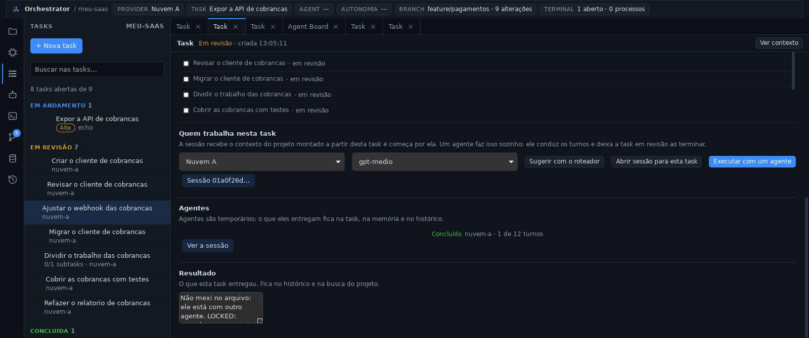
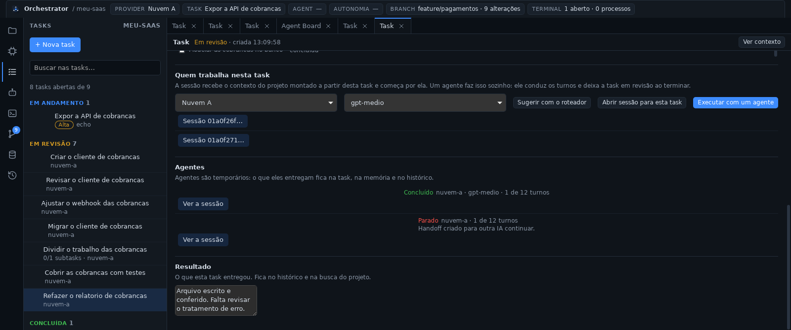

# Fase 8b — Agentes, subagentes e File Locks

## STATUS

✅ **Concluída.** O Orchestrator deixa de precisar do usuário conduzindo
cada turno: um agente executa a task sozinho, e mais de um trabalha ao
mesmo tempo quando não há conflito.

- **um agente por task:** ele abre a sessão com o contexto da task, conduz
  os turnos, usa as ferramentas e encerra chamando `agent.finish`. O
  resultado vai para a task, que fica **em revisão** — quem conclui é o
  usuário;
- **fila e paralelismo:** o agente começa quando há vaga (padrão 2) e os
  arquivos da task estão livres; o painel diz o que está no caminho;
- **File Lock Manager:** um dono por arquivo. Escrever num arquivo de outro
  agente é recusado com `LOCKED` e o motivo; leitura nunca trava e **o
  usuário nunca é bloqueado no próprio projeto**;
- **subagentes:** `agent.delegate` cria a subtask e enfileira quem vai
  fazê-la (profundidade 2, até 5 por agente);
- **quem para no meio deixa handoff** montado pelos fatos da sessão, sem
  gastar turno de IA;
- **Agent Board** (seção 25) e painel AGENTS com "Parar" e "Parar todos"
  (seção 11);
- **barra superior:** `AGENT` deixa de ser um traço.

Com isso a Fase 8 do documento mestre (Task Manager, Agent Manager,
subagentes e File Locks) está inteira, e os oito painéis da seção 24 são
todos reais.






## Decisões registradas antes do código

- [ADR-0015](../adr/0015-agentes-subagentes-e-file-locks.md):
  - `packages/agents` deixa de ser um README e vira o crate
    `orchestrator-agents`, como a ADR-0001 previu; contratos no `core`,
    persistência no `memory` (migração 4);
  - campos da seção 14 do documento mestre; agentes não são apagados e não
    recomeçam — o que recomeça é a task, com outro agente;
  - **o agente não conclui a task:** `agent.finish` leva a task para
    `REVIEW`, que é a coluna que o Agent Board pede;
  - **parou no meio, sai handoff** (falha, teto de turnos ou parada pelo
    usuário); terminou bem, o resultado na task é o registro;
  - travas por arquivo, tomadas ao iniciar e ao escrever, soltas no fim; só
    agentes travam e só agentes são travados;
  - **trava negada recusa a ferramenta com o motivo**, sem espera e sem
    deadlock;
  - tetos de paralelismo (2) e de turnos (12) em `agents.json`; `Pause`
    fica para a Fase 9 porque pausar sem retomada seria um botão que mente;
  - **nenhum tipo de evento novo:** `AGENT_STARTED` e `AGENT_FINISHED` já
    existiam desde a Fase 2.

## Arquivos criados

**Rust**
- `packages/agents/` (crate `orchestrator-agents`): `service.rs` (fila,
  turnos, teto, parar, delegar, handoff automático), `locks.rs` (File Lock
  Manager), `tools.rs` (`agent.finish`, `agent.delegate` e a verificação
  das travas), `settings.rs` (`agents.json`), `tests/agents.rs`.
- `packages/core/src/agent.rs`: `Agent`, `AgentStatus`, `FileLock`.
- `packages/memory/src/agents.rs`: agentes e travas (migração 4).
- `apps/desktop/src-tauri/src/agent_commands.rs`: `agents_list`,
  `agent_get`, `agent_start`, `agent_stop`, `agents_stop_all`,
  `agent_locks`, `agent_settings_get`, `agent_settings_save`.

**TypeScript — `apps/desktop/src`**
- `components/AgentsPanel.tsx`: painel AGENTS (agentes por estado, travas,
  "Parar", "Parar todos" e os dois limites).
- `components/BoardView.tsx`: Agent Board (seção 25).
- `lib/agents.ts` (+ teste) e `lib/useAgents.ts`.

**Documentação**
- ADR-0015, `docs/agents.md`, `docs/phases/fase-8b.md`,
  `docs/assets/fase-8b-board.png`, `fase-8b-trava.png`,
  `fase-8b-agente.png`.

## Arquivos modificados

- `packages/core`: `ids.rs` (`AgentId`), `tool.rs` (`ToolErrorKind::Locked`
  e a origem `agent` descrita pelo Agent Manager), `lib.rs`.
- `packages/memory`: `db.rs` (esquema 4: `agents`, `file_locks`, com teste
  de atualização de um banco da Fase 8a), `lib.rs`, `README.md`.
- `packages/providers`: `manager.rs` (`tool_names`, para o agente registrar
  as ferramentas que recebeu).
- `packages/orchestrator`: `task.rs` (`open_session`, a sessão da task sem
  enviar nada — o agente conduz os turnos), `lib.rs`, `README.md`.
- `apps/desktop/src-tauri`: `lib.rs` (liga `AgentTools` ao executor,
  `LockManager`, `AgentService`, recuperação na abertura e os comandos),
  `Cargo.toml`.
- `apps/desktop/src`:
  - `App.tsx`: painel AGENTS no lugar do placeholder, aba do Agent Board,
    agente atual na barra superior, tela inicial atualizada;
  - `components/ContextBar.tsx`: chip `AGENT`;
  - `components/TaskView.tsx`: "Executar com um agente", lista de agentes
    da task e sincronização dos campos que o usuário não editou;
  - `components/HistoryPanel.tsx`: filtros `AGENT_STARTED` e
    `AGENT_FINISHED`;
  - `lib/types.ts`, `lib/runtime.ts` (`agentApi`), `styles.css`;
  - `components/PhasePlaceholder.tsx` **removido**: era só do painel
    AGENTS, e não sobrou nenhum placeholder.
- Documentação: `ARCHITECTURE.md`, `README.md`, `docs/ipc.md`,
  `docs/memory.md`, `docs/tasks.md`, `docs/context.md`,
  `docs/tool-runtime.md`, índice de ADRs e de fases, `.github/workflows/ci.yml`.

## Dependências instaladas

Nenhuma. O crate novo usa as bibliotecas que já estavam no workspace.

## Comandos executados

```bash
cargo test -p orchestrator-core -p orchestrator-memory -p orchestrator-agents
cargo test --workspace
pnpm check        # tsc + cargo fmt --check + cargo clippy -D warnings (workspace)
pnpm test:web
pnpm tauri dev    # app real sob Xvfb, sobre o perfil da Fase 8a
```

## Testes executados

| Suíte | Qtde | Cobre |
| ----- | ---- | ----- |
| `orchestrator-core` (novos) | 3 | nomes da seção 14 no JSON do agente; ordem do painel e estados finais; a linha de progresso |
| `orchestrator-memory` (novos) | 4 | atualização de um banco da Fase 8a para o esquema 4 sem perder nada; agentes por estado, por sessão e por task; um dono por arquivo (com o perdedor sabendo quem tem); nada fica travado quando o app é encerrado |
| `orchestrator-agents` (novos) | 9 | schemas das ferramentas do agente e quais ferramentas a trava vigia; normalização de caminhos; configuração; e, de ponta a ponta: agente executando a task (contexto, resultado, task em revisão, evento e arquivo escrito), teto de turnos com handoff, fila esperando arquivo ocupado e andando depois do "Parar", escrita recusada com `LOCKED` no meio do turno, e delegação com subtask e subagente |
| Frontend (vitest, novos) | 5 | agrupamento por estado, linha de progresso, o agente de uma task, o chip `AGENT` e as travas por agente |
| Manual (app real) | — | ver abaixo |

Validação manual (dev, sobre o perfil da Fase 8a, com uma API local que
responde com chamadas de ferramenta nativas):

- **Migração:** o banco da Fase 8a (1 projeto, 2 tasks, 8 sessões, 386
  eventos, 3 entradas de memória, 1 decisão, 1 handoff) abriu no esquema 4,
  com `integrity_check` ok e nada perdido.
- **Agente de ponta a ponta:** "Criar o cliente de cobrancas" → o agente
  abriu a sessão (contexto de 702 tokens, 43 ferramentas), escreveu o
  arquivo no projeto, chamou `agent.finish` e a task foi para **em
  revisão** com o resultado dele. `AGENT_STARTED` e `AGENT_FINISHED` no
  histórico; travas liberadas.
- **Paralelismo e trava:** com um agente segurando `src/cobrancas.ts`,
  outro (task sem arquivos declarados) tentou escrever no mesmo arquivo e
  recebeu `LOCKED: src/cobrancas.ts está com o agente "Migrar o cliente de
  cobrancas"…`. Ele não insistiu, encerrou dizendo isso, e o arquivo ficou
  intacto. Uma terceira task que **declarava** o mesmo arquivo nem saiu da
  fila ("src/cobrancas.ts está com …").
- **Parar:** "Parar" num agente em execução → `STOPPED`, travas liberadas,
  **handoff automático** criado (fatos, sem turno de IA: "O agente foi
  parado pelo usuário", com a próxima ação), e a task continuou em
  andamento.
- **Delegação:** o agente chamou `agent.delegate`, a subtask apareceu
  ligada à task-mãe com os arquivos dela, e o subagente (com `parentAgent`
  preenchido) a executou e deixou em revisão.
- **Recuperação:** depois de uma queda do app, o agente que estava vivo
  apareceu como "Falhou · o Orchestrator foi encerrado enquanto este agente
  trabalhava", com os arquivos liberados.
- **Agent Board:** colunas a fazer / em andamento / em revisão, com task,
  agente, provider, estado e progresso, e "Ver a sessão".
- **Barra superior:** `AGENT` mostrou "1 em execução" e o título do agente
  da sessão aberta.

## Resultado dos testes

- Rust: **242/242** (core 19, agents 9, desktop 1, engine 21, git 19,
  memory 23, provider-api 33, providers 25, router 25, runtime 67; 1 teste
  de inspeção ignorado de propósito).
- Frontend: **55/55**; `tsc` limpo.
- `cargo clippy -D warnings` e `cargo fmt --check` limpos.

## Problemas encontrados

| Problema | Resolução |
| -------- | --------- |
| **O app abortava ao pôr um agente para rodar:** `tokio::spawn` fora do runtime ("there is no reactor running"). Comandos do Tauri não são executados dentro do runtime assíncrono | O serviço recebe o handle do runtime do app (`set_runtime`) e só usa `Handle::try_current()` como reserva; sem runtime, o agente fica na fila em vez de derrubar o app |
| O painel mostrava "0 de 12 turnos" enquanto o agente trabalhava | O turno é contado ao começar, não ao terminar: quem está no primeiro turno mostra "1 de 12" |
| "Na fila · na fila": o estado e o progresso diziam a mesma coisa | Um agente na fila sem nada no caminho não repete o estado; com algo, mostra o motivo |
| A aba da task ficava com o "Resultado" vazio depois de o agente escrever nele | A aba adota o que mudou nos campos que o usuário não editou (os editados continuam intocados) |
| O `PhasePlaceholder` virou código morto quando o painel AGENTS ficou pronto | Removido: não sobrou nenhum painel placeholder |

**Limitações conhecidas:**

- **Sem gate de autonomia:** um agente usa as ferramentas do Tool Runtime
  como o usuário usaria. O que limita hoje são os tetos, as travas e os
  botões de parar; políticas por ferramenta são a Fase 9.
- **Custo é real:** cada turno é uma chamada paga ao provider.
- **`Pause` não existe** (Fase 9): hoje é parar e recomeçar com outro
  agente a partir do handoff.
- **A trava protege arquivos, não o repositório:** dois agentes ainda podem
  rodar comandos que mexem no mesmo estado (`git`, builds).
- O agente conduz uma sessão só: não troca de provider no meio nem retoma a
  sessão de outro agente.
- Sem estimativa, prazo ou custo por agente no quadro.

## Próxima fase

**Fase 9 — Autonomia: Assistido, Autônomo e Acesso Irrestrito.**

- Gate explícito na frente do `invoke` do Tool Runtime, com políticas por
  ferramenta e por modo.
- `Pause` de verdade (com retomada) ao lado de Parar e Parar todos.
- Acesso Irrestrito literal: sem confirmações ocultas, sem bloqueios
  silenciosos, sem lista interna de comandos proibidos — e com tudo
  continuando a ser auditado.
- A arquitetura será registrada em ADR própria antes do código.
