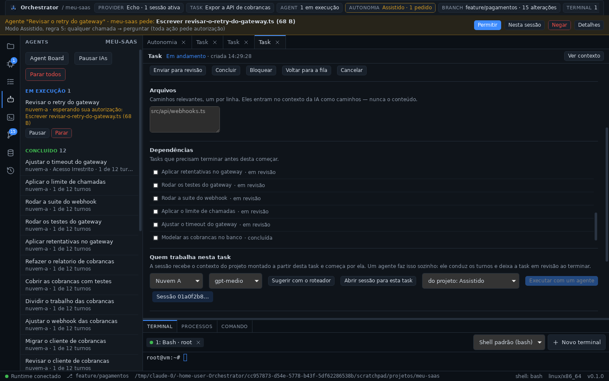
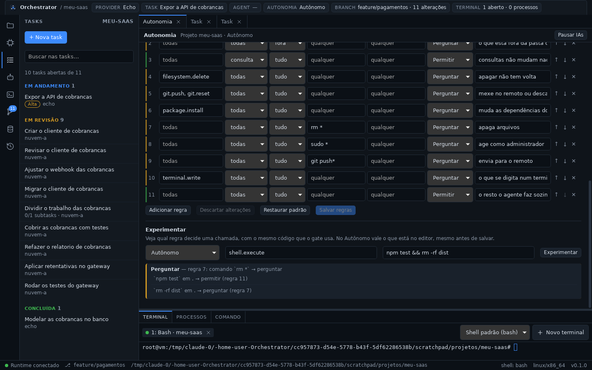
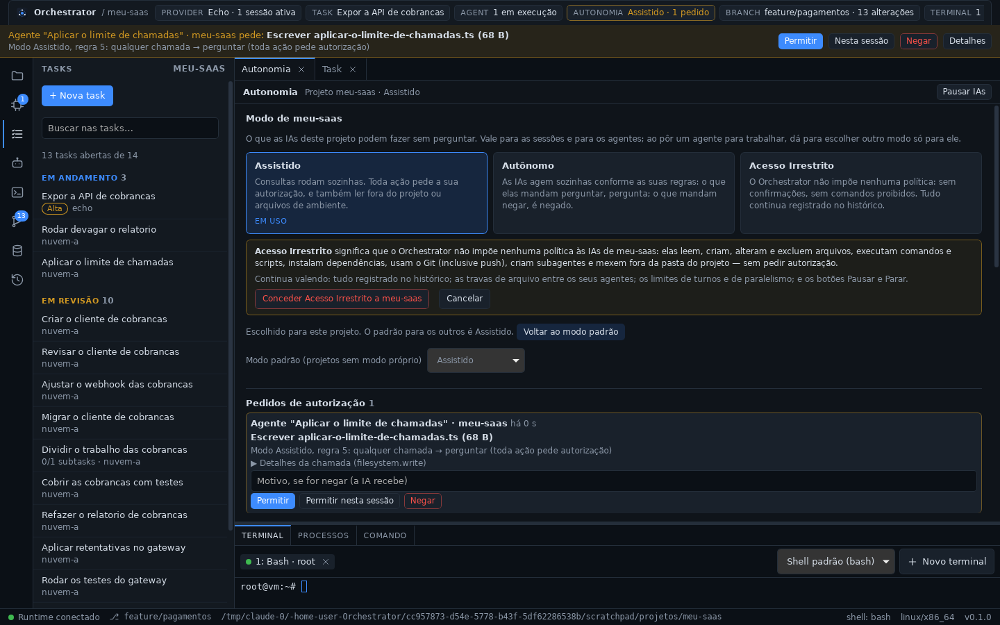

# Fase 9 — Autonomia: Assistido, Autônomo, Acesso Irrestrito e Pause

## STATUS

✅ **Concluída.** O usuário decide o que as IAs fazem sozinhas, e isso vale
no único caminho por onde elas agem:

- **gate de autonomia** na frente de toda chamada de ferramenta de uma IA
  (sessões e agentes), como o executor mais de fora; as chamadas do usuário
  nunca passam por ele;
- **três modos** (seção 10 do documento mestre):
  - **Assistido** (o padrão): consultas rodam; toda ação pede autorização,
    e também ler fora do projeto ou arquivos `.env*`;
  - **Autônomo:** as regras do usuário decidem — permitir, perguntar ou
    negar — por ferramenta, tipo, dentro/fora do projeto, comando e
    caminho; a primeira regra que casa decide, e num comando composto vale
    a parte mais restritiva;
  - **Acesso Irrestrito:** o gate não avalia nada — sem confirmações, sem
    lista de comandos proibidos, sem exceções;
- **modo por projeto e por agente:** o chip `Autonomia` e a aba escolhem o
  do projeto; ao pôr um agente para trabalhar, dá para dar a ele (e aos
  subagentes dele) outro modo;
- **pedidos de autorização** numa faixa sob a barra superior, em qualquer
  tela: Permitir, Permitir nesta sessão ou Negar com um motivo que a IA
  recebe; cancelar o turno ou parar o agente cancela o pedido; mudar o modo
  resolve a fila;
- **Pause** (seção 11): pausar todas as IAs ou um agente; nada age até
  retomar, e a fila não inicia ninguém;
- **Experimentar:** qual regra decide uma chamada, antes de salvar;
- **observabilidade não é restrição:** pedido, resposta, recusa e pausa no
  histórico, ligados ao `callId`; a chamada recusada também vira
  `TOOL_CALLED`.








## Decisões registradas antes do código

- [ADR-0016](../adr/0016-autonomia-e-pause.md):
  - **onde:** `AutonomyGate` como executor mais de fora das sessões
    (`AutonomyGate` → `AgentTools` → `EngineTools` → `RuntimeTools`), no
    `orchestrator-engine`; contratos no `core`; nenhum crate novo;
  - **só as IAs passam pelo gate**, e nenhuma ferramenta de IA muda modo,
    regras ou pausa;
  - `ToolExecutor::execute_with(call, cancel)` para que esperar pelo
    usuário ou pela pausa possa ser cancelado junto com o turno;
  - **modo do agente → do projeto → padrão (Assistido)**; subagentes
    herdam o modo dado ao pai;
  - regras fixas do Assistido; no Autônomo, lista ordenada do usuário
    (primeira que casa decide, nenhuma casou: perguntar); **alvos**
    (caminhos × partes do comando) e a decisão mais restritiva; comandos
    com `$(…)`/crases não valem para padrões de comando; caminhos
    resolvidos como o runtime, com links resolvidos no disco;
  - **Irrestrito não avalia nada.** Continuam: auditoria, travas entre
    agentes (coordenação da seção 13), tetos de custo e os botões do
    usuário — nenhum deles decide o que uma IA pode fazer;
  - pedidos sem prazo; "Permitir nesta sessão" cobre a mesma regra, a mesma
    ferramenta e o mesmo comando; mudar modo ou regras reavalia os pedidos
    e apaga as liberações;
  - `ToolErrorKind::Denied`; recusa nunca é silenciosa;
  - "pausado" não é um estado gravado; o agente pausado mantém vaga e
    travas;
  - `autonomy.json` (arquivo inválido: Assistido); o modo do agente no JSON
    do agente; **nenhuma migração**;
  - cinco eventos novos: `AUTONOMY_CHANGED`, `APPROVAL_REQUESTED`,
    `APPROVAL_DECIDED`, `EXECUTION_PAUSED`, `EXECUTION_RESUMED`;
  - a supervisão de processos contra queda do app (Job Objects etc.), que o
    `tool-runtime.md` previa "junto dos controles globais", **fica para a
    Fase 11**: é robustez do runtime, não controle do usuário sobre as IAs.

## Arquivos criados

**Rust**
- `packages/core/src/autonomy.rs`: `AutonomyMode`, `Decision`,
  `PolicyRule` (com `describe`), `RuleAccess`, `RuleWhere`,
  `ApprovalRequest`, `ApprovalAnswer`.
- `packages/orchestrator/src/autonomy/`:
  - `policy.rs`: alvos da chamada, divisão de comandos, resolução de
    caminhos (dentro/fora, links), padrões (`glob` de comando e de caminho
    no estilo `.gitignore`), avaliação por regra, regras do Assistido e
    padrão do Autônomo, validação;
  - `service.rs`: `AutonomyService` (contexto da chamada, modos, regras,
    pedidos, respostas, liberações, pausa, Experimentar, eventos, registro
    das recusas);
  - `gate.rs`: `AutonomyGate`;
  - `describe.rs`: o que a chamada pede, em palavras, e o detalhe;
  - `settings.rs`: `autonomy.json`;
  - `mod.rs`.
- `packages/orchestrator/tests/autonomy.rs`: o gate de ponta a ponta com o
  runtime real e sessões do `echo`.
- `apps/desktop/src-tauri/src/autonomy_commands.rs`: `autonomy_get`,
  `autonomy_set_mode`, `autonomy_set_default`, `autonomy_save_rules`,
  `autonomy_reset_rules`, `autonomy_try`, `approvals_pending`,
  `approval_answer`, `autonomy_revoke`, `execution_pause`,
  `execution_resume`.

**TypeScript — `apps/desktop/src`**
- `components/AutonomyView.tsx`: aba Autonomia (modos, confirmação do
  Irrestrito, modo padrão, pedidos, liberações, regras do Assistido,
  editor das regras do Autônomo, Experimentar).
- `components/ApprovalBar.tsx`: faixa de autorização.
- `lib/autonomy.ts` (+ teste): rótulos, regra como frase, rascunho do
  editor, ordem, comparação, chip, tempos, liberações e argumentos do
  Experimentar.
- `lib/useAutonomy.ts`: modo e pedidos, atualizados pelos eventos.

**Documentação**
- ADR-0016, `docs/autonomy.md`, `docs/phases/fase-9.md`,
  `docs/assets/fase-9-autonomia.png`, `fase-9-pedido.png`,
  `fase-9-regras.png`, `fase-9-irrestrito.png`.

## Arquivos modificados

- `packages/core`: `ids.rs` (`ApprovalId`), `event.rs` (cinco eventos),
  `tool.rs` (`DENIED`), `agent.rs` (`autonomy`), `lib.rs`.
- `packages/providers/src/context.rs`: `ToolExecutor::execute_with` e o
  `TurnContext` passando o token do turno.
- `packages/orchestrator`: `lib.rs`, `tools.rs` (`audit_args` público),
  `Cargo.toml` (`tokio-util`), `README.md`.
- `packages/agents`:
  - `service.rs`: `AgentDeps`; `StartAgent.autonomy`; pausar/retomar (um e
    todos); espera antes de cada turno; fila parada durante a pausa;
    subagente herda o modo; `AgentView.paused`, `approval`, `mode`;
    `AGENT_STARTED` com o modo;
  - `tools.rs`: **`TOOL_CALLED` de `agent.finish`, `agent.delegate` e das
    escritas recusadas com `LOCKED`** (correção da 8b);
  - `settings.rs`, `lib.rs`, `tests/agents.rs` (gate na cadeia, 4 testes
    novos), `README.md`.
- `packages/runtime/src/lib.rs`: comentário do gate.
- `apps/desktop/src-tauri/src/lib.rs`: `AutonomyService`, gate por fora da
  cadeia, `AgentDeps`, 13 comandos novos; `agent_commands.rs`
  (`agent_pause`, `agent_resume`).
- `apps/desktop/src`:
  - `App.tsx`: aba Autonomia, faixa, chip, pausa dos agentes, chamadas
    esperando na sessão, texto de boas-vindas;
  - `components/ContextBar.tsx`: chip `Autonomia` clicável e com alerta;
  - `components/AgentsPanel.tsx`: Pausar/Retomar (agente e IAs), modo do
    agente, espera por autorização, ações abaixo do texto;
  - `components/BoardView.tsx`: "Esperando você", "Pausado", Pausar/Retomar;
  - `components/TaskView.tsx`: modo do agente ao executar, Pausar/Retomar;
  - `components/SessionView.tsx`: "esperando sua autorização" na chamada;
  - `components/HistoryPanel.tsx`: filtros dos cinco eventos;
  - `lib/agents.ts` (+ teste), `lib/useAgents.ts`, `lib/types.ts`,
    `lib/runtime.ts` (`autonomyApi`, `agentApi.pause/resume`),
    `lib/council.ts`, `styles.css`.
- Documentação: `ARCHITECTURE.md` (§4.5 reescrita, módulos, contratos,
  agentes, Conselho), `README.md` (Fase 9 e tabela de fases), `docs/ipc.md`,
  `docs/tool-runtime.md`, `docs/agents.md`, `docs/router.md`,
  `docs/providers.md`, índice de ADRs e de fases.

## Dependências instaladas

Nenhuma. O `tokio-util` já era do workspace; o motor passou a usá-lo.

## Comandos executados

```bash
cargo test -p orchestrator-core -p orchestrator-engine -p orchestrator-agents
cargo test --workspace
pnpm check        # tsc + cargo fmt --check + cargo clippy -D warnings (workspace)
pnpm test:web
pnpm tauri dev    # app real sob Xvfb, sobre o perfil da Fase 8b
```

## Testes executados

| Suíte | Qtde | Cobre |
| ----- | ---- | ----- |
| `orchestrator-core` (novos) | 3 | nomes estáveis de modos, decisões e respostas; a decisão mais restritiva; regra como frase, `where` no JSON e campo com erro de digitação recusado; o campo `autonomy` do agente (inclusive linha da 8b sem ele) |
| `orchestrator-engine` unitários (novos) | 11 | globs de comando e de caminho (`**/`, `*` sem cruzar pasta, maiúsculas); divisão de comandos (`2>&1` e `&>` inteiros); primeira regra decide, parte mais restritiva vence, comando opaco, stdin conta, nenhuma regra = perguntar; caminhos como o runtime (`..`, absoluto, `move` com dentro e fora, sem projeto); link para fora conta como fora; regras do Assistido; regras padrão; validação; `autonomy.json` e arquivo quebrado caindo em Assistido; resumo e detalhe das chamadas |
| `orchestrator-engine` integração (`tests/autonomy.rs`) | 10 | Assistido lendo livre e pedindo antes de agir (pedido, decisão e execução com o mesmo `callId`; `.env` pedido); negar com motivo chegando à IA e ao histórico; "Permitir nesta sessão" só para a mesma regra/ferramenta/comando, outra sessão pergunta, revogar; regras do Autônomo e negação imediata; Irrestrito sem avaliar nada (nem uma regra que nega tudo) e ainda registrado; cancelar o turno retira o pedido; mudar o modo resolve a fila (para permitir e para negar); pausa segura toda chamada e cancelar libera; o usuário nunca passa pelo gate; Experimentar |
| `orchestrator-agents` (novos) | 4 | agente em Assistido esperando a autorização e terminando (sem pedir o `agent.finish`); parar cancela o pedido; pausar segura o próximo turno e retomar continua; com as IAs pausadas a fila espera; e, nos testes da 8b: `TOOL_CALLED` do `agent.finish` e do `LOCKED`, subagente herdando o modo |
| Frontend (vitest, novos) | 5 | regra como frase (igual ao motor), rascunho e volta, ordem, chip (modo, pausa, pedidos), tempos, liberações, quem pede e argumentos do Experimentar; progresso do agente esperando ou pausado |
| Manual (app real) | — | ver abaixo |

Validação manual (dev, sobre o perfil da Fase 8b; API compatível com
OpenAI simulada localmente, com chamadas nativas de ferramenta):

- **Sem migração:** o banco da 8b (10 agentes, 9 tasks, 551 eventos) abriu
  no mesmo esquema 4, `integrity_check` ok; sem `autonomy.json`, o chip
  mostrou **Assistido**.
- **Assistido:** um agente pediu para escrever um arquivo; a faixa mostrou
  quem, o quê e a regra 5, o chip virou "Assistido · 1 pedido", o painel
  AGENTS mostrou "esperando sua autorização" e nada foi escrito. Permitido:
  o arquivo apareceu, o `agent.finish` **não** pediu nada e a task foi para
  revisão.
- **Negar com motivo:** outro agente escreveu ("Permitir nesta sessão"
  apareceu nas liberações) e pediu `echo testes ok && echo fim`; negado
  com "Use pnpm test, nao echo". A IA recebeu `DENIED: O usuário negou:
  Use pnpm test, nao echo`, o comando não rodou (nenhum
  `COMMAND_EXECUTED`), o `TOOL_CALLED` ficou com `DENIED` e a regra 5, e a
  task foi para revisão com isso no resultado.
- **Autônomo:** o cartão mudou o modo; o editor mostrou as 11 regras; o
  Experimentar julgou `npm test && rm -rf dist` como *perguntar (regra 7)*,
  parte por parte. Uma regra nova `curl *` → negar, subida acima da regra
  geral, já valeu no Experimentar antes de salvar; salva, foi para o
  `autonomy.json`. Um agente escreveu e rodou o comando sem nenhum pedido.
- **Pausa:** com as IAs pausadas, um agente novo ficou "na fila · as IAs
  estão pausadas"; retomado, começou; pausado de novo enquanto o modelo
  respondia, a escrita que ele pediu ficou retida (nenhum `TOOL_CALLED`
  por 14 s depois da resposta) e foi executada no instante da retomada.
- **Reinício no meio do trabalho** (o `tauri dev` recompilou): o agente foi
  encerrado pela recuperação da 8b, as travas foram liberadas, e o projeto
  voltou **Autônomo** e **sem pausa**.
- **Mudar o modo resolve a fila:** com um pedido pendente, "Acesso
  Irrestrito" mostrou o que o modo significa; concedido, o pedido foi
  permitido pela mudança (`by: rules`) e o agente terminou.
- **Modo por agente:** com o projeto em Assistido, um agente com "Acesso
  Irrestrito" trabalhou sem nenhum pedido (`AGENT_STARTED` com
  `autonomy: unrestricted`); o painel mostra o modo dele.
- **Parar esperando:** "Parar" num agente que esperava autorização o
  encerrou (`STOPPED`, com handoff), cancelou o pedido (`by: turn`) e
  registrou `CANCELLED: o turno foi cancelado enquanto esperava
  autorização`; nada escrito, nenhuma trava sobrando.
- **Sessão do usuário (sem agente):** o `echo` pediu uma escrita; a faixa
  disse "Sessão · meu-saas pede…", o transcript mostrou "esperando sua
  autorização" e, depois de uma recarga da tela, o pedido continuava lá
  (o estado é do motor). Permitido, o arquivo foi escrito.
- **Histórico:** 6 pedidos e 6 decisões (2 permitidos, 1 nesta sessão, 1
  pela mudança de modo, 1 negado, 1 cancelado), 5 `AUTONOMY_CHANGED`, 2
  pausas e 2 retomadas, 5 `TOOL_CALLED` de `agent.*`; o HISTORY mostra
  decisão → `TOOL_CALLED` → `FILE_CHANGED` na ordem.

## Resultado dos testes

- Rust: **270/270** (core 22, agents 13, desktop 1, engine 42, git 19,
  memory 23, provider-api 33, providers 25, router 25, runtime 67; 1 teste
  de inspeção ignorado de propósito).
- Frontend: **60/60**; `tsc` limpo.
- `cargo clippy -D warnings` e `cargo fmt --check` limpos.

## Problemas encontrados

| Problema | Resolução |
| -------- | --------- |
| **Correção da 8b:** `agent.finish`, `agent.delegate` e as escritas recusadas com `LOCKED` não viravam `TOOL_CALLED` — a ADR-0015 e o `tool-runtime.md` diziam que sim | O `AgentTools` registra o que ele mesmo responde, no formato do runtime; testes cobrem `agent.finish` e `LOCKED` |
| Um pedido esperando não tinha como ser cancelado: `ToolExecutor::execute` não recebe o turno | `execute_with(call, cancel)`, com padrão que só chama `execute`; o `TurnContext` passa o token, e só o gate (o único que espera) o usa |
| `AgentService::new` passou de sete argumentos (clippy) | `AgentDeps` reúne os colaboradores |
| Painel AGENTS e TASKS: itens centralizados e, com dois botões ao lado, o texto estourava para a esquerda (defeito antigo: `.plain-list li` forçava coluna) | `li.list-item` volta a ser linha; as ações do agente vão para baixo do texto, e o progresso quebra linha quando há pedido |
| Seletor de modo na aba da task cortava o texto, depois espremia os outros | Opções curtas ("do projeto: Assistido") e largura mínima |
| Editor de regras: seletores cortados ("qualque", "Pergunta") e o placeholder das ferramentas parecendo valor | Rótulos curtos (todas/consulta/ação, tudo/dentro/fora), colunas rebalanceadas, placeholder "todas" |
| O Experimentar ficava em "Assistido" depois de o projeto virar Autônomo | Acompanha o modo do projeto quando ele muda |
| A chamada esperando autorização aparecia como "executando…" no transcript | "esperando sua autorização", pelo `callId` dos pedidos |
| O `README.md` ainda dizia que a 8b era a próxima fase | Tabela de fases atualizada |

**Limitações conhecidas:**

- **As regras não são sandbox:** julgam o que a ferramenta recebe (comando,
  caminhos), não o que um script faz; `>` escreve onde quiser; um link
  criado entre a avaliação e a execução não é visto.
- Aspas não são interpretadas ao dividir comandos (o erro só torna a
  decisão mais estrita).
- O Assistido pergunta muito; um pedido sem resposta segura o agente e a
  vaga.
- Pausar não interrompe o modelo que já está respondendo: o que ele pedir
  é que espera.
- As regras do Autônomo são uma lista só para todos os projetos; o que
  muda por projeto é o modo.
- A supervisão de processos contra queda do app ficou para a Fase 11.

## Próxima fase

**Fase 10 — GitHub, pull requests e operações remotas.**

- Integração com o GitHub (repositórios, branches, pull requests) a partir
  do projeto local, que continua sendo a fonte primária.
- Operações remotas passando pelo mesmo Tool Runtime e, para as IAs, pelo
  gate de autonomia.
- A arquitetura será registrada em ADR própria antes do código.
